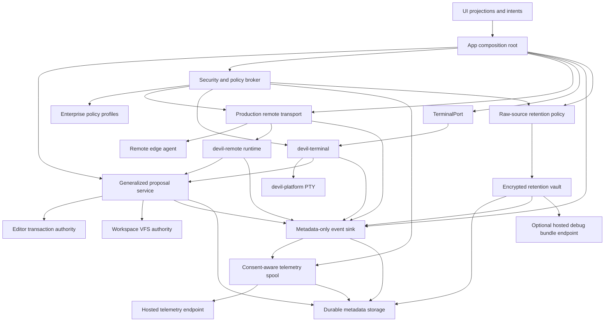

# Phase 8 Development And Implementation Plan

Status: planning draft  
Created: 2026-05-25  
Scope: Phase 8 capabilities deferred from Phase 7: production remote network transport, standalone local terminal runtime, hosted telemetry, raw-source retention, and operational hardening.

## 1. Baseline And Planning Thesis

Phase 7 is accepted only for the deterministic edge workspace runtime harness. It includes app-owned remote session composition, proposal-gated remote fixture filesystem mutation, bounded process/PTY/LSP/semantic descriptors, reconnect/offline metadata, default-deny remote policy gates, and metadata-only storage/observability.

Phase 8 must not treat the accepted Phase 7 harness as production infrastructure. Phase 8 must add production-grade runtime behavior only through new ADRs, dependency-policy entries, protocol contracts, contract tests, ownership tests, and evidence.

Non-negotiable constraints:

| Constraint | Phase 8 implication |
| --- | --- |
| UI is projection-only | UI may render terminal, remote, telemetry, retention, and health projections, but cannot own sessions, PTYs, transports, storage, editor text, or durable mutation authority. |
| Durable writes are proposal-mediated | Remote, terminal, telemetry import/export, and raw-source workflows cannot mutate files or buffers directly. Durable changes flow through the proposal, editor, and workspace authorities. |
| Existing save preconditions stay mandatory | Expected disk fingerprint, file content version, workspace generation, buffer version, snapshot id, capability decision, principal, non-zero correlation id, and non-nil causality id remain required where file mutation is involved. |
| Security is deny-by-default | Remote egress, terminal launch/input, hosted telemetry, and raw-source retention are disabled until explicit policy, consent, and capability gates allow them. |
| Air-gap remains authoritative | Air-gap disables hosted telemetry, non-approved outbound network, cloud providers, hosted embeddings, update checks, and remote gateways except narrowly scoped local loopback exceptions. |
| Observability and storage are metadata-only by default | Raw source, raw terminal transcript, raw process output, raw transport payload, prompts, provider payloads, secrets, and reconstructed source are not persisted unless a Phase 8 raw-source retention policy explicitly grants it. |
| Runtime crates require phase gates | Any new or activated runtime surface must land with ADR, dependency-policy entry, protocol symbols, tests, ownership checks, owner, evidence, and `xtask check-deps` alignment. |

Recommended Phase 8 shape:

| Program dimension | Recommendation |
| --- | --- |
| Duration | 18-22 weeks for the requested production scope. A 6-10 week schedule is only realistic for hardening without production remote transport, local terminal runtime, hosted telemetry, and raw-source retention. |
| Release model | Feature-gated alpha at week 10, enterprise/privacy beta at week 16, release candidate at week 20. |
| Governance model | Five ADRs minimum: production remote transport, standalone terminal runtime, hosted telemetry and egress, raw-source retention, and Phase 8 operations/enterprise policy. |
| Evidence model | Add `plans/evidence/phase-8/` with architecture map, threat models, policy tests, transport tests, terminal tests, telemetry tests, retention tests, migration/recovery drills, diagnostics evidence, and global phase-gate outputs. |

## 2. Phase 8 Capability Summary

| Capability | Primary objective | Runtime posture | Hard gate |
| --- | --- | --- | --- |
| Production remote network transport | Convert deterministic remote envelope handling into secure, encrypted, resumable, production network transport without granting local mutation authority. | Default-off, app-composed, policy-gated, typed-envelope-only. | Accepted transport ADR, dependency policy, protocol contracts, security tests, replay/order tests, redaction audit. |
| Standalone local terminal runtime | Activate a local terminal/PTY runtime behind `TerminalPort` and platform PTY abstractions without direct UI, plugin, AI, or remote process authority. | Default-off, app-composed, trusted-workspace and capability-gated. | Accepted terminal ADR, `devil-terminal` activation, terminal policy tests, PTY backend tests, proposal-only mutation tests. |
| Hosted telemetry | Add privacy-preserving hosted telemetry pipeline for operational metrics and diagnostics under explicit consent and egress policy. | Default-off for hosted export; air-gap hard-denies. | Accepted telemetry ADR, consent contracts, endpoint policy, redaction classifier, failure-mode tests. |
| Raw-source retention | Add explicit, purpose-bound raw-source retention vault/debug-bundle capability that is denied by default and never part of normal audit/telemetry. | Default-deny, explicit opt-in, TTL-bound, encrypted, access-audited. | Accepted retention ADR, retention policy contracts, encryption/access tests, deletion/revocation tests. |
| Operational hardening | Make active subsystems production-operable through migrations, diagnostics, replay drills, policy profiles, CI gates, and rollout controls. | Always-on local diagnostics; production gates before rollout. | Accepted operations ADR, migrations/recovery evidence, policy profile CI, subsystem health coverage, release readiness review. |

## 3. Capability A - Production Remote Network Transport

### Objectives

| Objective | Description |
| --- | --- |
| Secure transport | Provide encrypted, authenticated, tamper-resistant transport for `RemoteTransportEnvelope` traffic. |
| Preserve Phase 7 authority boundaries | Remote transport remains a carrier of typed envelopes. It cannot mutate local disk, editor text, UI state, or workspace state directly. |
| Production lifecycle | Support handshake, schema negotiation, heartbeat, reconnect, offline resume, graceful shutdown, backpressure, ordering, and duplicate protection. |
| Enterprise-ready policy | Respect workspace trust, principal identity, remote capability policy, air-gap, egress allowlists, and endpoint policy. |
| Operational visibility | Emit metadata-only remote transport health, latency, reconnect, denial, and audit events without retaining raw payloads. |

### Technical Requirements

| Area | Requirements |
| --- | --- |
| Governance | Create `ADR-0025-production-remote-network-transport.md` or equivalent. Update `plans/dependency-policy.md`, `xtask` protocol symbol checks, and Phase 8 evidence. |
| Crate boundary | Prefer a new `devil-remote-transport` crate or a strictly phase-gated production transport module that depends only on `devil-protocol`, `devil-security`, `devil-observability`, `devil-storage`, and `devil-platform` as accepted by policy. It must not depend on `devil-app`, `devil-ui`, `devil-editor`, `devil-project`, `devil-terminal`, `devil-lsp`, `devil-agent`, `devil-plugin`, `devil-collaboration`, or index internals. |
| Protocol | Add protocol DTOs for transport handshake, endpoint descriptor, peer identity, certificate/key reference, session negotiation, schema compatibility, frame metadata, flow-control state, resume token, transport health, and transport audit summaries. Existing `RemoteTransportEnvelope` remains the unit of remote action dispatch. |
| Cryptography | Use TLS/mTLS or an accepted equivalent. Bind peer identity to `RemoteAuthorityDescriptor`, `RemoteAgentDescriptor`, `PrincipalId`, workspace trust state, and capability profile. Reject downgrade, unknown authority, expired credentials, missing principal, wrong workspace, and schema mismatch. |
| Network policy | Non-loopback transport egress is denied under air-gap/local-provider-only policies. Production endpoint allowlists, proxy configuration, region restrictions, and certificate policy must be explicit and testable. |
| Framing | Enforce max frame size, max envelope size, schema version, compression policy, and malformed-frame fail-closed behavior. Raw network helper APIs are forbidden. |
| Ordering and replay | Preserve or extend `RemoteOperationId`, `EventSequence`, causality, checkpoints, duplicate detection, causal gap surfacing, and offline resume validation. |
| Flow control | Bound queues, apply backpressure, propagate cancellation, expose degraded network state, and load-shed safely without dropping mutation preconditions. |
| Remote agent packaging | Define remote agent bootstrap, version compatibility, integrity verification, upgrade/rollback, and startup health checks. |
| Audit and storage | Persist metadata-only checkpoints, health, handshake, denial, reconnect, and audit summaries. Reject raw transport payloads, raw source, terminal transcripts, process output, and secrets. |
| Platform | Validate at least Windows 11 and one Unix-like platform before GA if Phase 8 claims production network parity. |

### Implementation Steps

| Step | Work |
| --- | --- |
| A1 | Write the production remote transport ADR. Decide crate name, TLS/mTLS strategy, endpoint policy, schema negotiation, transport state model, remote agent packaging, and residual non-goals. |
| A2 | Update dependency policy with the approved production transport boundary and forbidden edges. Update `xtask check-deps` for any new crate and required protocol symbols. |
| A3 | Add protocol DTOs and validation helpers for handshake, frame metadata, endpoint policy, resume token, transport health, and transport audit summaries. Add contract tests before runtime code. |
| A4 | Implement deterministic in-memory transport conformance tests that simulate frame split, reorder, duplicate, tamper, malformed schema, backpressure, cancellation, and reconnect. |
| A5 | Implement secure dial/listen connection lifecycle behind an abstraction. Keep raw sockets out of app/UI. Make the typed envelope dispatcher the only remote operation path. |
| A6 | Bind handshake identity to workspace trust, principal, remote authority, remote agent, capability profile, and endpoint policy. Deny until all conditions pass. |
| A7 | Integrate transport with `devil-app` composition only through protocol ports and app-owned configuration. The app enables transport; UI renders projection state only. |
| A8 | Bridge successful frames into the existing `devil-remote` runtime dispatch path. Remote writes still require proposal ids and full write preconditions. |
| A9 | Add reconnect/offline resume persistence using metadata-only checkpoints and resume manifests. Ensure duplicate, stale, conflict, and causal gap outcomes remain explicit. |
| A10 | Add metadata-only event helpers and storage requests for transport health, handshake, denial, reconnect, degraded state, and resume. Add redaction tests. |
| A11 | Add remote agent packaging and compatibility checks: version range, integrity hash, startup health, shutdown, upgrade rollback, and fail-closed mismatch behavior. |
| A12 | Run fault injection, security, performance, platform, and global phase gates. Archive evidence under `plans/evidence/phase-8/`. |

### Dependencies

| Dependency | Required before production transport acceptance |
| --- | --- |
| Phase 2 proposal substrate | Remote writes and mutation outputs must already be proposal-mediated. |
| Phase 7 remote DTOs/runtime | Existing remote session descriptors, envelopes, offline resume, audit records, and write preconditions are the baseline. |
| `devil-security` policy | Remote capability policy, workspace trust policy, egress policy, principal validation, and air-gap enforcement. |
| `devil-observability` and `devil-storage` | Metadata-only event/audit persistence and rejection of raw payload/source markers. |
| `devil-platform` | Network, clock, keychain/certificate, process packaging, and platform-specific agent launch helpers if accepted. |
| Enterprise policy profiles | Required for non-loopback endpoint allowlists, proxy, certificate, and regional controls. |

### Milestones

| Milestone | Exit criteria |
| --- | --- |
| A-M1 Governance accepted | ADR, dependency policy, owner, threat model, protocol symbols, and evidence scaffold exist. |
| A-M2 Protocol locked | Handshake, frame, health, resume, and audit DTO contract tests pass and fail closed on invalid data. |
| A-M3 Secure loopback alpha | Encrypted local/loopback connection passes handshake, schema negotiation, typed-envelope dispatch, and redaction tests. |
| A-M4 Fault-injected beta | Reconnect, offline resume, duplicates, causal gaps, tamper, downgrade, backpressure, and cancellation tests pass. |
| A-M5 Production readiness | Remote agent packaging, endpoint policy, platform evidence, performance budgets, and global gates pass. |

### Resource Requirements

| Role | Allocation | Duration |
| --- | ---: | --- |
| Distributed Systems Lead | 1.0 FTE | 16-20 weeks |
| Rust Network Engineer | 1.0 FTE | 14-18 weeks |
| Security Engineer | 0.8 FTE | 14-18 weeks |
| Protocol Engineer | 0.5 FTE | 8-10 weeks |
| Observability/Storage Engineer | 0.4 FTE | 8-10 weeks |
| QA/Fault Injection Engineer | 0.8 FTE | 12-16 weeks |

### Risk Mitigations

| Risk | Mitigation |
| --- | --- |
| Remote transport bypasses proposal safety | Typed envelopes only, app-owned composition, dependency gates, ownership tests, and integration tests proving no direct local disk/editor mutation. |
| MITM, replay, or downgrade attack | mTLS or equivalent, schema/version negotiation, identity binding, nonce/replay windows, checkpoint validation, and tamper tests. |
| Air-gap regression | Air-gap egress denial tests run in CI for remote transport and hosted telemetry. |
| Raw payload retention | Validators reject raw transport payloads and secrets; event metadata drops payload; storage persists summaries only. |
| Network backpressure degrades editor input | Bounded queues, cancellation, load shedding, degraded projections, and performance tests proving editor input latency budgets hold. |
| Remote agent version drift | Compatibility matrix, integrity checks, explicit startup denial on unsupported agent, and rollback plan. |

### Acceptance Criteria

| Acceptance area | Criteria |
| --- | --- |
| Governance | ADR accepted; dependency policy and `xtask` updated; evidence artifacts complete. |
| Security | Unknown authority, untrusted workspace, wrong principal, missing capability, downgrade, expired credential, non-allowlisted endpoint, and air-gap egress all fail closed. |
| Authority | Remote transport cannot mutate local files or editor buffers directly; remote filesystem mutation still requires proposal id and all write preconditions. |
| Correctness | Duplicate, stale, conflict, causal gap, disconnect, reconnect, resume, cancellation, and shutdown outcomes are deterministic and tested. |
| Privacy | No raw source, terminal transcript, process output, transport payload body, or secret marker persists in audit, telemetry, or storage by default. |
| Operations | Health projection, CLI diagnostics, metrics, traces, fault-injection evidence, platform matrix, and performance budgets are accepted. |
| Gates | `cargo run -p xtask -- check-deps`, `cargo fmt --all --check`, `cargo check --workspace --all-targets`, `cargo test --workspace --all-targets`, `cargo clippy --workspace --all-targets -- -D warnings`, and `cargo deny check` pass or have accepted deny baseline notes. |

## 4. Capability B - Standalone Local Terminal Runtime

### Objectives

| Objective | Description |
| --- | --- |
| Activate local terminal runtime | Add a standalone local terminal/PTY runtime for trusted workspaces without routing process ownership through UI. |
| Preserve proposal safety | Terminal-triggered edits, command outputs that imply file changes, and task-generated mutations become proposals before durable state changes. |
| Enforce terminal policy | Launch/input/resize/close require trusted workspace, principal, capability, cwd policy, environment filtering, limits, and audit metadata. |
| Bound output and retention | Stream output to projection with bounded chunks; persist metadata only unless raw-source/terminal retention is separately approved. |
| Cross-platform isolation | Put OS PTY implementation in `devil-platform`; keep `devil-terminal` focused on policy, session state, and protocol. |

### Technical Requirements

| Area | Requirements |
| --- | --- |
| Governance | Create `ADR-0026-standalone-local-terminal-runtime.md` or equivalent. Update dependency policy to activate `devil-terminal`. |
| Crate boundary | Add or activate `crates/devil-terminal` with allowed dependencies: `devil-protocol`, `devil-platform`, `devil-security`, `devil-observability`, and optionally `devil-storage` only for metadata records. No dependency on app, UI, editor, project, remote, plugin, agent, AI, collaboration, or index internals. |
| Protocol | Extend terminal DTOs if needed for launch policy, cancellation/kill token, output sequence, redaction status, output truncation, cwd policy, environment redaction, exit metadata, and health projection. Maintain `TerminalPort` as the runtime boundary. |
| Security | Trusted workspace required by default. Capability namespace must include terminal launch/input/resize/close. CWD outside trusted workspace is denied unless an explicit enterprise profile allows it. Environment variables are allowlisted or redacted. |
| PTY backend | Implement deterministic fixture backend first, then OS backend behind `devil-platform::PtyService`. Windows ConPTY and Unix PTY support require platform evidence before GA. |
| Session lifecycle | Allocate non-zero `TerminalSessionId`; states include starting, running, exiting, exited, failed, denied, degraded; close/kill semantics are explicit and idempotent. |
| Output model | Output chunks are bounded, sequenced, redacted before projection/audit, and backpressure-aware. Overflow emits truncation metadata, not raw overflow. |
| Input model | Input requires active session, principal, capability, event context, and rate/size limits. Input after exit is denied. |
| Audit | Emit launch, input metadata, resize, output summary, truncation, exit, denial, timeout, kill, and backend-error events as metadata-only records. |
| Integration | App composes terminal runtime and exposes projection DTOs. UI emits command intents only. Plugins/AI/collaboration may request terminal actions only through app/protocol policy gates. |

### Implementation Steps

| Step | Work |
| --- | --- |
| B1 | Write the terminal ADR. Decide approval model for terminal command proposals versus direct user launch, retention defaults, shell policy, backend matrix, and non-goals. |
| B2 | Update dependency policy and `xtask` to activate `devil-terminal` and forbid UI/app/editor/project dependencies. |
| B3 | Extend protocol terminal DTOs and contract tests for launch/input/resize/close/output/exit/cancel/error, including invalid zero IDs and schema versions. |
| B4 | Implement deterministic terminal fixture backend with scripted output, exit, error, timeout, resize, and backpressure behavior. |
| B5 | Implement `devil-terminal` session registry, lifecycle state machine, policy evaluation, output sequence allocation, truncation, and shutdown. |
| B6 | Wire security checks for workspace trust, principal, terminal capability, cwd containment, environment redaction, command timeout, output limits, and shell allowlist. |
| B7 | Add platform PTY implementation behind `devil-platform::PtyService`; start with one validated OS backend and keep unsupported platforms fail-closed with clear diagnostics. |
| B8 | Integrate with app composition through `TerminalPort`; route UI command intents into app-owned terminal requests and terminal projections back to UI. |
| B9 | Route terminal-originated mutation candidates into `ProposalPort` and verify no terminal path writes editor/workspace state directly. |
| B10 | Add metadata-only observability and optional metadata storage for terminal lifecycle. Reject raw transcript/process output persistence by default. |
| B11 | Add CLI diagnostics for sessions, backend status, policy denials, output truncation, orphan-process cleanup, and event summaries. |
| B12 | Run terminal-specific tests, platform tests, sandbox/escape tests, performance tests, and global phase gates. |

### Dependencies

| Dependency | Required before acceptance |
| --- | --- |
| Protocol terminal DTOs | `TerminalSessionId`, `TerminalLaunchRequest`, `TerminalOutput`, `TerminalInput`, `TerminalResize`, `TerminalExit`, `TerminalRequest`, `TerminalResponse`, and `TerminalPort` are the baseline. |
| Proposal substrate | Terminal-generated edits or command suggestions must lower to proposals. |
| `devil-platform` PTY | OS-specific process/PTY implementation and resource cleanup live in platform code. |
| `devil-security` terminal policy | Trusted workspace, capability checks, command taxonomy, cwd policy, timeout, output size, and environment filtering. |
| Observability/storage | Metadata-only terminal events and optional metadata persistence. |
| App composition | App owns runtime construction and command routing. UI only renders projection. |

### Milestones

| Milestone | Exit criteria |
| --- | --- |
| B-M1 Governance accepted | ADR, dependency policy, protocol deltas, owner, threat model, and evidence scaffold exist. |
| B-M2 Fixture runtime | Deterministic backend supports lifecycle, output, input, resize, close, timeout, truncation, and denials. |
| B-M3 App integration alpha | App-composed terminal runtime works through `TerminalPort`; UI remains projection-only; terminal proposals still route safely. |
| B-M4 Native PTY beta | At least one OS PTY backend passes lifecycle, cleanup, output, redaction, and denial tests. |
| B-M5 Production terminal readiness | Platform matrix, orphan cleanup, resource limits, diagnostics, security tests, and global gates pass. |

### Resource Requirements

| Role | Allocation | Duration |
| --- | ---: | --- |
| Terminal Runtime Engineer | 1.0 FTE | 12-16 weeks |
| Platform Engineer | 0.8 FTE | 10-14 weeks |
| Security Engineer | 0.4 FTE | 8-12 weeks |
| App Integration Engineer | 0.4 FTE | 6-8 weeks |
| QA/Platform Engineer | 0.7 FTE | 10-14 weeks |

### Risk Mitigations

| Risk | Mitigation |
| --- | --- |
| UI or plugin gains ambient process authority | App-composed runtime only, no UI/runtime dependency edge, capability checks per action, and architecture tests. |
| Terminal command mutates files outside proposal path | Terminal-originated file changes become proposals; cwd containment; workspace watcher conflicts remain proposal-mediated. |
| Secrets leak through environment or transcript | Environment allowlist/redaction, output redaction, raw transcript persistence denied by default, adversarial secret tests. |
| Orphan processes after close/crash | Kill tree cleanup, session timeout, shutdown hooks, diagnostics, and platform-specific cleanup tests. |
| Platform PTY divergence | Feature-gate unsupported backends, maintain platform matrix, fail closed with clear `PtyUnavailable` diagnostics until validated. |
| Output overwhelms app/UI | Chunking, backpressure, truncation metadata, bounded queues, and p95 output latency tests. |

### Acceptance Criteria

| Acceptance area | Criteria |
| --- | --- |
| Governance | ADR accepted; `devil-terminal` activated in policy; forbidden edges enforced by `xtask`. |
| Security | Launch/input denied in untrusted workspaces, without capability, outside cwd policy, on blocked shell, or after timeout. |
| Lifecycle | Launch, output, input, resize, close, kill, exit, backend error, timeout, and truncation are deterministic and tested. |
| Authority | Terminal runtime cannot mutate editor/workspace/disk directly; mutation candidates are proposals. |
| Privacy | Raw command bodies, raw transcript, process output, secrets, and environment values are not persisted by default. |
| Operations | CLI diagnostics show session state, backend availability, limits, denials, output truncation, orphan cleanup, and metadata events. |
| Gates | Terminal-focused tests plus full workspace phase gates pass. |

## 5. Capability C - Hosted Telemetry

### Objectives

| Objective | Description |
| --- | --- |
| Production telemetry pipeline | Provide hosted operational metrics, traces, crash/diagnostic summaries, and health events for opted-in deployments. |
| Preserve privacy defaults | Hosted telemetry is disabled by default unless product policy explicitly changes it; air-gap always denies hosted export. |
| Consent and policy | Telemetry export requires explicit workspace/principal or enterprise policy consent, visible status, revocation, and queue purging. |
| Data minimization | Export metadata-only, bounded, schema-versioned records. Raw source, raw transcript, process output, transport payload bodies, prompts, provider payloads, and secrets are forbidden. |
| Operational resilience | Offline queue, retry, backpressure, drop policy, endpoint allowlist, proxy behavior, and failure diagnostics must be tested. |

### Technical Requirements

| Area | Requirements |
| --- | --- |
| Governance | Create `ADR-0027-hosted-telemetry-and-egress.md` or equivalent. Update air-gap/enterprise policy evidence. |
| Crate boundary | Prefer a `devil-telemetry` exporter crate or an accepted hosted sink module in `devil-observability`. Dependencies should be limited to `devil-protocol`, `devil-observability`, `devil-storage`, `devil-security`, and `devil-platform`. No dependency on UI/editor/project/app internals. |
| Protocol | Add telemetry consent, telemetry category, endpoint identity, export batch, spool record, privacy classification, budget, upload outcome, deletion/revocation, and hosted telemetry audit DTOs. |
| Event taxonomy | Distinguish local diagnostics, security audit, product metrics, performance traces, crash reports, remote transport health, terminal health, storage migration health, hosted telemetry export, and raw-source debug bundle references. |
| Consent | Consent must be explicit, inspectable, revocable, and testable per principal, workspace, organization/enterprise profile, category, and endpoint. Revocation purges queued records and prevents future export. |
| Egress | Endpoint allowlist, certificate policy, proxy, retry, rate limit, regional control, and air-gap denial must be enforced by `devil-security`. |
| Redaction | Event exporter must use a structured privacy classifier, not only heuristic key names. Metadata-only events remain default. Sensitive fields are dropped, hashed, bucketed, or redacted before spooling. |
| Spooling | Local queue is bounded, crash-safe, encrypted if it can hold sensitive metadata, TTL-bound, consent-aware, and backpressure-safe. |
| Hosted endpoint | Support schema validation, tenant/project identity, auth token handling, upload acknowledgement, retry-after, and deletion/export request hooks. |
| Observability | Exporter health is observable locally without exporting raw payloads. Export failures do not block editor input, saves, terminal, remote transport, or proposals. |

### Implementation Steps

| Step | Work |
| --- | --- |
| C1 | Write telemetry ADR. Decide default posture, categories, endpoint model, consent hierarchy, air-gap behavior, privacy budgets, spool behavior, and retention. |
| C2 | Update dependency policy, `xtask`, and required protocol symbol list for telemetry DTOs and any exporter crate. |
| C3 | Define telemetry taxonomy and protocol DTOs for consent, category, endpoint, export batch, spool record, upload outcome, revocation, deletion, and telemetry audit. Add DTO contract tests. |
| C4 | Add `devil-security` hosted egress policies: air-gap denial, endpoint allowlist, proxy, certificate, region, rate limit, and category gating. |
| C5 | Implement privacy classifier and redaction pipeline. Add adversarial tests for source, secrets, tokens, paths, terminal output, process output, transport payloads, prompts, provider payloads, and reconstructed source. |
| C6 | Implement local telemetry spool with bounded queues, TTL, crash recovery, consent tags, purge-on-revoke, retry/backoff, drop summaries, and metadata-only records. |
| C7 | Implement hosted exporter with typed batches, schema validation, endpoint auth, acknowledgement handling, retry-after, and failure classification. |
| C8 | Integrate telemetry source points across active subsystems: editor, app/proposals, storage, security, plugin, collaboration, remote, terminal, and CLI diagnostics. Keep every event bounded. |
| C9 | Add UI/app projection for telemetry status and consent without giving UI export authority. Add CLI diagnostics for consent, queue, drops, denials, and endpoint health. |
| C10 | Run offline, consent revocation, air-gap, endpoint denial, backpressure, crash recovery, redaction, and full phase-gate tests. |

### Dependencies

| Dependency | Required before acceptance |
| --- | --- |
| Observability event validation | Non-zero correlation, non-nil causality, non-zero sequence, schema version, metadata-only defaults. |
| Storage | Spool, metadata records, deletion/tombstone support, migration/recovery. |
| Security policy | Air-gap, local-provider-only, endpoint allowlists, principal/workspace/enterprise policy. |
| Raw-source retention policy | Hosted telemetry must know when a debug bundle link is valid, but must not include raw source directly. |
| CLI diagnostics | Operators need local visibility into exporter state without hosted export. |
| Enterprise policy profiles | Needed for organization-level opt-in, opt-out, approved endpoints, region, proxy, and audit export rules. |

### Milestones

| Milestone | Exit criteria |
| --- | --- |
| C-M1 Governance accepted | ADR, taxonomy, consent model, endpoint policy, owner, and evidence scaffold exist. |
| C-M2 Consent and policy contracts | DTO and security tests cover opt-in, opt-out, revoke, hierarchy, air-gap denial, and endpoint denial. |
| C-M3 Local spool alpha | Bounded, crash-safe, consent-aware spool passes TTL, purge, backpressure, and redaction tests. |
| C-M4 Hosted exporter beta | Exporter sends metadata-only batches to a test endpoint, handles ack/retry/drop, and never blocks critical paths. |
| C-M5 Production telemetry readiness | Privacy classifier audit, failure-mode tests, dashboards/diagnostics, enterprise profiles, and global gates pass. |

### Resource Requirements

| Role | Allocation | Duration |
| --- | ---: | --- |
| Observability Engineer | 1.0 FTE | 12-16 weeks |
| Security/Privacy Engineer | 0.8 FTE | 12-16 weeks |
| Storage Engineer | 0.5 FTE | 8-12 weeks |
| Backend/Telemetry Engineer | 0.8 FTE | 10-14 weeks |
| QA/Privacy Automation Engineer | 0.8 FTE | 10-14 weeks |

### Risk Mitigations

| Risk | Mitigation |
| --- | --- |
| Hosted telemetry violates air-gap | Air-gap denial enforced in security policy and exporter, with CI tests. |
| Raw source leaks through events | Structured classifier, redaction before spool, denylist and allowlist tests, metadata-only event schemas, adversarial test corpus. |
| Consent revocation leaves queued data | Consent tags on spool records, purge-on-revoke, revocation tombstones, and tests for race conditions. |
| Telemetry backpressure affects editor | Bounded queues, low-priority worker, drop summaries, no synchronous export on critical path. |
| Endpoint compromise or token leak | Endpoint allowlist, certificate policy, short-lived credential references, no token payload logging, access audits. |
| Overcollection undermines trust | Category budgets, explicit taxonomy, privacy review gate, and metrics coverage reports. |

### Acceptance Criteria

| Acceptance area | Criteria |
| --- | --- |
| Governance | Telemetry ADR accepted; endpoint and consent policy documented; dependency policy and evidence updated. |
| Consent | Telemetry export is denied without consent; consent is inspectable, revocable, category-scoped, and hierarchy-tested. |
| Air-gap | Air-gap and local-provider-only profiles deny hosted telemetry unconditionally. |
| Privacy | Hosted batches contain only classified, bounded, metadata-only records; raw source/transcripts/process output/transport payloads/secrets are rejected. |
| Reliability | Offline queue, crash recovery, retry, backpressure, retry-after, drop summaries, and endpoint denial are deterministic and tested. |
| Operations | CLI and app projections expose local status, queue size, drops, denials, last successful upload, and consent state. |
| Gates | Telemetry contract, policy, redaction, failure-mode, and full workspace gates pass. |

## 6. Capability D - Raw-Source Retention

### Objectives

| Objective | Description |
| --- | --- |
| Controlled exception to metadata-only default | Introduce a narrowly scoped raw-source retention capability for support/debug/replay bundles without weakening normal audit, telemetry, remote, terminal, AI, plugin, or collaboration defaults. |
| Explicit consent and purpose binding | Raw-source retention requires principal/workspace/enterprise policy consent, declared purpose, scope, TTL, access policy, and deletion path. |
| Strong storage controls | Retained raw source is encrypted, access-audited, integrity-checked, TTL-bound, and isolated from normal event/audit storage. |
| No accidental hosted export | Hosted telemetry may reference a retention bundle id only when explicitly allowed; it must not inline raw source. |
| Revocation and deletion | Revocation prevents new captures, purges queued bundles where allowed, tombstones deleted records, and records metadata-only deletion audit. |

### Technical Requirements

| Area | Requirements |
| --- | --- |
| Governance | Create `ADR-0028-raw-source-retention.md` or equivalent. Reconcile with metadata-only defaults and ADR-0009 memory consent. |
| Crate/storage boundary | Prefer implementing retention vault APIs in `devil-storage` with protocol-owned DTOs, or add a small `devil-retention` crate if accepted. The vault must not be a generic raw payload store for telemetry, observability, AI, terminal, or remote transport. |
| Protocol | Add DTOs for `RawSourceRetentionPolicy`, retention purpose, source capture request, consent grant, retention lease, retention bundle descriptor, encryption metadata, access audit, revocation, deletion, tombstone, and hosted export linkage. |
| Consent | Consent must be explicit, purpose-scoped, file/workspace-scoped, principal-bound, TTL-bound, revocable, and policy-overridable by enterprise administrators. |
| Capture rules | Capture only bounded source slices, file snapshots, or debug bundles that match approved scope. Large files require sampling, chunking, or explicit additional consent. Generated/binary/vendor files follow workspace discovery policy. |
| Encryption | Encrypt at rest using accepted local key management or enterprise-managed keys. Hosted bundle upload requires a separate endpoint and key decision. |
| Access control | Every read/export/delete requires principal, capability, purpose, correlation id, causality id, and event sequence. Reads emit metadata-only access audit. |
| Retention lifecycle | TTL, deletion, legal hold if accepted, compaction, backup/export, tombstone, and revocation semantics are defined and tested. |
| Redaction boundary | Retention vault can hold raw source only under grant. Observability, telemetry, proposal audit, remote audit, terminal audit, AI tracker, and plugin storage continue rejecting raw source unless explicitly consuming a retention lease by reference. |

### Implementation Steps

| Step | Work |
| --- | --- |
| D1 | Write raw-source retention ADR. Decide accepted purposes, local-only versus hosted bundle support, consent model, encryption, TTL defaults, deletion semantics, and legal hold posture. |
| D2 | Update dependency policy and `xtask` for any new retention protocol symbols or crate. Keep raw-source storage isolated from generic observability/storage records. |
| D3 | Add protocol DTOs and validation helpers for retention policy, consent grant, capture request, bundle descriptor, lease, access audit, deletion, tombstone, and hosted export linkage. Add contract tests. |
| D4 | Implement policy evaluation in `devil-security`: default denial, purpose scope, workspace/principal consent, enterprise override, air-gap hosted-upload denial, and capability checks. |
| D5 | Implement local encrypted retention vault with bounded capture, integrity hash, metadata index, TTL, access logs, deletion, tombstone, migration, and recovery. |
| D6 | Add capture integrations through app-owned flows only: proposal snapshot bundle, crash/support bundle, remote reproduction bundle, terminal/task debug bundle, and storage migration debug bundle. Each integration stores a retention lease reference in metadata, not raw content. |
| D7 | Add hosted debug bundle upload only if explicitly accepted by the ADR. It must reuse telemetry endpoint policy but require separate raw-source consent and stronger audit. |
| D8 | Add consent UI/app projections and CLI diagnostics for grants, bundles, TTL, access log, deletion, and export status. UI cannot read raw source through projection unless normal editor/workspace authority already allows it. |
| D9 | Add adversarial tests proving normal audit, telemetry, storage, remote, terminal, plugin, AI, and collaboration records still reject raw source markers. |
| D10 | Run retention lifecycle, encryption, key loss, corruption, migration, revocation, deletion, backup/restore, hosted upload denial, and full phase gates. |

### Dependencies

| Dependency | Required before acceptance |
| --- | --- |
| Storage migration/recovery | Raw-source vault needs durable, recoverable, encrypted storage and deletion/tombstone semantics. |
| Security policy | Consent, capability, purpose, principal, workspace trust, enterprise profile, and air-gap hosted denial. |
| Telemetry | Hosted telemetry must be able to link to bundle descriptors safely without embedding raw content. |
| Observability | Metadata-only access audit and deletion audit events with non-zero event identity. |
| Workspace/text snapshots | Capture source only through app/editor/workspace-authorized snapshots and leases, respecting large-file budget and path policy. |
| CLI diagnostics | Required for operators to inspect grants, bundles, access, deletion, and policy denials. |

### Milestones

| Milestone | Exit criteria |
| --- | --- |
| D-M1 Governance accepted | ADR, policy, accepted purposes, consent model, retention lifecycle, owner, and evidence scaffold exist. |
| D-M2 Contracts locked | DTO tests cover grant, deny, capture, lease, access audit, revoke, delete, tombstone, TTL, and hosted linkage. |
| D-M3 Local vault alpha | Encrypted local vault captures scoped bundles, emits access audit, enforces TTL, and deletes/tombstones. |
| D-M4 Integration beta | Support/debug bundle flows reference retention leases without leaking raw content into normal audit or telemetry. |
| D-M5 Retention readiness | Adversarial privacy audit, deletion/revocation tests, migration/recovery evidence, and global gates pass. |

### Resource Requirements

| Role | Allocation | Duration |
| --- | ---: | --- |
| Security/Privacy Lead | 1.0 FTE | 12-16 weeks |
| Storage Engineer | 0.8 FTE | 10-14 weeks |
| Protocol Engineer | 0.4 FTE | 6-8 weeks |
| App Integration Engineer | 0.4 FTE | 6-8 weeks |
| QA/Compliance Engineer | 0.8 FTE | 10-14 weeks |

### Risk Mitigations

| Risk | Mitigation |
| --- | --- |
| Raw-source retention becomes a backdoor default | Separate ADR, separate consent, separate vault, default denial, normal storage validators continue rejecting raw source. |
| Hosted telemetry accidentally carries raw source | Telemetry schema forbids raw content; only bundle descriptors by reference; exporter redaction and adversarial tests. |
| Consent scope is too broad | Purpose, file/workspace scope, TTL, principal, and enterprise policy are mandatory fields; broad grants require elevated approval. |
| Deletion is incomplete | Tombstones, purge tests, backup/export policy, revocation race tests, and deletion audit. |
| Vault compromise exposes source | Encryption, key management, access audit, least privilege, short TTL, and optional local-only posture. |
| Large-file capture overwhelms storage | Bounded capture, chunking, explicit extra consent above thresholds, quotas, and compression policy. |

### Acceptance Criteria

| Acceptance area | Criteria |
| --- | --- |
| Governance | Raw-source retention ADR accepted; dependency policy updated; default-deny posture documented. |
| Consent | No raw source can be retained without explicit scoped grant. Revocation blocks new capture and purges eligible queued bundles. |
| Isolation | Normal audit, telemetry, remote, terminal, plugin, AI, collaboration, and event metadata still reject raw source by default. |
| Security | Retained bundles are encrypted, access-controlled, access-audited, TTL-bound, and integrity-checked. |
| Lifecycle | Capture, read, export, revoke, delete, tombstone, migrate, backup/restore, and corruption recovery are tested. |
| Hosted boundary | Hosted upload is denied under air-gap and requires separate raw-source consent if accepted at all. |
| Gates | Retention contract, privacy audit, lifecycle, and full workspace gates pass. |

## 7. Capability E - Phase 8 Operational Hardening

### Objectives

| Objective | Description |
| --- | --- |
| Production readiness | Make active subsystems diagnosable, recoverable, measurable, policy-governed, and release-ready. |
| Durable migrations | Move accepted stores from in-memory or ad hoc file-backed behavior to durable, migrated, recoverable stores where needed. |
| Operational diagnostics | Expand CLI/app diagnostics for dependency graph, protocol schema, event summaries, proposal audit, storage health, index health, plugin sandbox, AI manifests, collaboration replay, remote traces, terminal sessions, telemetry queue, and retention vault. |
| Policy profiles | Validate enterprise policies for air-gap, local-only AI, hosted telemetry, remote restrictions, terminal restrictions, approved providers, plugin allowlists, collaboration retention, raw-source retention, and audit export. |
| Release discipline | Add phase gates, cargo-deny baseline handling, platform matrix, performance budgets, failure drills, and rollout/rollback playbooks. |

### Technical Requirements

| Area | Requirements |
| --- | --- |
| Governance | Create `ADR-0029-phase-8-operational-hardening.md` or equivalent. Update Phase 8 status ledger after acceptance. |
| Storage | Migration framework, schema versions, backup/restore, corrupt-store quarantine, downgrade or recoverability strategy, checksums, compaction, tombstones, and metadata-only replay. |
| Diagnostics | `devil-cli` commands for policy inspection, protocol schema validation, event summary, storage health, proposal audit, remote transport, terminal sessions, telemetry spool, retention vault, and phase-gate evidence generation. |
| CI | Required gates: dependency check, fmt, check, tests, clippy with warnings denied, cargo-deny, policy-profile tests, privacy tests, migration tests, fault injection, platform smoke tests. |
| Observability | Every active subsystem has metadata-only event coverage, health projection, error taxonomy, and bounded metrics. |
| Security | Enterprise policy profile validation, egress tests, sandbox escape tests, credential handling tests, retention access tests, remote transport threat model, terminal process isolation tests. |
| Performance | Editor input, terminal output, remote transport, telemetry exporter, storage migration, and CLI diagnostics have explicit p50/p95/p99 budgets and non-regression tests. |
| Release ops | Alpha, beta, RC, GA gates; kill switches; feature flags; migration backup; rollback plan; incident response runbooks; support bundle flow. |

### Implementation Steps

| Step | Work |
| --- | --- |
| E1 | Write operational hardening ADR. Define release readiness, evidence, storage migration requirements, diagnostics coverage, policy profiles, SLOs, and rollback criteria. |
| E2 | Build Phase 8 evidence directory scaffold and command-output capture conventions for all gates and capability-specific tests. |
| E3 | Implement or extend migration framework for storage domains activated through Phase 8: remote metadata, terminal metadata if persisted, telemetry spool, retention vault, event metadata, proposal audit, and policy profiles. |
| E4 | Add storage corruption recovery drills: malformed JSON/DB, partial write, interrupted migration, restore backup, downgrade/recover, missing key, and tombstone compaction. |
| E5 | Expand `devil-cli` diagnostics and schema tools. Make diagnostics read-only by default and safe in air-gap mode. |
| E6 | Add enterprise policy profile test matrix: air-gap, local-only AI, telemetry opt-in, telemetry denied, remote allowed, remote denied, terminal restricted, plugin allowlist, collaboration retention, raw-source denied, raw-source break-glass. |
| E7 | Add subsystem health events and projections for app, proposal, workspace, editor, index, plugin, collaboration, remote, terminal, telemetry, retention, storage, and security. |
| E8 | Add performance budgets and non-regression tests for critical paths under active remote, terminal, telemetry, and retention background load. |
| E9 | Add operational drills: replay critical flows from metadata, remote reconnect, terminal orphan cleanup, telemetry offline queue, retention deletion, migration recovery, deny-by-policy, and rollback. |
| E10 | Add release playbooks: feature flags, kill switches, canary rollout, incident response, evidence signoff, cargo-deny baseline review, and GA readiness checklist. |

### Dependencies

| Dependency | Required before acceptance |
| --- | --- |
| Capability-specific ADRs | Remote transport, terminal runtime, hosted telemetry, and raw-source retention must each define their own contracts. |
| Storage backend decision | Durable metadata stores and migration framework must be accepted for Phase 8 scope. |
| Observability taxonomy | Health, metrics, trace, audit, and telemetry categories must be distinct and bounded. |
| Security profiles | Enterprise policy and air-gap behavior must be enforceable in CI. |
| CLI foundation | `devil-cli` must be expanded without gaining mutation authority unless explicitly requested and gated. |

### Milestones

| Milestone | Exit criteria |
| --- | --- |
| E-M1 Operations ADR accepted | Readiness model, diagnostics coverage, migration policy, policy profiles, SLOs, and evidence scaffold exist. |
| E-M2 Diagnostics alpha | CLI can inspect dependency policy, protocol schema, event summaries, storage health, remote, terminal, telemetry, and retention state. |
| E-M3 Migration and recovery beta | Migration, corruption, backup/restore, downgrade/recover, and replay drills pass for active stores. |
| E-M4 Policy and privacy beta | Enterprise profile CI, egress denial, privacy retention defaults, redaction audits, and access audits pass. |
| E-M5 Release candidate | Global gates, performance budgets, platform matrix, rollback playbooks, and release readiness review pass. |

### Resource Requirements

| Role | Allocation | Duration |
| --- | ---: | --- |
| Platform Hardening Lead | 1.0 FTE | 18-22 weeks |
| Storage Engineer | 1.0 FTE | 14-18 weeks |
| Observability Engineer | 0.8 FTE | 14-18 weeks |
| Security/Compliance Engineer | 1.0 FTE | 16-20 weeks |
| CLI/DevEx Engineer | 0.8 FTE | 12-16 weeks |
| QA/Release Engineer | 1.2 FTE | 16-22 weeks |
| TPM/Release Manager | 0.6 FTE | 18-22 weeks |

### Risk Mitigations

| Risk | Mitigation |
| --- | --- |
| Hardening becomes a substitute for missing capability evidence | Each capability keeps independent ADR, policy, protocol, and tests; operational hardening accepts only evidenced active surfaces. |
| Migrations lose audit/trust/session data | Backups, checksums, migration dry runs, corruption drills, recovery plan, and metadata replay validation. |
| Diagnostics leak sensitive data | Diagnostics are metadata-only by default, redacted, read-only, and tested against raw source/secret fixtures. |
| Enterprise profiles drift from runtime policy | CI executes profile matrix against actual security broker decisions and egress/retention/terminal/remote gates. |
| Cargo-deny noise hides real issues | Baseline warnings are documented; new deny-level findings fail release readiness. |
| Platform parity claims outrun evidence | GA matrix lists only validated platforms and marks unsupported backends fail-closed. |

### Acceptance Criteria

| Acceptance area | Criteria |
| --- | --- |
| Governance | Operational hardening ADR accepted; evidence artifacts complete; phase status can move from future-gated to accepted only after gates pass. |
| Storage | Migrations are reversible or recoverable; corruption recovery, backup/restore, tombstone, and metadata replay drills pass. |
| Diagnostics | Every active subsystem has CLI/app health diagnostics and metadata-only event coverage. |
| Policy | Enterprise profiles validate automatically in CI and match runtime decisions. |
| Privacy | Metadata-only replay reconstructs critical flows without raw source by default; raw-source retention only works under scoped grant. |
| Release | Alpha/beta/RC/GA gates, performance budgets, platform matrix, cargo-deny, rollback playbooks, and incident runbooks are complete. |
| Gates | Full command set passes with evidence archived. |

## 8. Integrated Timeline And Phase Gates

Recommended schedule: 20 weeks, organized as 10 two-week iterations. Remote transport, terminal, telemetry, retention, and operational hardening can overlap only after the governance and protocol gates land.

| Window | Gate | Remote transport | Terminal runtime | Hosted telemetry | Raw-source retention | Operational hardening | Exit criteria |
| --- | --- | --- | --- | --- | --- | --- | --- |
| Weeks 0-2 | P8-G0 Governance | ADR A, threat model, crate decision | ADR B, crate decision | ADR C, taxonomy | ADR D, consent model | ADR E, readiness model | All ADR drafts reviewed, owners assigned, dependency-policy plan approved, evidence scaffold created. |
| Weeks 2-4 | P8-G1 Protocol and policy contracts | Handshake/frame/resume DTOs | Terminal lifecycle DTOs | Consent/export DTOs | Retention grant/lease DTOs | Policy profile DTOs | Protocol contract tests fail closed; `xtask` policy plan ready; no runtime activation yet. |
| Weeks 4-6 | P8-G2 Security defaults | Endpoint and identity denial tests | Trust/capability/cwd denial tests | Air-gap and endpoint denial tests | Default denial and scope tests | Enterprise profile matrix starts | Default-deny behavior proven before runtime wiring. |
| Weeks 6-8 | P8-G3 Deterministic fixtures | In-memory transport conformance | Fixture terminal backend | Local spool fixture | Local vault fixture | CLI diagnostic skeleton | Fixture runtimes validate lifecycle, limits, redaction, and metadata-only events. |
| Weeks 8-10 | P8-G4 Alpha integration | Secure loopback transport into app-owned remote composition | App-composed terminal through `TerminalPort` | Consent-aware local spool | Scoped local retention capture | Health projections | Alpha feature flags; UI projection-only; no direct mutation path; focused tests pass. |
| Weeks 10-12 | P8-G5 Native/hosted beta base | Encrypted network connection, agent compatibility | Native PTY backend for first platform | Hosted exporter test endpoint | Encrypted vault and access audit | Migration framework | First end-to-end beta flows pass under strict opt-in. |
| Weeks 12-14 | P8-G6 Fault and privacy hardening | Reconnect, tamper, replay, backpressure | Orphan cleanup, timeout, output limits | Offline/retry/revoke/backpressure | TTL/delete/tombstone/revoke | Corruption and replay drills | Fault injection and adversarial privacy tests pass. |
| Weeks 14-16 | P8-G7 Enterprise beta | Endpoint profiles, proxy, region | Terminal restriction profiles | Consent hierarchy, enterprise policy | Break-glass/deny profiles | CI profile matrix | Enterprise policy profiles validate automatically in CI. |
| Weeks 16-18 | P8-G8 Release candidate | Platform matrix, perf budgets | Platform matrix, perf budgets | Dashboard/diagnostic readiness | Migration/recovery readiness | Global gates | Full gates pass; cargo-deny reviewed; release notes and rollback playbooks ready. |
| Weeks 18-20 | P8-G9 GA decision | Canary results | Canary results | Opt-in telemetry results | Retention deletion audit | Readiness review | GA only if success metrics pass and residual risks have owner/date or are deferred. |

Phase gate definitions:

| Gate | Meaning | Must pass |
| --- | --- | --- |
| P8-G0 Governance | No runtime code beyond scaffolding. | Accepted or approval-ready ADRs, owners, threat model outline, dependency policy delta, evidence plan. |
| P8-G1 Protocol | Contracts before implementation. | DTO tests, invalid-value tests, serialization compatibility, required protocol symbol checks. |
| P8-G2 Security | Default-deny before runtime activation. | Capability, trust, egress, consent, retention, and air-gap denial tests. |
| P8-G3 Fixture | Deterministic local behavior before production dependencies. | Fixture runtimes prove lifecycle, limits, and redaction. |
| P8-G4 Alpha | App-composed integration behind flags. | UI projection-only, no direct mutation, focused integration tests. |
| P8-G5 Beta base | First production-adjacent backend. | Secure network, native PTY, hosted test endpoint, encrypted vault, migrations. |
| P8-G6 Fault/privacy | Break it before broad beta. | Fault injection, adversarial privacy, corruption, deletion, replay, backpressure tests. |
| P8-G7 Enterprise | Policy profile readiness. | CI profile matrix and operator diagnostics. |
| P8-G8 RC | Release candidate. | Full phase gates, platform matrix, performance budgets, cargo-deny, rollback plan. |
| P8-G9 GA | Production rollout decision. | Canary metrics, security/privacy signoff, support/incident readiness, accepted residual risks. |

## 9. Dependency Map And Interoperation Model

### Component Dependency Rules

| Component | May depend on | Must not depend on | Notes |
| --- | --- | --- | --- |
| `devil-ui` | `devil-protocol` projection DTOs only | app, editor, project, storage, remote, terminal internals | UI emits intents and renders projections. |
| `devil-app` | protocol, editor, project, storage, observability, security, accepted runtime ports | none of the runtime crates as hidden authority bypasses | App owns composition and routes requests through ports. |
| `devil-remote` | protocol, security, storage, observability, platform as accepted | app, UI, editor, project, terminal, LSP, plugin, AI, collaboration, index internals | Deterministic remote runtime and envelope dispatch. |
| `devil-remote-transport` | protocol, security, observability, storage, platform | app, UI, editor, project, terminal, plugin, AI, collaboration | Carries typed remote envelopes over secure network. |
| `devil-terminal` | protocol, platform, security, observability, optional storage metadata | app, UI, editor, project, remote, plugin, AI, collaboration | Local terminal session runtime behind `TerminalPort`. |
| `devil-telemetry` | protocol, observability, storage, security, platform | app, UI, editor, project, raw source storage direct reads | Hosted exporter for consented metadata-only batches. |
| `devil-storage` retention vault | protocol, platform/security if accepted | UI/editor/app internals | Stores encrypted raw-source bundles only through retention contracts. |
| `devil-security` | protocol | feature runtime internals where avoidable | Evaluates capability, trust, egress, consent, endpoint, and profile decisions. |
| `devil-observability` | protocol | raw source providers | Validates/redacts/records metadata events. |

### Interoperation Flow

### Data Flow Guarantees

| Flow | Guarantee |
| --- | --- |
| Remote transport to local workspace | Network frames become typed `RemoteTransportEnvelope` values. File mutation still requires proposals and write preconditions. |
| Terminal to workspace | Terminal output can trigger metadata or proposal candidates only. It cannot write files or buffers directly. |
| Observability to telemetry | Events are validated, classified, redacted, bounded, consent-tagged, and spooled before hosted export. |
| Raw-source retention to telemetry | Telemetry may include a retention bundle descriptor only under explicit grant; it must never inline raw source. |
| Storage to diagnostics | Diagnostics read metadata, health, indexes, event summaries, and bundle descriptors. Raw source reads require retention access authorization. |
| Security to every capability | Capability, trust, consent, egress, endpoint, retention, and policy profiles are evaluated before action. |

## 10. Phase 8 Evidence Artifacts

Create the following under `plans/evidence/phase-8/` during implementation:

| Artifact | Purpose |
| --- | --- |
| `phase-8-architecture-map.md` | Accepted scope, ownership map, dependency map, deferred surfaces, and validation command index. |
| `phase-8-threat-model.md` | Cross-capability threat model for network, terminal, telemetry, raw retention, storage, and operations. |
| `dependency-boundary.txt` | `xtask check-deps` output and crate dependency audit. |
| `protocol-dto-contract-tests.txt` | Protocol serialization/fail-closed test output for Phase 8 DTOs. |
| `remote-production-transport-security-tests.txt` | Handshake, encryption, identity, endpoint, replay, tamper, reconnect, and air-gap evidence. |
| `remote-agent-packaging-tests.txt` | Version compatibility, integrity, startup health, upgrade/rollback, shutdown evidence. |
| `terminal-runtime-policy-tests.txt` | Terminal trust, capability, cwd, environment, shell, timeout, output limit, and no-direct-mutation evidence. |
| `terminal-pty-platform-tests.txt` | Fixture and native PTY backend lifecycle, cleanup, output, resize, and platform matrix. |
| `hosted-telemetry-consent-policy-tests.txt` | Consent, revoke, hierarchy, air-gap, endpoint, proxy, region, and category tests. |
| `hosted-telemetry-failure-mode-tests.txt` | Offline queue, retry, backpressure, crash recovery, retry-after, drop, and purge evidence. |
| `privacy-redaction-classifier-audit.md` | Adversarial privacy corpus and false-negative/false-positive budget. |
| `raw-source-retention-policy-tests.txt` | Default denial, scoped grants, capture, lease, hosted denial, and break-glass evidence. |
| `raw-source-retention-lifecycle-tests.txt` | TTL, access audit, encryption, deletion, tombstone, revoke, backup/restore, and migration evidence. |
| `storage-migration-recovery-tests.txt` | Upgrade, downgrade/recover, corruption, quarantine, backup, restore, checksum, and compaction evidence. |
| `operational-health-diagnostics.txt` | CLI/app diagnostics coverage for every active subsystem. |
| `enterprise-policy-profile-ci.txt` | Air-gap, local-only, telemetry, remote, terminal, plugin, collaboration, retention, and audit export profile evidence. |
| `performance-budget-tests.txt` | Editor, remote, terminal, telemetry, retention, storage, and CLI performance budgets. |
| `metadata-replay-drills.txt` | Critical flow reconstruction without raw source by default. |
| `cargo-fmt-check.txt` | `cargo fmt --all --check` output. |
| `cargo-check-workspace-all-targets.txt` | `cargo check --workspace --all-targets` output. |
| `cargo-test-workspace-all-targets.txt` | `cargo test --workspace --all-targets` output. |
| `cargo-clippy-workspace-all-targets.txt` | `cargo clippy --workspace --all-targets -- -D warnings` output. |
| `cargo-deny-check.txt` | `cargo deny check` output and accepted baseline notes. |
| `xtask-check-deps.txt` | `cargo run -p xtask -- check-deps` output. |

## 11. Full Phase 8 Resource Plan

Recommended peak staffing for this expanded Phase 8 scope: 12-16 FTE over 18-22 weeks.

| Role | Peak allocation | Primary responsibilities |
| --- | ---: | --- |
| Principal Architect | 0.6 FTE | ADR approval, dependency boundaries, sequencing, phase-gate arbitration. |
| TPM/Release Manager | 0.6 FTE | Timeline, risk, milestone tracking, evidence readiness, release coordination. |
| Distributed Systems Engineers | 2.0 FTE | Production remote transport, reconnect/resume, remote agent packaging, fault injection. |
| Terminal/Platform Engineers | 1.5 FTE | `devil-terminal`, PTY backend, process cleanup, platform matrix. |
| Security/Privacy Engineers | 2.0 FTE | Threat models, egress policy, terminal policy, telemetry consent, raw retention, enterprise profiles. |
| Observability/Telemetry Engineers | 1.5 FTE | Event taxonomy, hosted telemetry exporter, privacy classifier, dashboards/diagnostics. |
| Storage Engineers | 1.5 FTE | Migrations, telemetry spool, retention vault, corruption recovery, metadata replay. |
| App/Protocol Engineers | 1.5 FTE | Protocol DTOs, app composition, port integration, proposal bridge, projection DTOs. |
| CLI/DevEx Engineer | 0.8 FTE | Diagnostics, schema tools, policy inspection, evidence generation. |
| QA/Automation Engineers | 2.0 FTE | Contract tests, integration tests, fault injection, platform CI, performance, cargo-deny. |
| SRE/Operations Advisor | 0.5 FTE | Rollout, canary, incident response, runbooks, operational metrics. |

## 12. Cross-Capability Risk Register

| Risk | Impact | Likelihood | Owner | Mitigation | Stop condition |
| --- | --- | ---: | --- | --- | --- |
| Network or terminal path mutates workspace directly | Data loss, bypassed audit, architecture violation | Medium | Principal Architect | Ownership tests, proposal-only integration tests, dependency gates. | Any direct editor/workspace mutation outside proposal authority. |
| Hosted telemetry leaks sensitive content | Privacy/compliance failure | Medium | Security/Privacy Lead | Classifier, redaction, schema allowlists, adversarial tests, consent gate. | Any raw source/secret/transcript reaches hosted batch. |
| Raw-source retention weakens default metadata-only promise | Trust failure | Medium | Security/Privacy Lead | Separate vault, separate consent, default denial, short TTL, access audit. | Raw source retained without scoped grant. |
| Air-gap policy bypass | Critical compliance failure | Low-Medium | Security Lead | Air-gap CI profile, endpoint denial, exporter and transport hard-deny. | Any outbound non-loopback call succeeds in air-gap. |
| Terminal process escape or orphan | User system risk | Medium | Platform Lead | PTY isolation, timeout, kill tree, env filtering, cwd policy, cleanup tests. | Process remains after close/shutdown or escapes cwd policy without grant. |
| Storage migration corrupts state | Loss of audit/trust/session data | Medium | Storage Lead | Backup, checksums, dry runs, recovery drills, metadata replay. | Migration cannot recover or roll forward safely. |
| Production transport destabilizes editor latency | Poor UX | Medium | Distributed Systems Lead | Background queues, backpressure, degraded state, performance budgets. | Editor input p95 regression exceeds agreed budget. |
| Cargo-deny or dependency sprawl blocks release | Release delay | Medium | QA/Release | Early dependency review, deny baseline, minimal crates, security review. | New unreviewed network/crypto/process dependency lands after RC. |
| Platform claims unsupported | Support burden | Medium | QA/Platform | Explicit support matrix, fail-closed unsupported backends, platform smoke tests. | GA marketing claims a platform without passing evidence. |

## 13. Success Metrics For Full Phase 8 Rollout

### Safety And Architecture Metrics

| Metric | Target |
| --- | --- |
| Direct mutation violations | 0 paths from remote, terminal, telemetry, retention, plugin, AI, or UI to workspace/editor mutation outside proposals. |
| Dependency gate violations | 0 forbidden edges; every new crate has dependency-policy coverage and `xtask check-deps` passes. |
| Event identity violations | 0 accepted events with zero correlation id, nil causality id, zero event sequence, or zero schema version. |
| Raw data leakage in metadata stores | 0 raw source/transcript/process output/transport payload/secret markers in metadata-only audit, telemetry, remote, terminal, plugin, AI, or collaboration records. |

### Remote Transport Metrics

| Metric | Target |
| --- | --- |
| Handshake fail-closed coverage | 100 percent of unknown authority, wrong principal, expired credential, downgrade, schema mismatch, and air-gap cases denied. |
| Reconnect success | >= 99 percent successful resume in fault-injection cases with valid checkpoints. |
| Causal gap detection | 100 percent of reordered/missing checkpoint scenarios surface explicit gap or stale outcomes. |
| Remote local-mutation bypasses | 0. |
| Transport overhead | p95 typed-envelope dispatch overhead within accepted budget, with no editor input p95 regression above 5 percent under idle remote connection. |

### Terminal Runtime Metrics

| Metric | Target |
| --- | --- |
| Policy denial coverage | 100 percent for untrusted workspace, missing capability, blocked cwd, blocked shell, env secret redaction, timeout, and output overflow cases. |
| Orphan process count | 0 after close, kill, crash cleanup, and app shutdown tests. |
| Output latency | p95 projection of bounded output chunks within accepted budget on validated platforms. |
| Transcript persistence | 0 raw transcript/output records outside explicitly granted retention vault. |
| Terminal mutation bypasses | 0. |

### Hosted Telemetry Metrics

| Metric | Target |
| --- | --- |
| Air-gap export attempts | 0 successful hosted exports under air-gap. |
| Consent enforcement | 100 percent of exports tied to active consent and category/endpoint policy. |
| Revocation purge | Queued records purged or tombstoned within accepted local budget after consent revocation. |
| Export backpressure | Telemetry exporter never blocks editor input, saves, remote transport dispatch, or terminal lifecycle. |
| Redaction classifier | 0 critical false negatives in adversarial source/secret/transcript/payload corpus at release gate. |

### Raw-Source Retention Metrics

| Metric | Target |
| --- | --- |
| Default denial | 100 percent of raw-source capture requests denied without scoped grant. |
| Access audit coverage | 100 percent of capture/read/export/delete/revoke actions emit metadata-only access audit. |
| Deletion and TTL | 100 percent TTL expiry and explicit deletion tests pass, including tombstone and backup/restore behavior. |
| Hosted raw-source upload | 0 uploads without separate raw-source consent and endpoint policy; 0 uploads under air-gap. |
| Vault integrity | 100 percent integrity checks pass after backup/restore and migration drills. |

### Operational Hardening Metrics

| Metric | Target |
| --- | --- |
| Global gates | All required cargo, `xtask`, cargo-deny, policy profile, privacy, migration, and fault-injection gates pass. |
| Diagnostics coverage | 100 percent of active subsystems have CLI/app health diagnostics and event coverage. |
| Metadata-only replay | Critical flows reconstruct from metadata without raw source by default. |
| Storage recovery | All migration, corruption, backup/restore, downgrade/recover, and tombstone drills pass. |
| Enterprise profile CI | Air-gap, local-only, telemetry, remote, terminal, plugin, collaboration, retention, and audit export profiles validate in CI. |
| Release readiness | Alpha, beta, RC, canary, rollback, incident runbook, and residual-risk signoff complete. |

## 14. Rollout Strategy

| Stage | Scope | Required controls |
| --- | --- | --- |
| Developer alpha | Fixture transport, fixture terminal, local telemetry spool, local retention vault, diagnostics | Feature flags, local-only endpoints, no hosted raw-source upload, focused tests. |
| Internal beta | Secure loopback/controlled remote endpoint, first native PTY backend, hosted telemetry test tenant, encrypted local retention | Consent UI/projections, air-gap denial, fault injection, privacy audit, migration backups. |
| Enterprise beta | Approved endpoint profiles, terminal restrictions, remote restrictions, telemetry opt-in, raw-source break-glass | Policy profile CI, support bundle review, deletion/revocation drills, operator diagnostics. |
| Release candidate | Validated platform matrix, canary rollout, cargo-deny, performance budgets, security/privacy signoff | Kill switches, rollback playbooks, incident response, evidence freeze. |
| GA | Only evidenced platforms and capabilities | Success metrics met; unresolved risks documented with owner/date or explicitly deferred. |

## 15. Final Definition Of Done

Phase 8 is accepted only when all of the following are true:

| Area | Done condition |
| --- | --- |
| Governance | All five capability ADRs are accepted, dependency policy and `xtask` are aligned, owners are recorded, and Phase 8 evidence is complete. |
| Remote transport | Production network transport is secure, typed-envelope-only, reconnectable, policy-gated, metadata-audited, and unable to bypass proposals. |
| Terminal runtime | Standalone local terminal runtime is app-composed, capability-gated, bounded, redacted, platform-evidenced, and unable to mutate workspace/editor directly. |
| Hosted telemetry | Hosted telemetry is consented, air-gap denied, endpoint-policy-gated, metadata-only, bounded, classified, resilient, and diagnosable. |
| Raw-source retention | Raw-source retention is default-deny, explicit-consent, purpose-bound, encrypted, TTL-bound, access-audited, deletable, and isolated from normal audit/telemetry. |
| Operations | Durable migrations, diagnostics, replay, privacy, policy profiles, performance budgets, cargo-deny, failure drills, platform matrix, and rollout playbooks pass. |
| Release | Full phase gates pass and success metrics meet targets for canary and release-candidate cohorts. |
