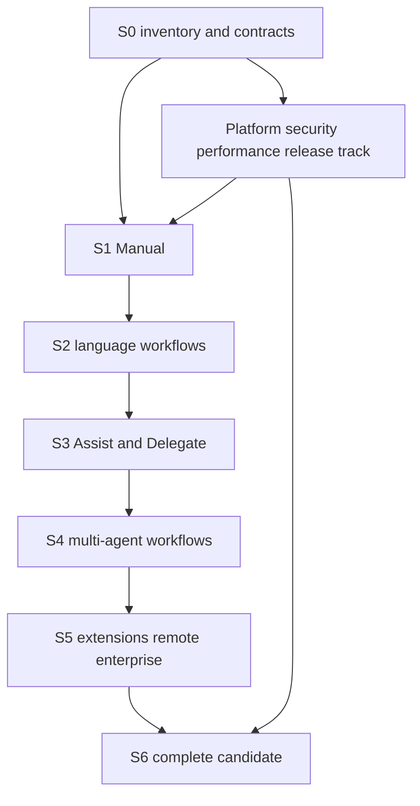

# Legion Full Product Completion Implementation Plan

> **For agentic workers:** REQUIRED SUB-SKILL: Use superpowers:subagent-driven-development (recommended) or superpowers:executing-plans to implement this plan task-by-task. Steps use checkbox (`- [ ]`) syntax for tracking.

**Goal:** Deliver the complete approved Legion vision as working user workflows on Windows, macOS and Linux, including complete Rust, TypeScript/JavaScript and Python development.

**Architecture:** Preserve UI projection, app orchestration, editor/text ownership and proposal-mediated workspace authority. Execute vertical workflows and qualify real effects through ordinary packaged-app controls. This master plan owns scope, dependencies, register interfaces and integration; linked plans own bounded subsystem work.

**Tech Stack:** Existing Rust workspace, eframe/egui, native PTY, real LSP/DAP processes, existing provider/agent/platform services, xtask, serde JSON/TOML and OS-native input/accessibility tooling.

**Spec:** [Approved product completion design](../specs/2026-09-04-product-completion-design.md).

## Global Constraints

- Full existing Legion vision plus missing everyday IDE essentials. Deferred features remain requirements for final completion.
- Complete editing, navigation, refactoring, debugging, and testing for Rust, TypeScript/JavaScript, and Python. Additional languages use the extension system.
- Separate implementation status from product acceptance.
- Direct runtime dispatch, test-only state injection, fabricated verification results, deterministic model replies and display-model assertions cannot close layer 3.
- Current source baseline is `1a9264ebced087192f1ef980609181fcf942ad33`; refresh it before execution. Existing staged planning files are user work and must be preserved.
- Follow current AGENTS.md, dependency policy and ADR authority. The retired surface freeze is not a justification for dropping required features.
- No provider credentials in source or compulsory live provider access for PR gates. Required live release qualification is separate.
- No scheduling, purchasing, publishing, infrastructure mutation, signing-key generation or model download is authorized by writing this plan.
- Local Git identity was unset during planning. Do not invent authorship or change global configuration to commit; retain artifacts until the owner supplies an identity or configuration is established.

---

## 1. Plan set and first execution order

| Document | Responsibility |
| --- | --- |
| [Traceability](2026-09-04-completion-traceability.md) | Every existing kanban task and additional source scope; historical status is not product acceptance |
| [Manual and language completion](2026-09-04-manual-language-completion.md) | Stage 1 and Stage 2: real input, editor/workbench/canvas, terminal/Git, all three language groups |
| [AI and team completion](2026-09-04-ai-team-completion.md) | Stages 3-5: models/context, Assist/Delegate, orchestration, interoperability, extensions, remote, collaboration and enterprise |
| [Production qualification](2026-09-04-production-qualification.md) | XQ-01..08 cross-cutting implementation beginning in Stages 0-1, and S6-01 final qualification |

Read this master plan and the approved spec before a linked plan. Future paths and command names are explicitly marked as new; they are not evidence of implemented tooling. Architecture-sensitive packets produce their bounded interface spec before implementation; they are required work, not feature deferrals. An executor must not fabricate missing API signatures or implement a distributed subsystem from a one-line backlog title.

Start with S0-01 and S0-02. Complete S0-03/04's record validators before using an accepted status. Begin S1 native-input work and cross-platform/procurement preflights as soon as their stated inputs exist. S0-05 records the initial product baseline without pretending unsupported environments were exercised. S0-06 reconciles claims and the dependency schedule.



The arrows govern milestone acceptance. Independent prerequisite work may run early. Within a stage use each linked package's dependencies, not numeric IDs alone. Stage 5 can develop extension or remote contracts alongside earlier stages after relevant authority designs are approved; its product acceptance requires the complete real development journeys.

`XQ-*` is a cross-cutting work track, not an eighth milestone or a synonym for Stage 6. Signing, updates, Manual packaging, crash recovery, accessibility and performance implementation are assigned to that track during Stages 0-5. Their full-candidate reruns feed S6-01. No required implementation is owned solely by final qualification. XQ-07 signing infrastructure can be implemented independently; producing its full artifact set needs XQ-04's helper and XQ-06's Manual packaging implementations. XQ-04/06 product acceptance then consumes those signed artifacts. XQ-02/03 qualify basic Manual behavior during Stage 1 and extend coverage during later stages, so they cannot require whole-Stage-2 acceptance before Stage 1 exits.

## 2. Execution units, ownership and evidence

Each package is a review boundary, not a single enormous code commit. Execute its checkboxes as test/implementation/review increments. If tracing shows code already provides a behavior, do not recreate it: write or run the missing meaningful test and proceed to product acceptance. If native acceptance fails, create a repair task under the same requirement ID and rerun it; do not replace the acceptance with an easier component test.

Model routing follows the supplied policy: Luna for inventory/commands/mechanical updates, Terra for ordinary implementation, Sol for security/persistence/concurrency/distributed/platform integration, and Astra for architecture/dependencies/final acceptance. A Sol reviewer independently reviews consequential changes. Workers never approve their own product completion. Delegate only disjoint ownership; serialize changes to shared app composition, protocol and gate entrypoints.

Inspect committed, modified, staged and untracked work before execution. Use an isolated checkout for product work when other work is present, following the worktree skill; do not move or erase user work. Commit only owned paths after successful validation and configured identity. Keep planning commits distinct from product changes.

### Record interfaces (new, owned by Stage 0)

Create `plans/completion/requirements.json`, `plans/completion/matrix.json`, `plans/completion/scenarios.json`, `plans/completion/decisions.md`, and `plans/completion/dependencies.json` during execution. Candidate nomination writes `plans/completion/candidate.json`. Evidence files live under `plans/evidence/completion/<run-id>/`. The planning traceability Markdown is an input, not a second mutable acceptance database.

All JSON roots carry `schema_version: 1`. Unknown fields are errors for validation. Use stable IDs rather than line-number references for joins.

| Record | Required fields and meaning |
| --- | --- |
| Requirement | `id`, `title`, `kind` (`product`/`internal`), `required`, `source_refs`, `legacy_ids`, `stage`, `package_id`, `owner_role`, `depends_on`, `implementation`, `acceptance`, `scenario_ids`, `configuration_ids`, `protected_product_ids`, `defect_ids` |
| Configuration | `id`, `os`, `architecture`, `tool_versions`, `hardware`, `project_category`, `required`, `owner_approval_ref` |
| Scenario | `id`, `requirement_ids`, `configuration_ids`, `steps`, `external_oracles`, `recovery_cases`, `sensitive_artifact_policy` |
| Evidence run | `id`, `scenario_id`, `configuration_id`, `candidate_sha`, `artifact_sha256`, `layer`, `input_route`, `dependencies`, `result`, `oracle_results`, `recovery_results`, `artifact_hashes`, `defect_ids`, `implementation_owners`, `reviewer`, `review_decision`, `started_at_utc`, `ended_at_utc` |
| Dependency observation | `name`, `version`, `execution` (`real`/`substituted`), `required_for_outcome`, `substitution_reason` |
| Defect | `id`, `requirement_ids`, `scenario_id`, `configuration_id`, `severity`, `invalidates_required_outcome`, `reproduction`, `expected`, `observed`, `owner`, `status`, `repair_package_id`, `verification_run_ids` |
| Package dependency | `package_id`, `requirement_ids`, `milestones`, `external_prerequisites`, `owner_role`, `implementation_stage`, `acceptance_stage`; each milestone has `id`, `depends_on`, and `deliverable_refs` |
| Candidate manifest | `schema_version`, `code_sha`, `artifacts`, `configuration_ids`, `nominated_at_utc`, `nominated_by`; each artifact has `component`, `configuration_id`, `path`, `sha256` and `build_provenance_path` |

`implementation` is `absent|partial|implemented|repair-required`. `acceptance` is `unassessed|blocked|failed|accepted`. `layer` is `component|integrated|product`. `input_route` is `native-input|runtime-dispatch|snapshot-injection|none`. `result` is `passed|failed|blocked|skipped`. Empty evidence and skipped configurations cannot count as passed. A configuration exemption needs a scope decision, never a test skip.

Oracle/recovery results contain `id`, `passed`, `artifact_path`, and `observed`; the ID must match the scenario definition. Artifact hashes map repository-relative evidence paths to SHA-256 strings. Reviewer and implementation owners use stable owner-approved identities, not model names; `review_decision` is `accepted|changes-required`. Defect `severity` is `P0|P1|P2|P3`, and defect `status` is `open|fixed-awaiting-verification|closed`; only verified repairs can close defects. Defects at any severity with `invalidates_required_outcome: true` block release.

Dependency references name a milestone, such as `XQ-04:implemented` or `XQ-07:artifacts-ready`, rather than ambiguously waiting for an entire package to be accepted. Validate cycles on this expanded milestone graph. Required release edges include `XQ-07:artifacts-ready -> [XQ-07:implemented, XQ-04:implemented, XQ-06:implemented]` and `XQ-04:accepted`/`XQ-06:accepted -> [XQ-07:artifacts-ready]`. An `implemented` milestone must have code/test review evidence but cannot count as product acceptance. Every mandatory package also has an `accepted` milestone; optional intermediate milestones must have defined deliverables.

Repository status checks validate register structure while permitting incomplete requirements. `--release` additionally requires every required product/configuration outcome and recovery case to be accepted on the nominated candidate; this distinction keeps development possible without weakening final acceptance.

### Candidate identity and evidence commits

`EvidenceRun.candidate_sha` means the immutable build source commit recorded as `candidate.json.code_sha`, never the later evidence-repository HEAD. Candidate artifacts cover desktop apps, helpers and deployed collaboration/enterprise services; their exact versions and hashes are nominated together. Committing evidence necessarily creates another repository revision and does not invalidate an unchanged binary.

Use this order: commit product code; build and hash the clean nominated source commit; record its candidate manifest; run gates/qualification against that exact source/artifact set; then commit only evidence/register updates referencing the pinned candidate. Never combine a new code change with evidence purporting to certify the resulting unknown commit. Later code changes require a new candidate and affected acceptance reruns. Evidence-only changes preserve candidate identity while retaining their own Git provenance.

Run full source gates in a clean worktree at the pinned code SHA. Run the completion validator against the evidence checkout (which may be a later commit) with that pinned SHA. On PowerShell, obtain the argument from `((Get-Content -Raw plans/completion/candidate.json | ConvertFrom-Json).code_sha)`, not `git rev-parse HEAD` after evidence has been added. Initial candidate nomination can read the clean code checkout's HEAD once, before creating evidence. The validator must reject a manifest/evidence mismatch and must not compare the candidate with the evidence checkout HEAD. Record the verifier revision separately in build provenance.

## 3. Stage 0 executable packages

### S0-01: Account for every requirement and preserve source history

**Owner:** Luna inventory, Astra reconciliation. **Dependencies:** approved design. **Deliverable:** complete source-to-requirement mapping with uncertainty retained.

**Files:** Create `plans/completion/requirements.json`, `plans/completion/decisions.md`; read the planning traceability document, `plans/kanban/legion-ga-backlog.toml`, all sources in spec section 3, and `docs/ui/canvas-workspace-direction.md`.

**Interfaces:** Produces requirement records above with stable `COMP-<family>-<number>` IDs. `legacy_ids` retains all task IDs; a legacy ID may map to multiple distinct outcomes. `source_refs` includes source path and section/task identity. No current code behavior is inferred from a historical title.

- [ ] Parse every kanban task; compare count and distinct IDs against the current file, not a hardcoded historical count.
- [ ] Split each promised user outcome into a requirement; preserve all 42 current feature families and every additional source item. Mark absent source files as unavailable in decisions and identify the accessible replacement/source trail.
- [ ] Classify implementation using current source traces and evidence. Leave acceptance unassessed unless a verified qualifying run exists; `done` is never a default acceptance value.
- [ ] Record conflicts including LSP startup wording, fixture default claims, canvas arrangement versus full direction, release capability claims and stale freeze citations. Each resolution names the source fact and governing decision.
- [ ] Assign each required row to a linked package or explicit new package within a stage. No row is owned solely by Stage 6 qualification.
- [ ] Review the diff against source inventories, validate JSON with `Get-Content -Raw plans/completion/requirements.json | ConvertFrom-Json`, and commit the mapping only after full source coverage is checked.

### S0-02: Pin compatibility, workloads and success thresholds

**Owner:** Astra contracts; Luna facts; Sol reviews platform/security implications. **Dependencies:** S0-01. **Files:** Create `plans/completion/matrix.json`, `plans/completion/scenarios.json`; update `plans/completion/decisions.md`; read current dependency policy, perf evidence and procurement records.

**Interfaces:** Produces stable configuration/scenario IDs in the record schema. Each required row references actual versioned configurations and independent result oracles.

S0-02 also ratifies the candidate-manifest schema above. S0-04 validates nomination and artifact identity; the manifest itself is populated after a clean code commit is selected for the first qualification run. An empty nomination cannot pass release validation.

- [ ] Select and record exact supported OS/architecture/tool versions from live supported releases and actual test environments. Verify official tool/protocol documentation when selecting versions; do not copy obsolete version claims from old plans.
- [ ] Include Rust binaries/libraries/multi-crate workspaces; browser and Node projects for both TS and JS; Python applications/packages with isolated environments. Select real maintainable repositories, build commands, test runners and debug adapters for every category.
- [ ] Include file-size/workspace-size/scrolling/startup/AI-streaming workloads and calibrated budgets on named hardware. Retain any stricter existing authoritative budgets; thresholds must precede qualification results.
- [ ] Enumerate required extension capabilities and representative real extensions; SSH/container configurations; collaboration participant counts/identity roles; supported local and hosted model configurations; interoperability peers and versions.
- [ ] Record failure and recovery oracles before implementation: actual contents/index/process exit/debuggee variables/remote state, not status labels. Live model matrix fixes task corpus, held-out tasks, number of trials and minimum success rates before evaluation.
- [ ] Confirm matrices preserve every approved capability, have finite version boundaries and owner approval. Commit approved matrices; unresolved entries block the dependent packet rather than disappearing.

### S0-03: Reject falsely accepted product rows

**Owner:** Terra implementation, Sol reviewer for acceptance integrity. **Dependencies:** S0-01/02. **Files:** Create `xtask/src/completion.rs`, `xtask/tests/completion.rs`; modify `xtask/src/lib.rs` and `xtask/src/main.rs` at the existing readiness command declarations/dispatch. Existing `serde_json` is sufficient; no new crate is needed.

**New interfaces:** `pub fn validate_completion(root: &std::path::Path, candidate: &str, release: bool) -> Result<Vec<String>, String>` loads the declared register files and evidence; operational failures return `Err`, invariant violations return a nonempty list. `pub fn qualifies_as_product_evidence(layer: &str, input_route: &str, result: &str, required_dependency_substituted: bool) -> bool` is a pure predicate, not the entire verifier.

- [ ] Add `pub mod completion;` and a failing predicate test:

```rust
use xtask::completion::qualifies_as_product_evidence;

#[test]
fn direct_dispatch_and_fake_dependencies_cannot_certify_product() {
    assert!(!qualifies_as_product_evidence("product", "runtime-dispatch", "passed", false));
    assert!(!qualifies_as_product_evidence("product", "native-input", "passed", true));
    assert!(!qualifies_as_product_evidence("product", "native-input", "skipped", false));
    assert!(qualifies_as_product_evidence("product", "native-input", "passed", false));
}
```

- [ ] Run `cargo test -p xtask --test completion direct_dispatch_and_fake_dependencies_cannot_certify_product`; first failure must be the missing behavior, not an unrelated build issue.
- [ ] Implement the predicate exactly as a conjunction of `layer == "product"`, `input_route == "native-input"`, `result == "passed"`, and `!required_dependency_substituted`. This is only an eligibility check: evidence authenticity and coverage remain S0-04.
- [ ] Implement register parsing with `#[serde(deny_unknown_fields)]`, enum-backed fields, duplicate/reference checks, complete legacy/source mapping, no dependency cycles and no missing package ownership. Reject accepted rows without eligible evidence even outside release mode; incomplete unaccepted rows remain legal outside release mode.
- [ ] Add fixture-driven tests for duplicate IDs, missing scenarios, empty configuration coverage, required recovery omitted, out-of-scope evidence, dependency cycles and existing `done` with unassessed acceptance. Test each distinct rejection and a valid incomplete development register.
- [ ] Add identity tests proving that later evidence-only commits do not invalidate the pinned candidate, while a different artifact hash or code SHA does. Candidate identity is read from the nomination manifest and explicit argument, not inferred from the verifier checkout.
- [ ] Add new command `cargo run -p xtask -- verify-completion --candidate <sha>`; add `--release` for the complete required matrix. Exit nonzero for operational errors or violations; print counts by status and never a blended readiness percentage.
- [ ] Run `cargo test -p xtask --test completion`, existing readiness/claim tests, then the new non-release command. Obtain independent diff review and commit owned files.

### S0-04: Bind acceptance to external artifacts and independent review

**Owner:** Sol engineering/review separation. **Dependencies:** S0-03. **Files:** Create `xtask/src/completion_evidence.rs`, `xtask/tests/completion_evidence.rs`; modify `xtask/src/completion.rs` and `xtask/src/lib.rs`; create `plans/evidence/completion/README.md`.

**New interface:** `pub fn validate_evidence_files(root: &std::path::Path, candidate: &str) -> Result<Vec<String>, String>` returns operational errors separately from invalid evidence. Consumed evidence has the schema in section 2. Scenario definitions determine required oracles and recovery checks; evidence cannot define its own easier expectations.

- [ ] Write tests with temporary evidence roots for missing artifact, altered artifact hash, path escape, wrong candidate SHA, substituted required dependency, unrelated scenario/configuration, missing reviewer, failed oracle and skipped recovery. Positive fixture has matching hashes but is test data, never release evidence.
- [ ] Run `cargo test -p xtask --test completion_evidence` and observe the intended failures before implementing checks.
- [ ] Hash declared artifacts with existing SHA-256 support; reject paths outside the evidence root after canonicalization, missing files, hash mismatch, unknown fields and invalid timestamps. Verify artifact/build identities match the selected candidate's manifest rather than trusting copied report labels.
- [ ] For installed binaries/service images outside the evidence directory, store their captured provenance/hash receipts inside the evidence directory and compare the independently observed running identity with the manifest. Do not copy private installations or secrets into the repository merely to satisfy a path rule.
- [ ] Join each oracle/recovery result to required scenario entries. Require named independent reviewer acceptance and explicit attribution of any test substitution. Reject a reviewer equal to the recorded implementation owner; identity authenticity is checked through the owner-reviewed evidence process, not assumed solved by a string comparison.
- [ ] Have native platform runners write real observations using this schema. Runs may fail or block honestly; collector success cannot force scenario success. Negative tests must show a forged passed label with failed external oracle is rejected.
- [ ] Run the tests plus `verify-completion` in development and release modes; development tolerates incomplete rows, release fails until the full candidate qualifies. Review and commit the evidence rules.

### S0-05: Observe the real baseline and turn failures into repair work

**Owner:** Luna collection, Astra interpretation, independent user/reviewer for product runs. **Dependencies:** S0-01/02; record validation after S0-03/04. **Files:** Create `plans/evidence/completion/baseline/` records and `plans/completion/defects.json`; update requirements and scenarios.

- [ ] Build/launch the normal desktop executable against disposable copies of selected real projects; record build hash, OS and tools. Never use `--beta-smoke` or direct dispatch as user-input proof.
- [ ] Attempt setup/open/edit/save/search/Git/terminal plus each language and AI journey available on the host. Inspect actual effects externally. Record unavailable platforms/services as blocked, with prerequisites and an owner.
- [ ] Record each failure with reproducible native input, expected/actual outcome and affected requirements. Separate missing implementation, broken wiring, poor discoverability, environmental limitation and missing evidence.
- [ ] Re-run narrowly after a suspected environmental correction; do not mark product code broken solely because an adapter is absent, or functional solely because a fixture passes.
- [ ] Add repair and acceptance tasks to the owning linked package; keep unmapped discoveries failing the register gate.
- [ ] Validate records and review baseline findings. Stage 0 exit requires every requirement accounted for and assigned, not a fictional full product pass.

### S0-06: Reconcile governing documents and freeze execution dependencies

**Owner:** Terra documentation/gates, Astra final reconciliation. **Dependencies:** S0-01..05. **Files:** Modify `docs/INDEX.md`, `docs/USER_GUIDE.md`, `plans/legion-production-roadmap-v1.0.md`, `plans/product-readiness-ledger.md`, `plans/kanban/legion-ga-backlog.toml` only where evidence supports corrections; create `plans/completion/dependencies.json`; extend `xtask/src/readiness_consistency.rs` when new consistency rules require it.

- [ ] Make the completion register authoritative for this program's acceptance, keeping historical milestone records intact. Existing plans link to it rather than copying mutable status.
- [ ] Resolve contradictory current-user instructions against observed behavior and the approved intended behavior. Where behavior needs changing, schedule the code repair before documenting it as present.
- [ ] Assign packages dependencies and acceptance configurations. Start signing/host/provider/accessibility prerequisites immediately with explicit owner actions and no unsupported purchase assumptions.
- [ ] Review the entire graph for cycles and missing final outcomes. Security, privacy, accessibility, performance and platform tests accompany each affected package, not only Stage 6.
- [ ] Run `cargo run -p xtask -- docs-hygiene`, `claim-audit`, `verify-kanban-backlog`, `verify-readiness-consistency`, and the new development `verify-completion` command. Document evidence provenance rather than promoting rows to satisfy the gates.
- [ ] Commit reconciled records after review. Start the first Manual/native-input repair packet with known entry/exit conditions.

## 4. Integration and final acceptance

Each code package runs its targeted red/green tests and all required standing phase gates before declaring code complete. Use serial Cargo execution when Windows artifact races occur; it does not waive tests. For the existing 21 gates, consult current AGENTS.md; do not snapshot a shorter list here. Native product evidence remains independently required.

Do not equate `#[ignore]` with never executed: the existing `rust-analyzer-smoke` xtask deliberately runs ignored real-server tests. Its result proves the specified real-server workflow, not native editor input or complete language UX. Apply the same precise evidence accounting to all existing suites.

Before a stage exit, all required stage rows must pass applicable product scenarios on the supported stage configurations, with no blocking defect; all previously accepted journeys regress successfully. Final exit uses the entire matrix on the release candidate, ten working days of owner dogfood, two independent uncoached users, and no unresolved defect invalidating a required outcome. Repeat stability observation under the approved spec's rules after qualifying failures.

The final S6 release decision is an output of validation, not evidence that must already claim success before validation runs. Dogfood, independent-user, install/service and other required scenario records are inputs. The verifier must not require its own not-yet-produced final verdict as an accepted prerequisite or use that verdict as proof of its inputs.

All mandatory internal requirements need negative/safety evidence and links to protected product outcomes. They cannot inflate a count of usable features. Training/telemetry, full canvas direction, extension APIs, remote and enterprise remain required even where historical cards were marked done or deferred.

## 5. Program risks and first useful outcome

The first useful outcome is a native-input development loop whose editing/save/Git/terminal effects are independently checked, paired with a register that cannot certify the old fixture shortcuts. The end outcome is the full approved matrix, not merely that initial loop.

Long-lead owner actions include supported host access, real-model resources, signing credentials, feed hosting, identity/remote environments, independent users and external audit. Read current procurement records first; existing Apple membership and Mac hardware do not mean issued signing certificates or clean-machine evidence. Do not force a specific hosted model vendor or copy old prices as current facts.

This plan authorizes no product implementation by its existence. After handoff, execute the linked plans package-by-package using the selected execution skill and the supplied multi-model policy. Preserve the full inventory when refining subsystem designs; report blocked work explicitly rather than declaring an incomplete product complete.
