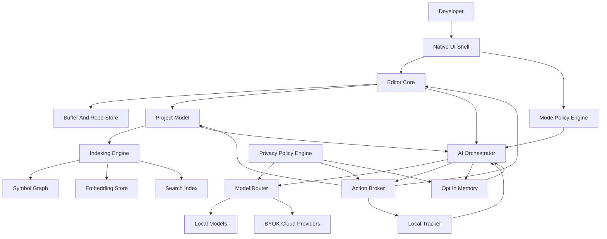
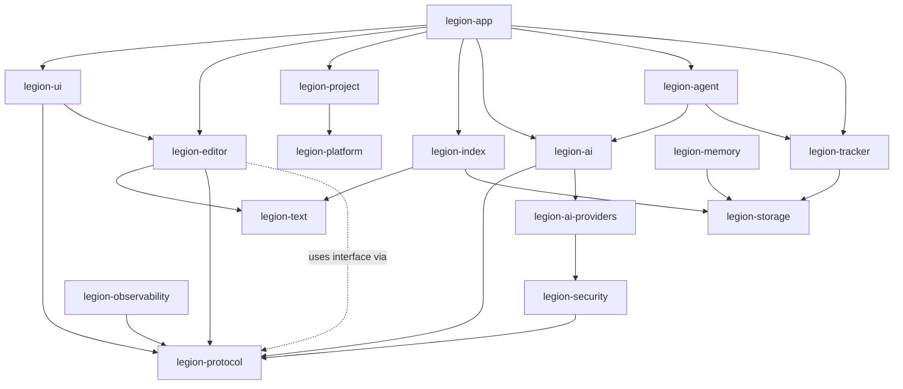
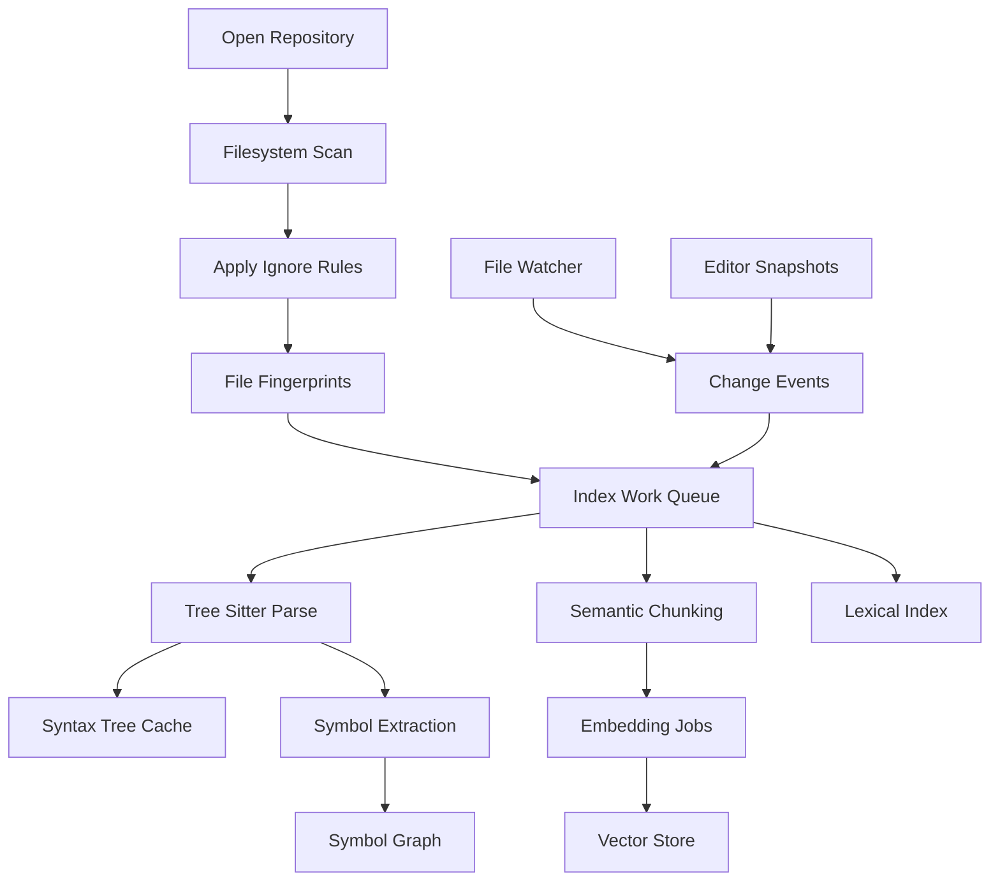
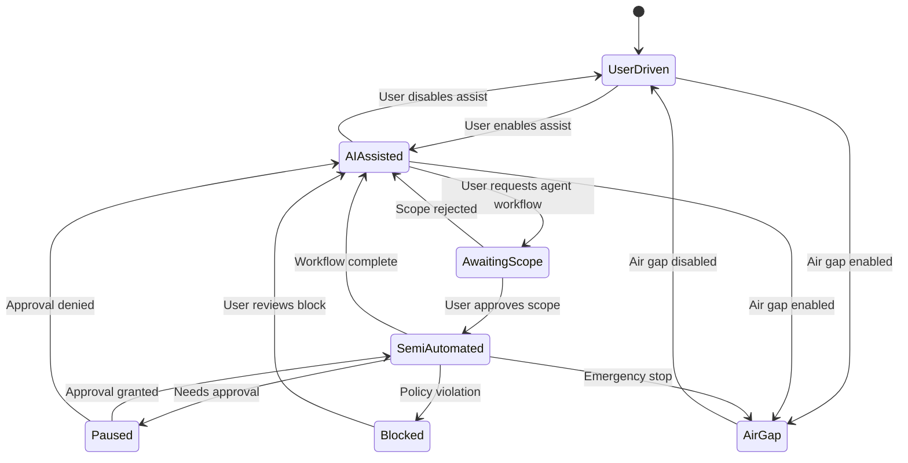
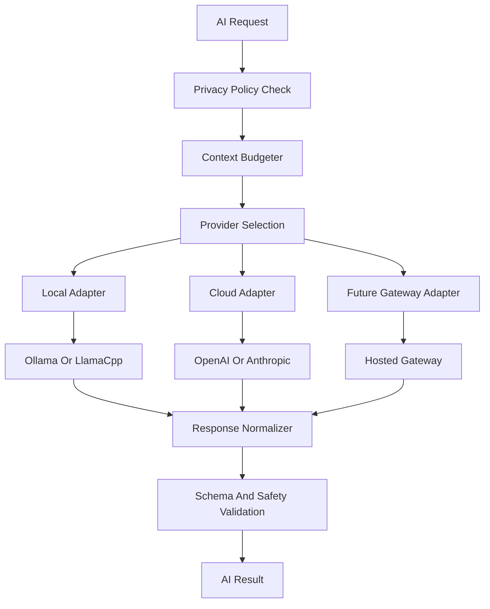

# Legion IDE Architecture Charter v0.1

Status: Draft for founding engineering review  
Audience: Founding engineering team, product leadership, design leadership, security lead  
Scope: Architectural charter for a proprietary, cross-platform, Rust-first IDE with deeply integrated AI agency  
Repository baseline: Initial Rust binary crate, edition 2024, no dependencies yet

---

## 0. Executive Position

Legion IDE is an IDE-first AI development environment: a native, high-performance editor where AI is not a sidebar, chatbot, or extension, but a first-class execution layer embedded into editor state, repository knowledge, task state, user intent, and controlled automation. The product must feel like a serious systems tool: fast under load, predictable under AI intervention, privacy-preserving by default, and engineered around user agency.

The architectural center of gravity is a Rust workspace composed of deterministic core services, asynchronous actor-style subsystems, and a latency-critical UI/editor shell. AI is integrated through a provider-agnostic orchestration layer that can route requests to local models, user-supplied cloud keys, or a future hosted gateway without contaminating the core editor model with provider-specific assumptions.

This charter establishes the first set of non-negotiable principles, subsystem boundaries, crate layout, UI direction, indexing architecture, mode system, security posture, risks, validation gates, and initial Architecture Decision Records.

---

## 1. Product-Level Architectural Principles

### 1.1 Latency Is a Feature

The IDE must optimize perceived and measured latency as a product requirement, not a performance polish item.

- Target sub-16ms frame budgets for normal editing interactions.
- Keep text input, cursor motion, selection, viewport scrolling, and completion popup rendering on latency-critical paths.
- Never allow indexing, embeddings, long-running AI inference, network calls, or task orchestration to block the editor core or UI thread.
- Prefer bounded queues, backpressure, cancellation, and degradation over uncontrolled background work.
- Define latency budgets per subsystem before implementation begins.

### 1.2 Local-First Privacy

The default architecture must assume private source code and private user intent.

- Repository content, task metadata, embeddings, and memory remain local unless the user explicitly opts into external transmission.
- Cloud requests must be inspectable and attributable.
- Air-gap mode must be a first-class runtime mode, not a marketing checkbox.
- Hosted services are roadmap accelerators, not architectural prerequisites.

### 1.3 Deterministic AI Interactions

AI must operate through explicit, auditable boundaries.

- AI actions must be represented as proposed operations against editor, file, task, and shell capabilities.
- User-visible state transitions must be deterministic even when model output is probabilistic.
- Every semi-automated action must have an origin, prompt context summary, model/provider identity, affected resources, and resulting diff or command record.
- AI autonomy must be mode-gated and capability-scoped.

### 1.4 User Agency Over AI Agency

The user controls the level of autonomy.

- AI can suggest, draft, plan, execute, or coordinate only within the active mode policy.
- Escalation from suggestion to mutation requires an explicit policy transition.
- The product must make it obvious when the AI is observing, reasoning, proposing, mutating, or blocked.

### 1.5 Native Core, Optional Bridges

The product should be pure Rust wherever feasible.

- Core editor, indexing, orchestration, tracker, memory, protocol, persistence, and platform abstractions should be Rust crates.
- Non-Rust dependencies require explicit ADR approval and must not own strategic product surface area.
- Web or hybrid UI may be used only if benchmarked latency, native integration, and long-term control justify it.

### 1.6 Clean-Slate Ecosystem

Legion IDE is not a VS Code fork and does not support VS Code extensions.

- Extension compatibility is not a V1 or V2 goal.
- Native plugin and automation APIs should be designed for determinism, security policy enforcement, and Rust-first performance.
- Language support should be built on native protocols and indexed repository intelligence, not extension marketplace inheritance.

### 1.7 Observable and Replayable Internal State

The IDE should be debuggable by its own engineers.

- Subsystems should expose structured traces, metrics, and causal event logs.
- AI plans, task mutations, index updates, and file edits should be replayable enough for bug reproduction.
- Architecture must support trace sampling without leaking source code by default.

### 1.8 Concurrency With Explicit Ownership

Rust safety is only useful if the architecture avoids shared mutable ambiguity.

- Use actor-style ownership for long-running subsystems.
- Cross-subsystem communication should use typed messages, versioned events, and bounded channels.
- Store canonical state in a small number of authoritative services; consume projections elsewhere.
- Cancellation, shutdown, and crash recovery are architectural requirements.

---

## 2. Major Subsystem Boundaries

### 2.1 Conceptual Flow



### 2.2 Boundary Definitions

#### UI Shell

Responsibilities:
- Render editor, panels, command palette, AI interaction surfaces, task tracker, diagnostics, and index status.
- Handle input, focus, viewport, animations, and display synchronization.
- Delegate semantic editing operations to Editor Core rather than owning text state.

Non-responsibilities:
- No model provider logic.
- No canonical project index ownership.
- No direct filesystem mutation bypassing Editor Core or Action Broker.

#### Editor Core

Responsibilities:
- Own buffers, selections, cursors, undo/redo, transaction logs, text snapshots, and file edit application.
- Provide deterministic APIs for edits, diagnostics overlays, completion application, code action previews, and diff views.
- Expose immutable snapshots to indexing and AI subsystems.

Non-responsibilities:
- No AI provider calls.
- No long-term memory policy.
- No UI rendering decisions beyond semantic layout data.

#### AI Orchestrator

Responsibilities:
- Convert user intent, editor state, task state, and repository context into model requests and tool plans.
- Enforce mode policy, capability boundaries, prompt context budgets, and action approvals.
- Manage multi-agent workflows as explicit state machines.

Non-responsibilities:
- No direct rendering.
- No direct filesystem writes.
- No provider-specific client logic outside provider adapters.

#### Indexing Engine

Responsibilities:
- Maintain repository file graph, tree-sitter syntax trees, symbol graph, lexical search, semantic chunks, and embeddings.
- Perform incremental updates based on file watcher and editor snapshot events.
- Provide query APIs optimized for completion, navigation, refactoring, and AI context retrieval.

Non-responsibilities:
- No model chat orchestration.
- No task management ownership.
- No UI state.

#### Local Tracker

Responsibilities:
- Store tasks, plans, decisions, linked files, linked diffs, AI run metadata, and user approvals locally.
- Provide structured project memory that is distinct from opt-in long-term personal memory.
- Serve as the canonical local workflow state for semi-automated agents.

Non-responsibilities:
- No generalized cloud sync in V1.
- No hidden transmission to model providers.

---

## 3. Proposed Rust Workspace and Crate Layout

The initial repository should evolve from a single binary crate into a multi-crate Cargo workspace that separates latency-sensitive core logic, platform integration, AI protocols, and UI shell.

### 3.1 Workspace Skeleton

```toml
[workspace]
resolver = "3"
members = [
    "crates/legion-app",
    "crates/legion-ui",
    "crates/legion-editor",
    "crates/legion-text",
    "crates/legion-project",
    "crates/legion-index",
    "crates/legion-ai",
    "crates/legion-ai-providers",
    "crates/legion-agent",
    "crates/legion-tracker",
    "crates/legion-memory",
    "crates/legion-security",
    "crates/legion-platform",
    "crates/legion-protocol",
    "crates/legion-storage",
    "crates/legion-observability",
    "crates/legion-cli"
]

[workspace.package]
edition = "2024"
license = "Proprietary"
publish = false

[workspace.dependencies]
anyhow = "1"
thiserror = "2"
tokio = { version = "1", features = ["rt-multi-thread", "sync", "time", "macros"] }
tracing = "0.1"
serde = { version = "1", features = ["derive"] }
serde_json = "1"
uuid = { version = "1", features = ["v7", "serde"] }
```

### 3.2 Crate Responsibilities

| Crate | Responsibility | Critical traits |
|---|---|---|
| `legion-app` | Main desktop binary, startup, dependency wiring, workspace lifecycle | Thin composition root |
| `legion-ui` | UI shell, rendering adapters, input translation, panels | Latency critical |
| `legion-editor` | Buffers, transactions, undo/redo, diagnostics, editor commands | Deterministic core |
| `legion-text` | Rope, spans, ranges, UTF indexing, edits, snapshots | Allocation disciplined |
| `legion-project` | Workspace model, file tree, file watcher, project config | Cross-platform stable |
| `legion-index` | Tree-sitter parsing, symbol graph, lexical and vector indexes | Highly concurrent |
| `legion-ai` | Prompt assembly, context selection, model request abstraction | Provider agnostic |
| `legion-ai-providers` | Ollama, llama.cpp, OpenAI, Anthropic, future gateway adapters | Replaceable adapters |
| `legion-agent` | Plans, tool-use state machines, capability-scoped agent workflows | Auditable automation |
| `legion-tracker` | Local tasks, plans, links, approvals, run records | Local durable state |
| `legion-memory` | Opt-in long-term memory, embedding references, retention policies | Consent enforced |
| `legion-security` | Policy engine, air-gap mode, exfiltration checks, secrets boundaries | Mandatory gatekeeper |
| `legion-platform` | OS abstractions, keychain, filesystem, processes, window integration | Platform-specific internals |
| `legion-protocol` | Shared DTOs, event schemas, action schemas, versioning | Stable contracts |
| `legion-storage` | SQLite, sled, Tantivy, vector store wrappers, migrations | Data durability |
| `legion-observability` | Tracing, metrics, event log, performance counters | Low overhead |
| `legion-cli` | Diagnostics, index commands, repair tools, headless tests | Developer tooling |

### 3.3 Dependency Direction



Rules:
- `legion-ui` may depend on semantic core crates but core crates must not depend on UI.
- `legion-editor`, `legion-index`, `legion-tracker`, and `legion-ai` communicate through protocol types and service traits.
- Provider crates must be behind capability and privacy checks.
- Storage implementation details must not leak into feature crates.

---

## 4. UI and Editor Stack Evaluation

The UI decision is strategic. Legion IDE cannot redefine AI-native development if the editor surface feels slower, less native, or less controllable than incumbent tools.

### 4.1 Evaluation Criteria

- Sustained sub-16ms frame times under editor workloads.
- Low input latency for typing, navigation, completion, and inline AI edits.
- Deep control over text rendering, GPU composition, input method editors, accessibility, and platform menus.
- Rust-first integration with async core services.
- Ability to build custom editor primitives rather than force-fit web document models.
- Cross-platform maturity across Windows, macOS, and Linux.
- Team hiring feasibility and long-term maintenance burden.

### 4.2 Option A: GPUI-Style Rust-Native GPU UI

Description: Rust-native GPU-accelerated UI architecture inspired by Zed's GPUI approach, emphasizing retained application state with direct rendering control.

Strengths:
- Best alignment with high-performance native editor thesis.
- Direct Rust integration and fewer impedance mismatches between core state and UI state.
- Better path to custom editor surfaces, inline AI controls, high-frequency updates, and low-latency input.
- Avoids browser engine memory overhead and web layout unpredictability.

Weaknesses:
- Ecosystem maturity and documentation risk.
- Accessibility, IME, native menus, and platform edge cases may require significant internal investment.
- Hiring pool is smaller than web UI.

Best use:
- Strategic product shell if spikes validate input latency, text shaping, accessibility roadmap, and cross-platform stability.

### 4.3 Option B: Slint Rust-Native Declarative UI

Description: Rust-friendly declarative UI toolkit with native rendering ambitions and commercial support options.

Strengths:
- More productized toolkit than many experimental Rust UI libraries.
- Strong for structured panels, forms, settings, dialogs, and predictable component hierarchies.
- Commercial backing may reduce adoption risk.

Weaknesses:
- Editor-grade text surface may still require custom integration.
- Declarative UI model may constrain highly specialized editor rendering and AI overlays.
- Need benchmark proof for large document editing and rapid inline composition.

Best use:
- Candidate for peripheral UI or full shell only if editor surface integration meets latency and customization needs.

### 4.4 Option C: Tauri or WRY Hybrid Shell

Description: Native Rust backend with WebView-based UI shell.

Strengths:
- Fast iteration for product surfaces.
- Larger hiring pool for UI engineers.
- Mature web layout, accessibility, devtools, and component ecosystem.
- Strong for settings, marketplace, onboarding, account flows, and documentation panels.

Weaknesses:
- Browser engine memory overhead and latency variance are misaligned with a premium native editor thesis.
- Editor core and UI state may bifurcate across Rust and JavaScript boundaries.
- Harder to guarantee deterministic sub-16ms behavior under heavy AI/indexing UI updates.
- Risk of recreating VS Code-style web architecture despite clean-slate requirements.

Best use:
- Secondary surfaces or a contingency UI path; not recommended for the primary editor if Rust-native spikes succeed.

### 4.5 Definitive Recommendation

Recommendation: Build a Rust-native GPU UI/editor shell using a GPUI-style architecture as the primary path, with Slint evaluated as a fallback for non-editor panels and Tauri/WRY reserved for non-core auxiliary surfaces only.

Rationale:
- Legion IDE's thesis depends on native responsiveness, not merely native packaging.
- The editor and AI interaction layer require custom rendering, precise state synchronization, and predictable latency.
- A browser-based shell would accelerate early UI delivery but risks locking the product into a performance and architecture ceiling that contradicts the brand promise.

Validation condition:
- This recommendation is provisional until the UI spike demonstrates reliable text input, viewport scrolling, glyph shaping, completion popup rendering, inline AI diff rendering, and command palette interactions within the latency targets on all three target platforms.

---

## 5. First Vertical Slice

The first vertical slice must prove the architectural thesis, not merely display a window.

### 5.1 MVP Scenario

Open a Rust repository, edit a file, index the repository incrementally, ask a local or BYOK model for a code change, receive a structured patch proposal, link the work to a local tracker task, apply the patch with undo support, and inspect what context was sent to the model.

### 5.2 Required Capabilities

1. Desktop app launches natively on one primary development platform, with portability scaffolding for the other two.
2. File tree opens a local repository.
3. Editor opens and edits UTF-8 Rust source files using a real text buffer and undo/redo transaction model.
4. Tree-sitter Rust parsing produces syntax tree updates after edits.
5. Symbol extraction identifies functions, structs, enums, impl blocks, imports, and module boundaries.
6. Lexical search supports file and symbol lookup.
7. Embedding pipeline chunks source files and stores vectors incrementally using a local embedding provider.
8. Local tracker creates a task and links it to selected files and AI interaction records.
9. AI Orchestrator retrieves relevant context from editor selection, symbol graph, task, and vector search.
10. Provider router sends request to local Ollama or BYOK OpenAI-compatible endpoint.
11. AI response is transformed into a proposed patch, never directly applied.
12. User approves patch; Editor Core applies it as a reversible transaction.
13. Privacy inspector shows provider, files, snippets, task metadata, and memory items included in the request.

### 5.3 Success Criteria

- Typing remains responsive while indexing and embeddings are active.
- AI context retrieval is explainable and bounded.
- Patch application is deterministic and undoable.
- Tracker contains durable records linking user task, AI run, selected context, patch proposal, and applied edit.
- Air-gap mode can disable all network providers while preserving local model support.

---

## 6. Repo Onboarding and Indexing Architecture

### 6.1 Pipeline Overview



### 6.2 Onboarding Stages

Stage 1: Repository Discovery
- Discover root, VCS metadata, ignore rules, file count, language mix, large-file exclusions, binary files, generated directories, and workspace manifests.
- Create a project identity and persistent index namespace.
- Record trust level for the repository before enabling execution or agent actions.

Stage 2: Fast Shallow Index
- Build file tree, filename index, extension distribution, and basic text search metadata.
- UI should become useful quickly without waiting for deep semantic indexing.

Stage 3: Syntax and Symbol Index
- Parse source files with tree-sitter workers.
- Extract symbols into a normalized graph: definition, reference, import/export, module, trait, impl, call, type relation where practical.
- Store parse artifacts using content fingerprints to avoid unnecessary reparsing.

Stage 4: Semantic Chunking and Embeddings
- Chunk code by syntax-aware boundaries, not arbitrary token windows.
- Prefer symbol-level chunks for functions, methods, types, modules, tests, docs, and configuration blocks.
- Embed only changed chunks based on content hash.
- Store vector records with provenance: file path, byte range, symbol id, language, model id, embedding dimensionality, created timestamp, and privacy policy scope.

Stage 5: Query Serving
- Serve editor features and AI retrieval from layered indexes:
  - Fast path: open buffer snapshot and symbol graph.
  - Medium path: lexical and structural search.
  - Deep path: vector retrieval and reranking.

### 6.3 Concurrency Model

- Use a coordinator actor for each repository index.
- Use bounded worker pools for parsing and embedding.
- Give editor-originated indexing updates higher priority than background repository scans.
- Use cancellation tokens for obsolete work when a file changes again.
- Use immutable text snapshots for parse jobs to avoid locking live buffers.
- Apply backpressure to embedding generation before memory or CPU pressure affects editing.

### 6.4 Storage Strategy

Recommended local storage layers:
- SQLite for tracker state, metadata, migrations, provider configuration references, and durable event records.
- Tantivy or equivalent Rust-native inverted index for lexical search.
- LanceDB, Qdrant embedded mode, sqlite-vec, or an internal HNSW implementation for vector search, selected through a spike.
- Content-addressed blob/cache directory for parse artifacts and chunk payloads.

### 6.5 Index Invalidations

Invalidation should be content-hash based rather than timestamp based.

- File content hash changes invalidate lexical, syntax, symbol, and chunk records for affected ranges.
- Parser grammar version changes invalidate syntax-derived records for that language.
- Embedding model changes invalidate embedding vectors for affected index namespace.
- Privacy scope changes may tombstone or quarantine memory-linked vector records.

---

## 7. Mode System Architecture

### 7.1 Modes

#### User-Driven Mode

AI role:
- Passive completions, documentation lookup, inline explanations, and suggestions.

Allowed actions:
- Read current selection and explicit user-provided context.
- Propose completions and explanations.
- No file mutation without direct user edit gesture.

#### AI-Assisted Mode

AI role:
- Interactive collaborator that can propose structured changes.

Allowed actions:
- Retrieve bounded repository context.
- Generate patch proposals.
- Create or update tracker suggestions.
- Request permission for commands or file edits.
- Apply edits only after explicit approval.

#### Semi-Automated Agent Mode

AI role:
- Capability-scoped workflow executor under user-approved task boundaries.

Allowed actions:
- Maintain a plan.
- Query repository indexes.
- Propose and apply approved classes of edits if policy permits.
- Run allowed commands in sandboxed or approved contexts.
- Update tracker records.
- Stop on policy violation, test failure threshold, ambiguous intent, or sensitive data boundary.

### 7.2 State Machine



### 7.3 Policy Dimensions

Mode policy should be represented as data, not scattered conditionals.

Policy dimensions:
- Context access: current file, open buffers, selected files, repository index, tracker, memory.
- Mutation access: editor patch, file create/delete, task update, settings update.
- Execution access: none, read-only commands, test commands, build commands, arbitrary commands.
- Network access: none, local loopback, BYOK providers, hosted gateway.
- Approval model: per suggestion, per patch, per file, per command, per task scope.
- Memory access: disabled, session-only, project memory, long-term memory.

### 7.4 Mode Enforcement

All AI actions must pass through the Action Broker and Privacy Policy Engine.

The AI Orchestrator is not trusted to self-police. It requests capabilities; policy grants, denies, redacts, or requires approval.

---

## 8. Built-in Tracker Architecture

### 8.1 Purpose

The tracker is the local project operating system for user intent and AI collaboration. It is not a generic issue tracker clone. It links work, context, decisions, code changes, prompts, model responses, approvals, and outcomes inside the IDE.

### 8.2 Core Domain Model

- Task: unit of user intent with title, description, status, priority, tags, linked files, linked symbols, and active mode.
- Plan: ordered steps associated with a task, created by user or AI, with approval status.
- Work Session: temporal grouping of edits, AI runs, commands, and decisions.
- AI Run: provider, model, prompt context summary, retrieved context ids, output ids, proposed actions, policy decisions.
- Decision: user or AI-authored note with rationale and linked artifacts.
- Code Link: file path, range, symbol id, commit hash if available, buffer snapshot id.
- Change Link: patch id, applied transaction id, diff summary, undo id.
- Approval: actor, scope, timestamp, policy, expiration, and revocation state.

### 8.3 Storage and Privacy

- Store tracker data in local SQLite by repository namespace.
- Encrypt secrets separately using platform keychain; do not store provider keys in tracker rows.
- Keep prompt and response bodies subject to retention settings.
- Store compact context manifests even when full prompt retention is disabled.

### 8.4 Integration Points

- Editor Core emits transaction events that can be linked to active task sessions.
- AI Orchestrator reads active task context and writes AI run records.
- Indexing Engine links tasks to symbols and files.
- Privacy Inspector reads tracker manifests to show what happened.
- Future hosted sync must treat tracker state as user-owned data requiring explicit opt-in.

---

## 9. AI Provider and Router Architecture

### 9.1 Provider-Agnostic Interface

The AI layer should expose stable internal capabilities rather than provider-specific APIs.

Core capabilities:
- Chat completion.
- Structured output.
- Embeddings.
- Reranking.
- Tool planning.
- Streaming tokens.
- Context window introspection.
- Model metadata and cost metadata.

### 9.2 Router Flow



### 9.3 Provider Adapters

Initial adapters:
- Ollama local chat and embeddings.
- llama.cpp server-compatible local endpoint.
- OpenAI-compatible chat and embeddings for BYOK.
- Anthropic BYOK chat for high-quality reasoning.

Adapter rules:
- No provider adapter may read files directly.
- No adapter may bypass Privacy Policy Engine.
- Provider-specific response formats must normalize into internal response events.
- Streaming must support cancellation and partial response cleanup.
- Rate limits, retries, and circuit breakers must be per provider profile.

### 9.4 Context Budgeting

Context selection should be explicit and inspectable.

Priority order:
1. User-selected text and current cursor context.
2. Active task and plan.
3. Open buffer neighborhood.
4. Direct symbol dependencies.
5. Lexical matches.
6. Vector search results.
7. Opt-in memory items.

Every item included in context should produce a context manifest entry.

### 9.5 Hosted Gateway Roadmap

A hosted gateway may add team policy management, caching, billing aggregation, hosted embeddings, and enterprise audit logs. It must not be required for core product functionality.

---

## 10. Memory Opt-in Architecture

### 10.1 Memory Types

Session Memory:
- Temporary context for the current IDE session.
- Cleared automatically unless promoted.

Project Memory:
- Repository-scoped, local, task-linked facts and decisions.
- Enabled by default only for non-sensitive local tracker artifacts.

Long-Term Memory:
- Cross-project user memory containing preferences, conventions, recurring decisions, and user-approved summaries.
- Strictly opt-in.

### 10.2 Consent Model

Long-term memory requires explicit enablement and clear UX.

Required controls:
- Enable or disable globally.
- Enable or disable per repository.
- Review pending memory candidates before storage.
- Delete individual memory entries.
- Delete by project, tag, time range, or provider scope.
- Export memory manifest.
- Disable memory access for a given AI run.

### 10.3 Storage Model

Memory records:
- Stable id.
- Type: preference, fact, decision, convention, workflow, tool usage, project summary.
- Text summary.
- Embedding vector id.
- Source references.
- Consent source.
- Retention policy.
- Sensitivity label.
- Last accessed timestamp.
- Tombstone marker.

Embeddings must be generated locally by default for memory. Cloud embedding generation for memory requires separate explicit consent because it can transmit derived semantic content.

### 10.4 Retrieval Rules

- Memory is never implicitly included in cloud model prompts unless policy permits it.
- Sensitive memory records are excluded by default from cloud calls.
- Retrieval must be explainable in the Privacy Inspector.
- Memory recall should be bounded, ranked, and deduplicated against current project context.

---

## 11. Security and Privacy Boundaries

### 11.1 Air-Gap Mode

Air-gap mode is a runtime-enforced policy profile.

Behavior:
- Disable all outbound network calls except explicitly allowed local loopback for local model endpoints.
- Disable hosted telemetry, update checks, cloud model providers, hosted embeddings, and remote gateway calls.
- Mark UI with persistent air-gap status.
- Prevent agent workflows from invoking network-capable commands unless separately sandboxed and approved.
- Continue to support local indexing, local tracker, local models, and local memory.

### 11.2 Data Exfiltration Protections

- Centralize all model requests through the router and policy engine.
- Maintain a context manifest for every external request.
- Require user-visible provider identity before BYOK cloud calls.
- Redact configured secret patterns before prompt assembly.
- Block transmission of files marked sensitive unless user approves.
- Provide repository-level allowlists and denylists for cloud context.
- Detect high-risk paths such as secrets, environment files, credentials, private keys, and generated artifacts.

### 11.3 Secrets Management

- Store provider credentials in OS keychain facilities through platform abstractions.
- Never include secrets in logs, tracker records, memory, traces, or prompts.
- Use explicit secret wrapper types with redacted debug implementations.

### 11.4 Agent Execution Security

- Commands are capabilities, not strings to blindly execute.
- Semi-automated workflows require command class policies.
- Shell execution should support dry-run, preview, environment filtering, working directory restrictions, timeout, output capture limits, and cancellation.
- Dangerous command patterns should require escalation or be blocked.

### 11.5 Plugin and Extension Security

V1 should avoid arbitrary third-party extension execution. Future plugin design must use sandboxed capability APIs rather than Node-style unrestricted host access.

---

## 12. Risk Register

| Risk | Impact | Mitigation |
|---|---|---|
| Rust-native UI maturity is insufficient for production editor UX | Product cannot meet native responsiveness or platform expectations | Run UI spike before full UI hiring; isolate editor rendering primitives; maintain Slint and hybrid fallback strategy |
| Indexing and embeddings degrade editor responsiveness on large repositories | Core value proposition fails under real workloads | Use bounded worker pools, priority scheduling, snapshot-based parsing, cancellation, resource budgets, and large-repo benchmarks |
| AI orchestration becomes nondeterministic and hard to trust | Users reject semi-automated workflows | Represent actions as typed proposals, enforce policy outside the model, record context manifests, and build replayable run logs |
| Cross-platform platform integration consumes disproportionate engineering capacity | Delivery slows and quality fragments by OS | Centralize OS code in platform crate; define platform support matrix; validate file watching, keychain, IME, rendering, and process control early |
| Local-first storage and memory create privacy or corruption liabilities | Loss of trust, data loss, or compliance exposure | Use migrations, encryption for secrets, retention controls, backup/export, crash recovery tests, and explicit memory consent boundaries |

---

## 13. Required Architecture Spikes

### Spike 1: Native UI Editor Latency

Validate GPUI-style native rendering for text editing.

Required proof:
- Open and scroll large Rust file.
- Type continuously while syntax highlighting and completion overlay update.
- Render inline AI diff decorations.
- Measure frame time, input latency, memory use, IME behavior, and accessibility feasibility.

### Spike 2: Incremental Indexing Under Edit Load

Validate tree-sitter incremental parsing and symbol extraction while user edits.

Required proof:
- Parse and index a large Rust repository.
- Update syntax and symbols from live buffer snapshots.
- Cancel obsolete parse jobs.
- Keep editor interactions responsive during background work.

### Spike 3: Embedding Store Selection

Compare embedded vector storage candidates.

Required proof:
- Incremental embedding insertion.
- Deletion and invalidation by content hash.
- Query latency under realistic chunk counts.
- Metadata filtering by repository, language, file path, symbol type, and privacy scope.

### Spike 4: AI Action Broker and Patch Application

Validate structured AI output to deterministic editor transaction.

Required proof:
- Generate patch proposals from local and cloud models.
- Validate schema.
- Preview diff.
- Apply through Editor Core.
- Undo cleanly.
- Record tracker linkage.

### Spike 5: Air-Gap Enforcement

Validate policy-enforced network isolation.

Required proof:
- Disable cloud providers and telemetry.
- Permit local model loopback only when configured.
- Verify router and agent cannot bypass policy.
- Produce visible request denial records.

### Spike 6: Tracker Persistence and Replay

Validate local task, AI run, approval, and edit linkage.

Required proof:
- Create task.
- Link files and symbols.
- Record AI run context manifest.
- Apply patch.
- Reload IDE and reconstruct workflow history.

---

## 14. Initial ADR List

1. ADR-0001: Adopt Rust 2024 multi-crate workspace and proprietary distribution model.
2. ADR-0002: Select primary UI/editor rendering architecture.
3. ADR-0003: Define Editor Core text buffer, rope, transaction, and snapshot model.
4. ADR-0004: Select async runtime and subsystem actor model.
5. ADR-0005: Select local metadata, lexical index, and vector store backends.
6. ADR-0006: Define AI provider abstraction and BYOK credential boundaries.
7. ADR-0007: Define mode policy engine and Action Broker capability model.
8. ADR-0008: Define local tracker schema and event retention policy.
9. ADR-0009: Define memory consent, storage, retention, and retrieval policy.
10. ADR-0010: Define air-gap mode and outbound network enforcement model.

---

## 15. Explicit Non-Goals

### V1 Non-Goals

- No VS Code fork.
- No VS Code extension compatibility.
- No generalized third-party plugin marketplace.
- No cloud account requirement for core product usage.
- No hosted gateway dependency.
- No silent repository upload or hidden background prompt transmission.
- No autonomous agent mode with unrestricted filesystem, shell, or network access.
- No multi-user collaborative editing.
- No remote development environment as a primary feature.
- No attempt to support every language equally at launch.

### V2 Non-Goals Unless Rechartered

- Full enterprise policy server.
- General-purpose CI/CD automation platform.
- Browser-based IDE replacement.
- Arbitrary untrusted extension execution.
- Full compatibility with existing editor configuration ecosystems.
- Model training on customer code.

---

## 16. Validation Gating

The following workstreams must not begin or scale before specific architecture validations are complete.

### 16.1 UI Design and Frontend Hiring Gate

Do not scale UI design system implementation or hire a large frontend team until Spike 1 validates the primary UI/editor stack or an ADR selects a fallback.

Required validation:
- Editor text rendering path.
- Input latency measurement.
- Cross-platform window and input feasibility.
- Accessibility and IME feasibility plan.

### 16.2 Backend Feature Development Gate

Do not build broad AI features until Editor Core transactions, Action Broker, and tracker linkage are validated.

Required validation:
- AI patch proposal schema.
- Deterministic patch application.
- Undo/redo integration.
- Tracker event recording.
- Policy enforcement outside model prompts.

### 16.3 Index-Dependent Product Gate

Do not commit product UX to semantic repository intelligence until indexing and embeddings are benchmarked on large repositories.

Required validation:
- File scan and shallow index performance.
- Tree-sitter incremental update performance.
- Symbol graph query latency.
- Vector retrieval latency and memory footprint.
- Backpressure behavior while editing.

### 16.4 Security and Privacy Gate

Do not enable BYOK cloud models by default until the Privacy Policy Engine, context manifests, secret redaction, and provider identity UX are implemented.

Required validation:
- Cloud request inspection.
- Sensitive path blocking.
- Secret redaction tests.
- Air-gap enforcement test.
- Credential storage through platform keychain.

### 16.5 Agent Workflow Gate

Do not expose semi-automated agent workflows to users until mode policy, approval handling, command restrictions, and replayable AI run records are implemented.

Required validation:
- State machine implementation.
- Capability-scoped actions.
- Approval revocation.
- Command execution sandbox policy.
- Failure and pause behavior.

### 16.6 Dependency-Direction Gate

Do not scale crates or implement additional adapters until cross-crate direction is validated against the charter intent.

Required validation:
- Confirm `legion-ai` depends on `legion-protocol` and does not depend on `legion-ai-providers` directly.
- Confirm `legion-ai-providers` depends on `legion-ai` and does not pull in feature semantics through hidden imports.
- Confirm `legion-ui` and `legion-editor` consume `legion-protocol` data contracts for cross-domain interactions.
- Confirm no domain crate introduces a hard dependency from `legion-editor` to `legion-project`.

### 16.7 Protocol-Contract Gate

Do not proceed to multi-crate implementation before project/editor contracts are explicitly versioned and validated.

Required validation:
- `ProjectInfoQuery`, `ProjectInfo`, and `EditorTransactionEvent` are defined in `legion-protocol` and consumed by intended callers.
- `ProjectInfoPort` trait is stable and used for editor/project interaction tests.
- Add a lightweight regression check to ensure protocol crate API changes are explicit and reviewed before downstream updates.

### 16.8 Text-Model Stress Gate

Do not scale Editor and indexing integration before text model stress benchmarks demonstrate deterministic behavior under worst-case local workload.

Required validation:
- Edit throughput and operation latency at baseline and at load on large files.
- Snapshot memory growth over repeated edit bursts and rollback cycles.
- Index update lag while typing in files over memory and line-length thresholds.
- Heap profile stability with mixed short/long snapshots and undo/redo activity.

### 16.9 Freeze-Gate Enforcement

Do not proceed beyond Spike 1A until all freeze artifacts explicitly confirm implementation readiness.

Required validation:
- `plans/architecture-freeze-v0.1.md` completed and reviewed.
- `plans/milestone-0-feasibility-proofs.md` completed and reviewed.
- `plans/SPIKE-001A-native-shell-proof.md` completed and reviewed.
- `plans/SPIKE-000-platform-boundary-proof.md` completed and reviewed.

---

## 17. Founding Engineering Implementation Sequence

This sequence is not a schedule. It is the recommended dependency order for reducing architectural uncertainty.

1. Establish workspace skeleton and coding standards.
2. Implement minimal observability, protocol types, and error taxonomy.
3. Build text buffer, snapshot, edit transaction, and undo model.
4. Run UI editor latency spike against the text model.
5. Implement project opening, file watching, and shallow index.
6. Add tree-sitter parsing and Rust symbol extraction.
7. Add local tracker schema and event recording.
8. Implement AI provider router with local and one BYOK cloud adapter.
9. Implement context manifest and Privacy Inspector data model.
10. Implement patch proposal, preview, apply, and undo flow.
11. Add vector embedding pipeline and retrieval integration.
12. Implement mode policy engine and Action Broker.
13. Validate air-gap mode and exfiltration protections.
14. Build first semi-automated task workflow behind a guarded feature flag.

---

## 18. Architecture Charter Summary

Legion IDE should be architected as a Rust-native, local-first, latency-obsessed development environment where AI is deeply integrated but never unbounded. The product should differentiate by making AI agency explicit, inspectable, reversible, and tied to real editor and repository state. The founding engineering team should resist shortcuts that compromise the core thesis: browser-first architecture, opaque AI side effects, hidden cloud dependencies, unrestricted agent execution, or extension compatibility obligations.

The most important immediate decisions are the native UI/editor stack, text transaction model, indexing pipeline, action broker, provider router, and privacy enforcement model. These must be validated through focused spikes before broader product development scales.
