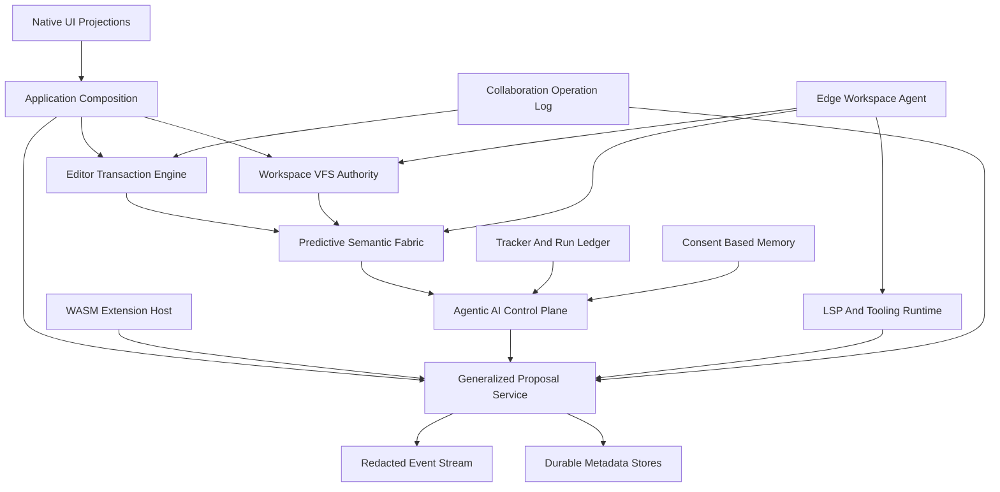

# Devil IDE 2026 Architecture and Functional Review Roadmap v0.1

Status: Strategic review artifact  
Mode: Architecture planning  
Scope: end-to-end repository review against a state-of-the-art 2026 IDE target  
Baseline date: 2026-05-14

---

## 1. Executive verdict

The repository has moved beyond a spike-only baseline in several critical foundations. The most important current strength is that durable local saves are now proposal-mediated, conflict-aware, fingerprint-checked, and fail-closed through [`SaveWorkflowService`](crates/devil-app/src/lib.rs:935), [`WorkspaceSaveRequest`](crates/devil-project/src/lib.rs:133), and [`WorkspaceActor::save_file_with_proposal()`](crates/devil-project/src/lib.rs:1620). The UI shell is also projection-oriented through [`ActiveBufferProjection`](crates/devil-ui/src/ui.rs:86) and command intents rather than editor ownership.

That said, the product is still far from the requested 2026 IDE target. The current system is best described as a deterministic local core with partial proposal safety and metadata-oriented observability, not yet a modern AI-native, predictive, extensible, remote, and collaborative IDE platform.

The gap is not a single missing feature. The required 2026 paradigm needs five platform layers that are either absent or only represented by protocol stubs:

1. Agentic AI execution embedded in editor, workspace, task, terminal, semantic index, policy, and replay context.
2. Zero-latency predictive semantic analysis backed by incremental parsing, symbol graphs, LSP fusion, typed caches, and speculative invalidation.
3. A WebAssembly extension ecosystem with manifest validation, WASI capability mediation, ABI versioning, quotas, and deterministic contribution points.
4. Edge-executed remote development with workspace agents, remote file/process/LSP/index services, encrypted transport, latency hiding, offline tolerance, and local projections.
5. Real-time multiplayer collaboration with an operation log or CRDT layer, presence, version vectors, conflict-safe file operations, shared proposals, and collaborative AI approvals.

The strategic recommendation is to preserve the existing safety thesis, then recharter the roadmap from a local-first foundational IDE into a distributed, AI-native IDE platform. The current proposal-mediated mutation rule must remain non-negotiable: AI, LSP, plugins, collaboration, and remote agents must all mutate through typed proposals, editor transactions, workspace VFS authority, redacted events, and storage audit metadata.

---

## 2. Evidence basis and stale-document correction

Primary repository evidence reviewed:

- Workspace layout and crate inventory from [`Cargo.toml`](Cargo.toml).
- Repository engineering constraints from [`AGENTS.md`](AGENTS.md:9).
- Current foundational architecture from [`plans/ide-core-architecture-spec-v0.1.md`](plans/ide-core-architecture-spec-v0.1.md:27).
- Foundational roadmap non-goals from [`plans/foundational-core-ide-platform-roadmap-v0.1.md`](plans/foundational-core-ide-platform-roadmap-v0.1.md:24).
- Foundational implementation plan constraints from [`plans/foundational-core-ide-platform-implementation-plan-v0.1.md`](plans/foundational-core-ide-platform-implementation-plan-v0.1.md:32).
- AI-native founding vision from [`plans/architecture-charter-v0.1.md`](plans/architecture-charter-v0.1.md:10).
- Current dependency-policy gate from [`xtask/src/main.rs`](xtask/src/main.rs:117) and [`plans/dependency-policy.md`](plans/dependency-policy.md:9).
- Save and conflict integration tests from [`crates/devil-app/tests/workspace_vfs_integration.rs`](crates/devil-app/tests/workspace_vfs_integration.rs:73).
- Protocol golden tests from [`crates/devil-protocol/tests/dto_contracts.rs`](crates/devil-protocol/tests/dto_contracts.rs:244).
- Text and index stress baseline from [`plans/evidence/phase-0/text-index-stress-baseline.md`](plans/evidence/phase-0/text-index-stress-baseline.md:31).

Important correction: older review documents such as [`plans/architecture-review-full-codebase-v0.1.md`](plans/architecture-review-full-codebase-v0.1.md:61) and [`plans/architecture-review-phases-5-6-v0.1.md`](plans/architecture-review-phases-5-6-v0.1.md:25) report issues that have since been partially resolved. In the current implementation, saves no longer bypass proposal mediation. The correct current baseline is:

- Save orchestration starts in [`SaveWorkflowService::save_active_buffer()`](crates/devil-app/src/lib.rs:938).
- Save proposals are built by [`SaveProposalCoordinator::build_save_proposal()`](crates/devil-app/src/lib.rs:151).
- Workspace writes require fingerprint, file version, workspace generation, buffer version, snapshot id, payload length, correlation id, and causality id through [`WorkspaceSaveRequest`](crates/devil-project/src/lib.rs:133).
- Atomic write fallback is fail-closed through [`NonAtomicSaveFallbackPolicy`](crates/devil-project/src/lib.rs:172).
- Untrusted writes, stale saves, and external overwrites are asserted by [`workspace_vfs_integration_untrusted_save_is_denied_without_disk_mutation`](crates/devil-app/tests/workspace_vfs_integration.rs:73) and [`workspace_vfs_integration_external_overwrite_between_open_and_save_yields_conflict`](crates/devil-app/tests/workspace_vfs_integration.rs:280).

The roadmap below therefore treats proposal-mediated save as a current strength, while identifying that the proposal system is still narrow, save-focused, local-only, and not yet generalized for LSP edits, plugin edits, AI-generated edits, collaborative operations, or remote workspace mutations.

---

## 3. Current-state architecture assessment

| Subsystem | Current state | 2026 readiness assessment |
|---|---|---|
| Workspace and VFS | Local workspace actor owns root, shallow tree, file identity, watcher state, trust, fingerprint checks, and proposal-safe save through [`WorkspaceActor`](crates/devil-project/src/lib.rs:410). | Strong foundation for local durable mutation, but not yet multi-root, remote-capable, collaborative, content-addressed, or edge-replicated. |
| Save and mutation safety | Save path uses [`WorkspaceProposal`](crates/devil-protocol/src/lib.rs:397), proposal lifecycle responses in tests, and [`WorkspaceActor::save_file_with_proposal()`](crates/devil-project/src/lib.rs:1620). | Strong for manual file save, incomplete for generalized workspace edits, multi-file atomicity, rollback, AI patches, LSP code actions, plugin changes, and collaborative operations. |
| UI shell | Projection-only shell uses [`ActiveBufferProjection`](crates/devil-ui/src/ui.rs:86) and [`CommandDispatchIntent`](crates/devil-ui/src/ui.rs:143). | Correct ownership direction, but still primitive. It projects full buffer text and lacks production renderer, tabs, panels, semantic overlays, presence, agent activity, remote status, or collaborative proposal UX. |
| Editor engine | [`EditorEngine`](crates/devil-editor/src/lib.rs:312) owns buffers, transactions, snapshots, undo, redo, dirty state, and conflict acknowledgements through [`EditorEngine::acknowledge_save_outcome()`](crates/devil-editor/src/lib.rs:1250). | Good deterministic editor core, but not yet optimized for zero-latency semantic workloads, collaborative operation transforms, large-file viewport rendering, or multi-consumer snapshot leases. |
| Text model | [`DEFAULT_FULL_CACHE_BYTE_BUDGET_BYTES`](crates/devil-text/src/lib.rs:22) caps full-cache materialization; [`LineIndex`](crates/devil-text/src/lib.rs:457) supports coordinate conversion. | Major bottleneck. Full text cache and full line index refresh remain incompatible with very large files, remote latency hiding, and predictive semantic analysis under continuous edits. |
| Protocol boundary | [`devil-protocol`](crates/devil-protocol/src/lib.rs) contains IDs, editor DTOs, proposal DTOs, terminal DTOs, LSP DTOs, plugin DTOs, storage DTOs, and ports. | Good central boundary, but it lacks first-class remote workspace, collaboration, agent-run, semantic-index, WASM ABI, operation-log, and distributed identity contracts. |
| Security and policy | [`DenyByDefaultBroker`](crates/devil-security/src/lib.rs:668) gates capability requests and trust-sensitive actions. | Useful scaffold, but request context is not yet fully enforced in all decisions, and the model is not sufficient for untrusted WASM, autonomous agents, provider egress, remote edge execution, or multiplayer permissions. |
| Observability | [`InMemoryEventSink`](crates/devil-observability/src/lib.rs:71), [`RedactingEventSink`](crates/devil-observability/src/lib.rs:130), [`event_metadata_record()`](crates/devil-observability/src/lib.rs:376), and [`proposal_audit_record()`](crates/devil-observability/src/lib.rs:394) provide metadata-only event and audit foundations. | Good privacy direction, but production event storage, replay drills, metrics, tracing spans, distributed correlation, and privacy-inspector surfaces are incomplete. |
| Storage | [`InMemoryStorageRepositoryPort`](crates/devil-storage/src/lib.rs) supports protocol-oriented metadata, trust, sessions, proposal audit, and event records. | Not yet a durable SQLite or multi-store production boundary for sessions, tracker, semantic index, memory, collaboration logs, remote sync metadata, or migration governance. |
| AI | [`ModelProvider`](crates/devil-ai/src/lib.rs:216) defines provider abstraction; [`OllamaStub`](crates/devil-ai-providers/src/lib.rs:75) and [`OpenAiStub`](crates/devil-ai-providers/src/lib.rs:83) reject real calls. | Provider inversion is correct, but the AI layer is not an orchestrator. No context graph, provider router, streaming, tool policy, context manifest, privacy inspector, patch synthesis, agent state machine, or proposal integration exists. |
| Indexing | [`crates/devil-index/src/lib.rs`](crates/devil-index/src/lib.rs:1) is a placeholder. | Critical missing layer. No tree-sitter, symbol graph, lexical index, vector index, semantic cache, predictive invalidation, or LSP fusion. |
| Agent workflows | [`crates/devil-agent/src/lib.rs`](crates/devil-agent/src/lib.rs:1) is a placeholder. | Critical missing layer. No autonomous planning, tool-use state machine, approval model, run records, policy transitions, or recovery semantics. |
| Tracker and memory | [`crates/devil-tracker/src/lib.rs`](crates/devil-tracker/src/lib.rs) and [`crates/devil-memory/src/lib.rs`](crates/devil-memory/src/lib.rs:1) are placeholders. | Critical for AI-native workflows, but not implemented. No task graph, AI run ledger, approval ledger, context manifest, opt-in memory, retention controls, or privacy inspector data model. |
| Plugins | Protocol DTOs and target architecture exist in [`plans/ide-core-architecture-spec-v0.1.md`](plans/ide-core-architecture-spec-v0.1.md:525), but no runtime crate exists. | Not ready. There is no WASM host, WASI capabilities, ABI, manifest loader, contribution registry, sandbox quotas, plugin state store, or marketplace governance. |
| Terminal and LSP | Platform has process and PTY scaffolding through [`ProcessRequest`](crates/devil-platform/src/lib.rs:558) and [`NativePtyService`](crates/devil-platform/src/lib.rs:632); LSP remains protocol and plan only. | Not ready for 2026 language workflows. No supervised LSP runtime, semantic-token cache, completion broker, diagnostics store, terminal UX, or remote process substrate. |
| Remote development | Foundational roadmap explicitly excludes hosted dependency and remote collaboration in [`plans/foundational-core-ide-platform-roadmap-v0.1.md`](plans/foundational-core-ide-platform-roadmap-v0.1.md:24). | Absent. No edge workspace agent, transport protocol, remote filesystem, remote process, remote LSP, sync model, or identity federation. |
| Multiplayer collaboration | No collaboration crate, protocol, operation log, CRDT, presence, cursor sharing, shared proposal, or conflict policy exists. | Absent. This is a full platform initiative, not a feature flag. |

---

## 4. Target 2026 IDE capability model

A state-of-the-art 2026 IDE should be built as an evented, distributed, policy-mediated development substrate rather than a local editor with add-ons. The target model for this repository should be:

Core target principles:

1. Editor keystrokes, cursor motion, viewport rendering, and local undo stay on the latency-critical path and never wait for AI, indexing, LSP, plugins, remote calls, or collaboration consensus.
2. Every non-user-direct mutation from AI, plugins, LSP, terminal tools, remote agents, or collaborators enters the same versioned proposal pipeline.
3. Every context-producing subsystem uses sensitivity labels, redaction hints, retention labels, correlation ids, and explainable provenance.
4. Remote and collaborative development are not special bypass paths. They are distributed clients of the same editor, workspace, proposal, storage, policy, and event contracts.
5. WASM extensions and AI agents are untrusted by default, even when first-party. Their privileges are derived from explicit capability grants and observable decisions.

---

## 5. Critical bottlenecks and required architectural remedies

### 5.1 Full-buffer materialization blocks zero-latency scale

Evidence: [`ActiveBufferProjection`](crates/devil-ui/src/ui.rs:86) contains full `text`, and the app constructs projections from full editor text. The text layer still has full-cache budget behavior through [`DEFAULT_FULL_CACHE_BYTE_BUDGET_BYTES`](crates/devil-text/src/lib.rs:22) and line-index materialization through [`LineIndex`](crates/devil-text/src/lib.rs:457).

Remedy:

- Replace full active-buffer projections with viewport slices, decoration spans, fold ranges, semantic token overlays, and lazy line metrics.
- Add streaming or chunked snapshots with stable snapshot ids and chunk hashes.
- Add incremental line index maintenance rather than whole-buffer rebuilds after edits.
- Introduce degraded large-file mode with search-only, viewport-only, and disabled expensive overlays.
- Require perf tests that simulate editor input while semantic indexing, LSP, AI retrieval, and collaboration replay are active.

### 5.2 Proposal mediation is save-focused rather than platform-wide

Evidence: saves flow through [`SaveWorkflowService::save_active_buffer()`](crates/devil-app/src/lib.rs:938), but generalized payload handling still panics in save-only assumptions through [`proposal_file_identity()`](crates/devil-app/src/lib.rs:1332).

Remedy:

- Promote save proposal logic into a generalized proposal service crate or app-domain service.
- Support text edit, create, delete, rename, format, code action, terminal command, AI patch, plugin command, and collaborative operation proposals.
- Add multi-file preview, apply, rollback, cancellation, stale detection, and partial failure semantics.
- Require every proposal to emit audit records through [`proposal_audit_record()`](crates/devil-observability/src/lib.rs:394) and event metadata through [`event_metadata_record()`](crates/devil-observability/src/lib.rs:376).
- Add golden tests for all proposal payloads and lifecycle transitions.

### 5.3 Missing semantic fabric prevents predictive IDE behavior

Evidence: [`crates/devil-index/src/lib.rs`](crates/devil-index/src/lib.rs:1) is placeholder-only, and the accepted baseline states no active semantic indexing, embeddings, or vector retrieval in [`plans/evidence/phase-0/text-index-stress-baseline.md`](plans/evidence/phase-0/text-index-stress-baseline.md:37).

Remedy:

- Implement repository discovery and shallow lexical index first.
- Add tree-sitter workers, syntax tree caches, symbol extraction, reference graph, import graph, and call/type relationship graph.
- Fuse open-buffer snapshots, watcher deltas, LSP diagnostics, semantic tokens, and symbol graph updates into a predictive semantic fabric.
- Add low-latency query APIs for completion ranking, go-to-definition, references, AI retrieval, test impact analysis, and agent planning.
- Add speculative invalidation and cancellation tokens for obsolete parse, LSP, embedding, and ranking work.

### 5.4 AI is provider abstraction only, not an execution plane

Evidence: [`ModelProvider`](crates/devil-ai/src/lib.rs:216) abstracts provider calls, while provider implementations are stubs in [`crates/devil-ai-providers/src/lib.rs`](crates/devil-ai-providers/src/lib.rs:23). [`crates/devil-agent/src/lib.rs`](crates/devil-agent/src/lib.rs:1) is empty.

Remedy:

- Build an AI control plane with request routing, context manifests, provider selection, policy checks, redaction, streaming, cancellation, and model metadata.
- Implement an agent run state machine with explicit states for observing, planning, proposing, waiting for approval, applying, verifying, and blocked.
- Treat agents as clients of the proposal service, semantic fabric, terminal policy, tracker, memory, and event sink.
- Persist AI run records, selected context, model/provider identity, tool decisions, approvals, generated proposals, and verification outcomes in tracker storage.
- Require air-gap mode and local-provider-only paths before enabling cloud providers.

### 5.5 Extension architecture lacks runtime isolation

Evidence: the target plugin architecture is specified in [`plans/ide-core-architecture-spec-v0.1.md`](plans/ide-core-architecture-spec-v0.1.md:525), but no plugin runtime crate exists, and WASI is still described as a future target in [`plans/ide-core-architecture-spec-v0.1.md`](plans/ide-core-architecture-spec-v0.1.md:546).

Remedy:

- Add a phase-gated WASM plugin runtime with deterministic host calls and no direct filesystem, process, network, editor, or workspace access.
- Define a stable plugin ABI in [`devil-protocol`](crates/devil-protocol/src/lib.rs), with manifest schema, activation events, contribution descriptors, context providers, quotas, and compatibility ranges.
- Route all extension reads through scoped context providers and all extension writes through proposals.
- Add per-plugin state namespaces, storage quotas, CPU and memory budgets, cancellation, crash isolation, and redacted plugin events.
- Make VS Code extension compatibility remain out of scope unless a future ADR explicitly reverses the clean-slate constraint in [`plans/architecture-charter-v0.1.md`](plans/architecture-charter-v0.1.md:66).

### 5.6 Remote and collaboration are absent from contracts

Evidence: foundational scope excludes remote collaboration in [`plans/foundational-core-ide-platform-roadmap-v0.1.md`](plans/foundational-core-ide-platform-roadmap-v0.1.md:24), and no collaboration or remote-development crate exists in [`Cargo.toml`](Cargo.toml).

Remedy:

- Add ADRs and protocol DTOs for distributed workspace identity, remote workspace sessions, operation logs, collaborator identity, presence, permissions, CRDT state, version vectors, and edge workspace agents.
- Introduce a collaboration layer between editor transactions and workspace proposals so local keystrokes stay immediate while remote operations merge deterministically.
- Model remote filesystem, process, terminal, LSP, and semantic index services as capability-scoped remote ports, not raw network helpers.
- Add transport encryption, resumable sessions, offline queues, conflict recovery, audit events, and enterprise policy hooks.

### 5.7 Governance gates are incomplete

Evidence: [`validate_dependency_policy()`](xtask/src/main.rs:117) skips crates without policy entries, and [`Policy::from_markdown()`](xtask/src/main.rs:245) contains hardcoded requirements. The dependency policy covers only a subset of crates in [`plans/dependency-policy.md`](plans/dependency-policy.md:11).

Remedy:

- Make dependency policy complete for every workspace crate.
- Fail the gate when a crate lacks a policy section.
- Move hardcoded dependency requirements out of [`Policy::from_markdown()`](xtask/src/main.rs:245) and into [`plans/dependency-policy.md`](plans/dependency-policy.md).
- Add policy sections before activating placeholder crates or adding new runtime crates.
- Add CI gates for protocol symbol drift, architecture-boundary imports, event coverage, proposal-only mutation, and privacy retention defaults.

---

## 6. Prioritized phased engineering roadmap

### Phase 0 — Rebaseline governance and architecture truth

Priority: mandatory before adding 2026 runtime surfaces.

Technical steps:

1. Mark stale findings in [`plans/architecture-review-full-codebase-v0.1.md`](plans/architecture-review-full-codebase-v0.1.md:61) and [`plans/architecture-review-phases-5-6-v0.1.md`](plans/architecture-review-phases-5-6-v0.1.md:25) as historical where they contradict current save and UI behavior.
2. Expand [`plans/dependency-policy.md`](plans/dependency-policy.md:9) to include every current crate and all planned runtime crates.
3. Change [`validate_dependency_policy()`](xtask/src/main.rs:117) so missing crate policy is a violation, not a silent skip.
4. Require a new ADR before activating each placeholder crate: index, agent, tracker, memory, plugin, LSP, terminal, collaboration, remote.
5. Add architecture-gate tests proving UI does not own editor/workspace state, saves remain proposal-mediated, and source snapshots are not persisted by default.

Validation gate:

- Dependency policy covers all crates.
- Protocol symbols required by policy exist.
- Stale save-flow claims are documented as historical.
- No runtime surface is added without ADR, policy, contract tests, and event coverage.

### Phase 1 — Scale the editor and text substrate

Priority: highest technical enabler for every 2026 feature.

Technical steps:

1. Replace full text projection in [`ActiveBufferProjection`](crates/devil-ui/src/ui.rs:86) with viewport projections, visible line slices, cursor/selection projections, overlays, and lazy metadata.
2. Refactor [`LineIndex`](crates/devil-text/src/lib.rs:457) into an incremental or chunked line-metric index.
3. Replace full-cache refresh behavior with chunked snapshots, content-addressed chunk hashes, and snapshot leases for LSP, index, plugins, AI, and collaboration.
4. Add degraded mode for files above [`DEFAULT_FULL_CACHE_BYTE_BUDGET_BYTES`](crates/devil-text/src/lib.rs:22), including viewport-only rendering and disabled expensive semantic overlays.
5. Add transaction event streams from [`EditorEngine`](crates/devil-editor/src/lib.rs:312) to semantic, LSP, collaboration, storage, and observability consumers without blocking input.

Validation gate:

- Very large files open without full source materialization.
- Edits update viewport, snapshots, and line metrics incrementally.
- UI never receives full source text unless explicitly in a bounded small-buffer mode.
- Concurrent indexing and AI retrieval cannot block editor input.

### Phase 2 — Generalize proposal-mediated mutation

Priority: required before active LSP edits, plugins, agents, collaboration, or remote mutation.

Technical steps:

1. Extract save-specific proposal coordination from [`SaveProposalCoordinator`](crates/devil-app/src/lib.rs:120) into a generalized proposal service.
2. Implement proposal validation, preview, approval, apply, rollback, stale, denied, conflict, failed, and cancelled transitions for all payload kinds.
3. Replace save-only assumptions in [`proposal_file_identity()`](crates/devil-app/src/lib.rs:1332) with typed payload visitors that support multi-file and non-file proposals.
4. Add proposal preview models for text edits, file creates, deletes, renames, format edits, code actions, terminal commands, AI patches, plugin commands, and collaboration operations.
5. Ensure open-buffer edits go through editor transactions and closed-file edits go through workspace VFS, with shared rollback semantics.
6. Persist proposal audit metadata using [`proposal_audit_record()`](crates/devil-observability/src/lib.rs:394) and event metadata using [`event_metadata_record()`](crates/devil-observability/src/lib.rs:376).

Validation gate:

- Stale proposals cannot apply.
- External overwrite cannot be clobbered.
- Multi-file proposals either apply atomically or produce explicit rollback/failure records.
- AI, LSP, plugin, remote, and collaboration proposals all share the same lifecycle model.

### Phase 3 — Build the predictive semantic fabric

Priority: required for zero-latency semantic analysis and useful AI context.

Technical steps:

1. Implement [`crates/devil-index/src/lib.rs`](crates/devil-index/src/lib.rs:1) as an actor-owned indexing engine with bounded queues and cancellation.
2. Add repository discovery, ignore handling, file fingerprints, shallow lexical index, and symbol file map.
3. Add tree-sitter parsing workers and syntax tree caches keyed by content hash and grammar version.
4. Extract symbols, references, imports, exports, call edges, type relations, test links, diagnostics links, and ownership metadata into a normalized graph.
5. Integrate LSP diagnostics, completions, hover, semantic tokens, definitions, references, rename, formatting, and code actions through normalized protocol DTOs.
6. Add semantic query APIs for UI navigation, completion ranking, AI context selection, agent planning, test impact, and refactoring previews.
7. Add vector indexing only after syntax-aware chunking, provenance, privacy scope, model identity, and invalidation contracts are in place.

Validation gate:

- Semantic updates from live editor snapshots supersede slower background repository scans.
- Obsolete parse, LSP, embedding, and ranking work is cancelled.
- Completion, hover, diagnostics, and symbol lookup remain responsive under active editing.
- Index records can be invalidated by content hash, grammar version, model version, and privacy scope.

### Phase 4 — Implement native agentic AI execution context

Priority: high after semantic fabric and generalized proposals.

Technical steps:

1. Expand [`ModelProvider`](crates/devil-ai/src/lib.rs:216) into a router-facing provider capability model with streaming, structured output, embeddings, reranking, tool planning, context window metadata, cost metadata, cancellation, and provider health.
2. Replace stubs in [`crates/devil-ai-providers/src/lib.rs`](crates/devil-ai-providers/src/lib.rs:23) with gated local-provider adapters first, then cloud adapters behind explicit policy and redacted events.
3. Implement [`crates/devil-agent/src/lib.rs`](crates/devil-agent/src/lib.rs:1) as a state-machine runtime for observe, plan, propose, approve, apply, verify, recover, and blocked states.
4. Add context manifests that cite editor snapshots, semantic symbols, retrieved chunks, tracker tasks, memory records, diagnostics, terminal output summaries, and user selections.
5. Implement a Privacy Inspector backed by tracker and event metadata showing provider, model, files, ranges, symbols, memory items, prompt categories, proposal outputs, and policy decisions.
6. Route all generated edits through generalized proposals and all command execution through capability policy.
7. Persist AI run records, selected context, tool calls, approvals, proposal ids, verification outputs, and redacted provider metadata in tracker storage.
8. Enforce air-gap mode from [`plans/architecture-charter-v0.1.md`](plans/architecture-charter-v0.1.md:827) before enabling cloud provider paths.

Validation gate:

- AI cannot mutate editor buffers, disk, terminal, tracker, memory, or settings directly.
- Every model call has redacted event metadata and a context manifest.
- Users can inspect what context was sent and why.
- Air-gap mode prevents cloud providers, hosted telemetry, and non-approved outbound network access.
- Agent runs can be cancelled, resumed, and replayed from metadata.

### Phase 5 — Create a WASM isolated extension ecosystem

Priority: required before untrusted extensibility.

Technical steps:

1. Add a phase-gated plugin runtime crate only after updating [`plans/dependency-policy.md`](plans/dependency-policy.md:9).
2. Define a WASM ABI in [`devil-protocol`](crates/devil-protocol/src/lib.rs) for commands, menus, panels, status items, editor decorations, snippets, language providers, formatters, LSP registrations, workspace scanners, and passive AI context providers.
3. Implement manifest parsing, signature or trust metadata, capability declaration, activation events, compatibility range checks, and contribution registration.
4. Run extensions in WASI with no ambient filesystem, process, network, editor, workspace, storage, or AI access.
5. Expose host calls only through capability-checked protocol requests.
6. Route extension mutations through generalized proposals and extension reads through scoped context providers.
7. Add plugin state namespaces, storage quotas, CPU and memory budgets, cancellation, crash isolation, and redacted plugin event streams.

Validation gate:

- A malicious extension cannot access source, network, process, storage, or editor state outside granted capabilities.
- Extension crashes do not crash the IDE.
- Extension commands are observable, cancellable when applicable, and proposal-mediated for mutations.
- Plugin ABI compatibility is tested with golden manifests and host-call schemas.

### Phase 6 — Add real-time multiplayer collaboration

Priority: required before team-native workflows and shared AI operations.

Technical steps:

1. Add collaboration ADRs for CRDT or operation-log strategy, identity, permissions, conflict policy, offline behavior, and retention.
2. Extend [`devil-protocol`](crates/devil-protocol/src/lib.rs) with collaborator identity, workspace session, document operation, presence, cursor, selection, version vector, operation acknowledgement, and shared proposal DTOs.
3. Insert a collaboration operation layer between editor transactions and downstream consumers.
4. Convert local editor transactions into collaborative operations and merge remote operations into editor transactions without blocking input.
5. Add shared proposal flows for multi-user AI actions, LSP refactors, plugin commands, and file operations.
6. Add awareness UI projections for presence, selections, comments, proposal approvals, agent activity, and remote conflict states.
7. Persist operation metadata and causal order without storing full source snapshots by default.

Validation gate:

- Concurrent edits converge deterministically.
- Undo semantics are clear for local and collaborative operations.
- Dirty buffers are never overwritten by remote operations without explicit conflict handling.
- Shared proposals record approvers, denials, policy decisions, and applied operation ids.
- Collaboration can survive disconnect and replay metadata to recover state.

### Phase 7 — Build edge-executed cloud remote development

Priority: required for cloud-native workflows after local safety, semantic, and collaboration foundations are stable.

Technical steps:

1. Add remote-development ADRs for edge workspace agent, local UI projection model, transport, authentication, authorization, secrets, storage, process isolation, and enterprise policy.
2. Add protocol DTOs for remote workspace lifecycle, remote filesystem snapshots, remote file operations, remote process and PTY sessions, remote LSP sessions, remote semantic index queries, latency hints, and offline resume.
3. Implement a remote workspace agent that owns filesystem, process, LSP, semantic index, and terminal execution at the edge.
4. Treat remote reads and writes as capability-scoped workspace requests, not raw network calls.
5. Reuse generalized proposals for remote edits and file operations.
6. Use local optimistic projections, remote acknowledgement, operation logs, and version vectors to hide latency without sacrificing conflict safety.
7. Add encrypted transport, session resumption, edge cache invalidation, remote observability correlation, and policy-enforced provider egress controls.
8. Integrate remote development with collaboration so multi-user sessions and remote edge workspaces share identity, operation, and proposal semantics.

Validation gate:

- Local UI remains responsive during remote latency and reconnect events.
- Remote file writes cannot bypass proposal and fingerprint preconditions.
- Remote terminals and LSP servers cannot launch in untrusted workspaces or outside policy.
- Remote events correlate with local events using non-zero causality and correlation ids.
- Offline resume reconciles operation logs without silent data loss.

### Phase 8 — Product hardening, governance, and ecosystem readiness

Priority: required before broad external usage.

Technical steps:

1. Move storage from in-memory scaffolding to durable, migrated stores for sessions, trust, file metadata, proposal audit, event metadata, tracker, memory, semantic indexes, plugin state, collaboration logs, and remote session metadata.
2. Add CLI diagnostics beyond [`crates/devil-cli/src/main.rs`](crates/devil-cli/src/main.rs:5): dependency graph, protocol schema, event summaries, proposal audit, storage health, index health, plugin sandbox state, AI run manifests, collaboration replay, and remote session traces.
3. Add privacy-preserving metrics with subsystem budgets for edit, render, index, LSP, AI, plugin, collaboration, and remote operations.
4. Add enterprise policy profiles for air-gap, local-only AI, approved provider list, plugin allowlist, remote workspace restrictions, collaboration data retention, and audit export.
5. Add corruption recovery drills, replay drills, downgrade and migration tests, provider egress tests, sandbox escape tests, collaboration convergence tests, and remote reconnect tests.

Validation gate:

- Metadata-only replay can reconstruct critical user flows without retaining raw source by default.
- Storage migrations are reversible or recoverable.
- Privacy and retention defaults are enforced by tests.
- Every active subsystem has event coverage and operational health diagnostics.

---

## 7. Required ADR backlog

The following ADRs should be created or revised before implementation of the corresponding phases:

1. Streaming text storage, chunked snapshots, and viewport projection ADR.
2. Generalized proposal service and multi-file atomicity ADR.
3. Durable event, audit, replay, and storage retention ADR.
4. Semantic fabric, tree-sitter, symbol graph, lexical index, and vector store ADR.
5. LSP runtime supervision and semantic cache ADR.
6. AI provider router, context manifest, and Privacy Inspector ADR.
7. Agent state machine, tool policy, approval, and recovery ADR.
8. Tracker schema and AI run ledger revision based on [`plans/adrs/ADR-0008-tracker-schema.md`](plans/adrs/ADR-0008-tracker-schema.md:1).
9. Memory consent and retention revision based on [`plans/adrs/ADR-0009-memory-consent.md`](plans/adrs/ADR-0009-memory-consent.md:1).
10. WASM plugin ABI, WASI sandbox, capability host calls, and plugin storage ADR.
11. Collaboration operation log or CRDT ADR.
12. Remote edge workspace agent, transport, and edge execution ADR.
13. Enterprise policy and air-gap enforcement ADR.
14. Dependency policy completeness and architecture gate ADR.

---

## 8. Strategic sequencing constraints

The roadmap should not be parallelized in a way that violates core safety dependencies:

1. Do not enable AI-generated edits until generalized proposals, observability, tracker records, and privacy manifests are implemented.
2. Do not enable untrusted extensions until WASM sandboxing, capability host calls, storage quotas, and proposal-only mutation are implemented.
3. Do not enable remote workspace writes until local proposal and conflict semantics are generalized and tested.
4. Do not enable collaborative editing until the editor text model supports operation replay, snapshot leases, and convergence tests.
5. Do not enable predictive semantic indexing on the live edit path until the text model supports incremental line metrics, chunked snapshots, and bounded background queues.
6. Do not activate placeholder crates without dependency-policy entries, ADR acceptance, protocol contracts, and tests.

---

## 9. Final strategic position

The current repository has the right architectural instincts: Rust-first boundaries, central protocol contracts, projection-only UI direction, deterministic editor ownership, proposal-mediated saves, fail-closed workspace writes, default-deny security posture, and metadata-only observability. Those strengths should be preserved.

The gap to a 2026 IDE is nevertheless substantial. The repository must evolve from a local deterministic IDE core into a distributed platform with a semantic fabric, agentic control plane, sandboxed extension runtime, collaboration substrate, and edge workspace agent. The highest-leverage path is not to graft those systems onto the app crate. The correct path is to promote the existing proposal, protocol, event, and policy patterns into universal platform contracts that every advanced subsystem must consume.

The next implementation handoff should start with Phase 0, Phase 1, and Phase 2. Those phases remove the current scalability and governance blockers and create the stable mutation substrate required for AI, semantic prediction, WASM plugins, collaboration, and edge remote development.
