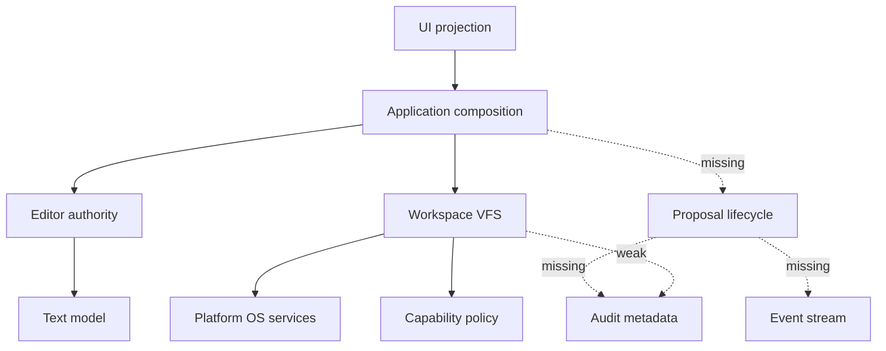

# Legion IDE - Full Codebase Architectural Review v0.1

Status: **REVIEW COMPLETE — REQUIRED REFACTORING IDENTIFIED**

Reviewed at: 2026-05-14T03:15:00Z

## Scope and evidence basis

This review evaluates the current repository against the intended architecture documented in [`ide-core-architecture-spec-v0.1.md`](plans/ide-core-architecture-spec-v0.1.md:45), the dependency policy in [`dependency-policy.md`](plans/dependency-policy.md:1), the phase implementation plan in [`foundational-core-ide-platform-implementation-plan-v0.1.md`](plans/foundational-core-ide-platform-implementation-plan-v0.1.md:134), the accepted phase zero freeze in [`architecture-freeze-v0.1.md`](plans/architecture-freeze-v0.1.md:1), and current implementation evidence across the workspace.

The review covers:

- crate layout and dependency direction from [`Cargo.toml`](Cargo.toml:1), [`dependency-policy.md`](plans/dependency-policy.md:9), and [`xtask::validate_dependency_policy()`](xtask/src/main.rs:117);
- application, UI, editor, workspace, platform, storage, security, observability, protocol, AI, provider, and bounded runtime crate boundaries;
- architectural test and evidence coverage from [`cargo-test-workspace-all-targets.txt`](plans/evidence/phase-0/cargo-test-workspace-all-targets.txt:1), [`text-index-stress-baseline.md`](plans/evidence/phase-0/text-index-stress-baseline.md:1), and [`editor-performance-suite.txt`](plans/evidence/phase-0/editor-performance-suite.txt:1);
- specification drift from the deterministic mutation, strict dependency direction, central save pipeline, and event-log requirements in [`ide-core-architecture-spec-v0.1.md`](plans/ide-core-architecture-spec-v0.1.md:61).

## Executive assessment

The repository has successfully moved beyond the earliest spike hazards: the UI is now projection-only through [`Shell`](crates/devil-ui/src/ui.rs:228), editor and project do not have a direct crate dependency under [`dependency-policy.md`](plans/dependency-policy.md:22), application-level integration tests exercise workspace/editor routing in [`workspace_vfs_integration.rs`](crates/devil-app/tests/workspace_vfs_integration.rs:32), and the accepted phase zero gates passed in [`architecture-freeze-v0.1.md`](plans/architecture-freeze-v0.1.md:13).

> Historical rebaseline note (2026-05-15): the direct save-bypass concerns captured in this review describe the pre-rebaseline implementation. Current manual saves route through [`SaveWorkflowService::save_active_buffer()`](crates/devil-app/src/lib.rs:938) and then through [`WorkspaceActor::save_file_with_proposal()`](crates/devil-app/src/lib.rs:1021), while the shell remains projection-only through [`Shell`](crates/devil-ui/src/ui.rs:228). Treat the save-bypass language below as historical context unless it is explicitly discussing proposal generalization beyond save.
>
> Current correction (2026-06-02): this review also predates accepted bounded slices for semantic fabric, agent/tracker/memory, plugin, collaboration, remote, terminal, telemetry, retention, GUI productization, and Legion workflow orchestration. Treat "placeholder crate" warnings as historical gate-discipline guidance, not as current claims that those crates are empty.

However, the current implementation is not yet structurally aligned with the full target architecture. The most serious drift is concentrated around durable mutation safety, service-port mediation, observability integration, storage/session integration, security-policy completeness, and large-file scalability. These are architectural issues, not isolated bugs, because they affect ownership boundaries, data-flow invariants, and future feature scaling.

### Highest-impact issues

1. Historical finding, now resolved for the manual save path: durable file saving previously bypassed the proposal lifecycle, stale fingerprint checks, audit lifecycle, and conflict state required by [`foundational-core-ide-platform-implementation-plan-v0.1.md`](plans/foundational-core-ide-platform-implementation-plan-v0.1.md:150).
2. Protocol service ports exist, but core concrete services are mostly invoked directly rather than through implemented ports such as [`EditorPort`](crates/devil-protocol/src/lib.rs:1841), [`ProposalPort`](crates/devil-protocol/src/lib.rs:1847), and [`StorageRepositoryPort`](crates/devil-protocol/src/lib.rs:1877).
3. Observability has usable sink and envelope helpers through [`InMemoryEventSink`](crates/devil-observability/src/lib.rs:51) and [`EventEnvelopeBuilder`](crates/devil-observability/src/lib.rs:177), but the core app, editor, and workspace flows do not emit those events.
4. The text model still rebuilds a full text cache and line index after edits through [`TextBuffer::try_replace_range()`](crates/devil-text/src/lib.rs:820), so the large-file architecture remains intentionally incomplete.
5. Storage, session restore, and audit persistence are not yet wired into app/workspace flows despite storage contracts and local persistence scaffolding in [`SessionRecord`](crates/devil-storage/src/lib.rs:43).

## Intended architecture versus current data flow

The diagram above is historical for the save path. The current phase-zero baseline is safer because manual saves now flow through [`SaveWorkflowService::save_active_buffer()`](crates/devil-app/src/lib.rs:938), proposal validation/preview, and [`WorkspaceActor::save_file_with_proposal()`](crates/devil-app/src/lib.rs:1021). The remaining architecture gap is that proposal mediation is still save-focused rather than universal across future LSP, plugin, terminal, AI, collaboration, or remote mutation sources.

## Severity model

| Severity | Meaning |
|---|---|
| Critical | Can violate durable mutation safety, silently lose data, or block core architectural phase gates. |
| High | Creates tight coupling, incomplete ownership boundaries, scaling failure, or missing enforcement for a primary architecture invariant. |
| Medium | Adds maintainability risk, weakens gates, or creates predictable future refactoring cost. |
| Low | Cleanup or documentation alignment that does not currently threaten core correctness. |

## Detailed findings

### Finding 1 — Save pipeline bypasses proposal, conflict, and audit requirements

> Historical note (rebaselined 2026-05-15): this finding captured the pre-Track-5 save path. Current application saves no longer jump directly from app code to a raw workspace write. They route through [`SaveWorkflowService::save_active_buffer()`](crates/devil-app/src/lib.rs:938), emit proposal lifecycle events via [`SaveWorkflowService::observe_proposal_response()`](crates/devil-app/src/lib.rs:1048), and apply disk mutations through [`WorkspaceActor::save_file_with_proposal()`](crates/devil-app/src/lib.rs:1021). The remaining follow-on work is to generalize the same proposal discipline beyond manual save.

| Field | Assessment |
|---|---|
| Category | Durable mutation safety and specification drift |
| Severity | Critical |
| Affected areas | application save orchestration, editor save DTO emission, workspace write path, protocol proposal contracts |
| Evidence | [`AppComposition::save_active_buffer()`](crates/devil-app/src/lib.rs:214) calls [`EditorEngine::request_save()`](crates/devil-editor/src/lib.rs:930) and then directly calls [`WorkspaceActor::write_file_text()`](crates/devil-project/src/lib.rs:1083). The target architecture requires a central pipeline in [`ide-core-architecture-spec-v0.1.md`](plans/ide-core-architecture-spec-v0.1.md:329), and phase six explicitly requires versioned, previewable, auditable durable mutation in [`foundational-core-ide-platform-implementation-plan-v0.1.md`](plans/foundational-core-ide-platform-implementation-plan-v0.1.md:152). |
| Impact | A stale buffer can overwrite changed disk content because no expected disk fingerprint, file content version, workspace generation, or proposal state is mandatory at the call boundary. The save also cannot produce complete proposal audit history or user-visible conflict state. |
| Recommendation | Introduce a proposal service implementing [`ProposalPort`](crates/devil-protocol/src/lib.rs:1847). Route saves by creating [`WorkspaceProposal`](crates/devil-protocol/src/lib.rs:783) with an expanded [`SaveFileProposal`](crates/devil-protocol/src/lib.rs:873), mandatory [`ProposalVersionPreconditions`](crates/devil-protocol/src/lib.rs:711), and conflict-safe expected fingerprint metadata. Make [`WorkspaceActor::write_file_text()`](crates/devil-project/src/lib.rs:1083) internal or require proposal context and precondition verification before it can write. |

### Finding 2 — Conflict state and proposal lifecycle are under-modeled

| Field | Assessment |
|---|---|
| Category | Protocol contract incompleteness |
| Severity | Critical |
| Affected areas | protocol DTOs, save pipeline, future UI conflict UX, audit storage |
| Evidence | [`FileConflictState`](crates/devil-protocol/src/lib.rs:502) is a generic struct with a free-form reason. [`ProposalResponse`](crates/devil-protocol/src/lib.rs:1568) only models valid, preview, applied, and denied. [`SaveFileProposal`](crates/devil-protocol/src/lib.rs:873) contains only file identity and snapshot id. Phase six requires clean, dirty, saving, save failed, disk changed clean, conflict dirty, reload available, keep-both pending, compare pending, plus proposal diagnostics and audit lifecycle in [`foundational-core-ide-platform-implementation-plan-v0.1.md`](plans/foundational-core-ide-platform-implementation-plan-v0.1.md:156). |
| Impact | The architecture cannot express several required save outcomes. This forces policy into ad hoc strings and makes it hard to build deterministic UI, storage, tests, or replay tools around save conflicts. |
| Recommendation | Replace generic conflict reason modeling with a typed conflict state machine. Extend [`ProposalResponse`](crates/devil-protocol/src/lib.rs:1568) to include created, validated, approved, rejected, applied, failed, rolled back, stale, and conflict states. Extend [`SaveFileProposal`](crates/devil-protocol/src/lib.rs:873) with buffer version, file content version, workspace generation, expected fingerprint, save intent, trust decision, required capability, principal, correlation id, diagnostics, and conflict policy. |

### Finding 3 — Service-port contracts exist but are not implemented by core services

| Field | Assessment |
|---|---|
| Category | Ports-and-adapters drift |
| Severity | High |
| Affected areas | app composition, editor, storage, proposal lifecycle, protocol boundary |
| Evidence | Protocol declares [`WorkspacePort`](crates/devil-protocol/src/lib.rs:1835), [`EditorPort`](crates/devil-protocol/src/lib.rs:1841), [`ProposalPort`](crates/devil-protocol/src/lib.rs:1847), [`EventSinkPort`](crates/devil-protocol/src/lib.rs:1871), and [`StorageRepositoryPort`](crates/devil-protocol/src/lib.rs:1877). Search evidence and implementation review show concrete app code invokes [`EditorEngine`](crates/devil-editor/src/lib.rs:1), [`WorkspaceActor`](crates/devil-project/src/lib.rs:1), and storage repositories directly. Only workspace, security, and observability have meaningful port implementations; storage and editor do not implement their declared service ports. |
| Impact | The architecture claims protocol-mediated boundaries, but app code becomes the integration surface. This tightens coupling, complicates testing through contract mocks, and will make LSP/plugin/AI orchestration harder to add without contaminating app logic. |
| Recommendation | Add adapter implementations for [`EditorPort`](crates/devil-protocol/src/lib.rs:1841) over editor engine operations and [`StorageRepositoryPort`](crates/devil-protocol/src/lib.rs:1877) over storage repositories. Add a real proposal service implementing [`ProposalPort`](crates/devil-protocol/src/lib.rs:1847). Refactor application orchestration to depend on port traits or thin domain services instead of directly routing every command to concrete subsystems. |

### Finding 4 — Application composition is accumulating orchestration state and direct subsystem coupling

| Field | Assessment |
|---|---|
| Category | Composition-root overreach |
| Severity | High |
| Affected areas | application state, command dispatch, save routing, projection generation |
| Evidence | [`AppComposition`](crates/devil-app/src/lib.rs:68) owns concrete workspace and editor instances plus active file and buffer state. [`AppComposition::dispatch_ui_intent()`](crates/devil-app/src/lib.rs:158) directly maps every UI intent to concrete editor/workspace calls. [`AppComposition::active_buffer_projection()`](crates/devil-app/src/lib.rs:247) pulls full text from the editor for UI projection. [`AppComposition::open_workspace()`](crates/devil-app/src/lib.rs:98) hardcodes a correlation id at [`CorrelationId`](crates/devil-app/src/lib.rs:106). |
| Impact | The app layer is thin enough for the current spike but already holds cross-domain routing, active selection state, save policy, and projection construction. As tabs, sessions, LSP, proposals, and event sinks arrive, this shape risks becoming a central coordinator with too many responsibilities. |
| Recommendation | Split the app root into composition wiring plus focused services: command dispatcher, active document controller, projection builder, proposal coordinator, and event publisher. Generate unique correlation ids per user action and pass causality through edit, save, storage, and event paths. Keep [`AppComposition`](crates/devil-app/src/lib.rs:68) as lifecycle wiring rather than the owner of every workflow rule. |

### Finding 5 — Open-file error handling can silently replace failed reads with empty buffers

| Field | Assessment |
|---|---|
| Category | Data-flow correctness |
| Severity | High |
| Affected areas | application open flow, workspace read authority, editor buffer initialization |
| Evidence | [`AppComposition::open_file()`](crates/devil-app/src/lib.rs:121) resolves a file and then calls workspace read, but uses [`Result::unwrap_or_default()`](crates/devil-app/src/lib.rs:129) for the read result. |
| Impact | Permission errors, encoding errors, missing file races, or policy denials can become empty editor buffers. A subsequent save can overwrite real disk content with an empty or partial buffer, especially because the save pipeline has no stale fingerprint protection. |
| Recommendation | Preserve and surface read errors. Add an explicit new-file path for non-existent files, distinct from failed existing-file reads. Store the read fingerprint and content version with the opened buffer so later saves can verify preconditions. |

### Finding 6 — Observability contracts exist but are not wired into core flows

| Field | Assessment |
|---|---|
| Category | Auditability and replay gap |
| Severity | High |
| Affected areas | app save flow, editor transactions, workspace writes, security denials, watcher recovery, proposal lifecycle |
| Evidence | [`EventEnvelope`](crates/devil-protocol/src/lib.rs:1725), [`EventSinkPort`](crates/devil-protocol/src/lib.rs:1871), [`InMemoryEventSink`](crates/devil-observability/src/lib.rs:51), [`RedactingEventSink`](crates/devil-observability/src/lib.rs:110), [`transaction_event()`](crates/devil-observability/src/lib.rs:340), [`save_denied_event()`](crates/devil-observability/src/lib.rs:310), and [`watcher_recovery_event()`](crates/devil-observability/src/lib.rs:373) exist. The app and workspace flows reviewed do not inject or emit through an event sink. Phase six requires proposal and conflict event emission in [`foundational-core-ide-platform-implementation-plan-v0.1.md`](plans/foundational-core-ide-platform-implementation-plan-v0.1.md:160). |
| Impact | Core mutation paths cannot be replayed, audited, or causally inspected. Security denials and conflict decisions are not consistently visible to diagnostics or future telemetry tools. |
| Recommendation | Inject an [`EventSinkPort`](crates/devil-protocol/src/lib.rs:1871) into app, workspace, proposal service, and editor transaction adapters. Emit events for transaction applied or failed, proposal created or applied, save denied, stale save rejected, conflict created, watcher overflow and recovery, and security denial. Require non-zero correlation and causality ids for core events. |

### Finding 7 — Workspace VFS partially bypasses platform abstraction and storage integration

| Field | Assessment |
|---|---|
| Category | Boundary leakage and duplicated infrastructure |
| Severity | High |
| Affected areas | workspace VFS, platform services, storage metadata, error mapping |
| Evidence | [`WorkspaceActor::write_file_text()`](crates/devil-project/src/lib.rs:1083) uses the platform service for writes but then calls direct filesystem metadata through [`std::fs::metadata`](crates/devil-project/src/lib.rs:1107). The project crate also duplicates platform error conversion through [`platform_error_from_io()`](crates/devil-project/src/lib.rs:56). Storage metadata APIs exist through [`FileMetadataRecord`](crates/devil-storage/src/lib.rs:34), but workspace write updates are not persisted through storage. |
| Impact | The platform boundary becomes porous, metadata behavior can diverge from injected fake filesystem behavior, and tests can miss platform-specific behavior. Missing storage integration prevents durable fingerprint tracking required by conflict-safe saves. |
| Recommendation | Add metadata and fingerprint methods to [`FileSystemService`](crates/devil-platform/src/lib.rs:1) or route all metadata through existing platform APIs. Remove duplicated IO error mapping from workspace. Persist file metadata and read/save fingerprints through a storage port after successful writes and after trusted reads. |

### Finding 8 — Atomic write semantics are not yet fail-closed

| Field | Assessment |
|---|---|
| Category | Durable write safety |
| Severity | High |
| Affected areas | platform filesystem, workspace save path, conflict handling |
| Evidence | [`WorkspaceActor::write_file_text()`](crates/devil-project/src/lib.rs:1099) tries an atomic write and then falls back to plain write on any atomic-write failure. The architecture requires temporary write, flush, atomic replace, metadata update, and conflict-safe behavior in [`ide-core-architecture-spec-v0.1.md`](plans/ide-core-architecture-spec-v0.1.md:331). The phase six review already identified fallback policy as too permissive in [`architecture-review-phases-5-6-v0.1.md`](plans/architecture-review-phases-5-6-v0.1.md:61). |
| Impact | A broad fallback can mask permission, path, cross-device, or filesystem-specific atomicity failures and silently degrade durable mutation safety. |
| Recommendation | Make non-atomic fallback opt-in and policy-gated. Add explicit fallback outcome events, expected fingerprint verification immediately before fallback, and tests proving external overwrites cannot be clobbered. Update platform atomic write to document and validate flush behavior. |

### Finding 9 — Security policy declarations exceed current enforcement

| Field | Assessment |
|---|---|
| Category | Capability-policy incompleteness |
| Severity | High |
| Affected areas | write limits, path policy, plugin policy, terminal and network policy |
| Evidence | [`PathPolicy::max_write_bytes`](crates/devil-security/src/lib.rs:59) exists, and [`FileWritePolicy`](crates/devil-security/src/lib.rs:326) declares write controls, but [`WorkspaceActor::write_file_text()`](crates/devil-project/src/lib.rs:1083) passes only capability and target path into the broker. [`DenyByDefaultBroker::decide_with_context()`](crates/devil-security/src/lib.rs:528) broadly allows non-write filesystem capabilities at [`DenyByDefaultBroker::decide_with_context()`](crates/devil-security/src/lib.rs:585), LSP variants at [`DenyByDefaultBroker::decide_with_context()`](crates/devil-security/src/lib.rs:603), and network variants at [`DenyByDefaultBroker::decide_with_context()`](crates/devil-security/src/lib.rs:609). |
| Impact | The policy surface suggests stronger controls than are enforced. This creates specification drift and can mislead future contributors into assuming write-size, binary allowlist, and capability namespace checks are comprehensive. |
| Recommendation | Change capability evaluation inputs to include operation size, command binary, command class, network target, and plugin namespace. Enforce write-size ceilings in the workspace write path before materializing or writing payloads. Add tests for blocked write size, disallowed LSP binary, disallowed plugin namespace, and denied network target. |

### Finding 10 — Text model scalability is intentionally bounded by full-cache rebuilds

| Field | Assessment |
|---|---|
| Category | Large-file scaling limitation |
| Severity | High |
| Affected areas | text buffer, editor open path, UI projection, performance gates |
| Evidence | [`DEFAULT_FULL_CACHE_BYTE_BUDGET_BYTES`](crates/devil-text/src/lib.rs:17) caps full-cache operations at five megabytes. [`TextBuffer::try_replace_range()`](crates/devil-text/src/lib.rs:820) validates the post-edit cache size and refreshes cache and line index after each edit at [`TextBuffer::try_replace_range()`](crates/devil-text/src/lib.rs:833). The accepted stress baseline records that 100MB editing triggers full-cache budget failure in [`text-index-stress-baseline.md`](plans/evidence/phase-0/text-index-stress-baseline.md:31), with concrete failure output in [`editor-performance-suite.txt`](plans/evidence/phase-0/editor-performance-suite.txt:19). |
| Impact | Rope storage does not currently deliver large-file behavior because a full string cache and full line index remain authoritative after edits. Future indexing, LSP sync, and UI rendering cannot assume scalable large-file editing until a degraded or streaming path exists. |
| Recommendation | Add a degraded large-file mode with chunked text access, incremental line index updates, viewport slices, and disabled or bounded features. Refactor UI projection so active-buffer rendering can consume viewport text slices rather than full text. Create separate performance gates for budget-sized buffers and degraded large-file buffers. |

### Finding 11 — Snapshot retention can invalidate undo-depth assumptions

| Field | Assessment |
|---|---|
| Category | Editor history semantics and performance policy |
| Severity | Medium |
| Affected areas | editor undo/redo, snapshot retention, benchmarks, future replay tools |
| Evidence | [`EditorEngine::enforce_snapshot_retention_policy()`](crates/devil-editor/src/lib.rs:667) removes old undo or redo entries when retention limits are exceeded. The ignored undo/redo performance evidence fails with `NothingToUndo` in [`editor-performance-suite.txt`](plans/evidence/phase-0/editor-performance-suite.txt:24). |
| Impact | Bounded retention is reasonable, but the current system does not clearly expose degraded undo history to UI or replay consumers. Tests that assume retained history fail unless retention is explicitly configured. |
| Recommendation | Expose undo history degradation as editor state, emit a retention event through [`EventSinkPort`](crates/devil-protocol/src/lib.rs:1871), and make performance tests configure intentional retention profiles. Add UI projection fields for reduced history availability once tab/session UI expands. |

### Finding 12 — Storage is scaffolded but not integrated through protocol ports

| Field | Assessment |
|---|---|
| Category | Persistence boundary drift |
| Severity | High |
| Affected areas | session restore, workspace config, file metadata cache, audit persistence |
| Evidence | [`SessionRecord`](crates/devil-storage/src/lib.rs:43) persists only workspace id, workspace path, and trust state. [`StorageRepositoryRequest`](crates/devil-protocol/src/lib.rs:1802) covers workspace config and file metadata, but not session restore or proposal audit history. [`StorageRepositoryPort`](crates/devil-protocol/src/lib.rs:1877) exists but storage implementations expose custom repository traits rather than that port. Phase five requires open tabs, active buffer, layout, explorer expansion, panel state, and last workspace persistence in [`foundational-core-ide-platform-implementation-plan-v0.1.md`](plans/foundational-core-ide-platform-implementation-plan-v0.1.md:142). |
| Impact | Storage cannot yet serve as the stable persistence boundary for session restore, proposal audit history, or durable file metadata. Without integration, workspace conflict detection cannot persist fingerprints across sessions. |
| Recommendation | Extend protocol storage requests with session restore and proposal audit records. Implement [`StorageRepositoryPort`](crates/devil-protocol/src/lib.rs:1877) for storage backends. Expand [`SessionRecord`](crates/devil-storage/src/lib.rs:43) or add versioned session DTOs for tabs, active buffer, layout, explorer expansion, panel state, and last workspace. |

### Finding 13 — Storage depends on security types, which weakens dependency separation

| Field | Assessment |
|---|---|
| Category | Dependency direction drift |
| Severity | Medium |
| Affected areas | storage, security, protocol ownership |
| Evidence | [`devil-storage`](crates/devil-storage/src/lib.rs:9) imports protocol DTOs and also imports [`TrustState`](crates/devil-storage/src/lib.rs:12) from the security crate. The target architecture says storage details are hidden behind storage services and should not leak into other domains in [`ide-core-architecture-spec-v0.1.md`](plans/ide-core-architecture-spec-v0.1.md:67), while the physical role for storage is local persistence wrappers in [`ide-core-architecture-spec-v0.1.md`](plans/ide-core-architecture-spec-v0.1.md:158). |
| Impact | Storage becomes aware of security implementation details instead of persisting protocol-level trust DTOs. That coupling is small today but will complicate policy evolution, migrations, and alternate security brokers. |
| Recommendation | Remove direct dependency on security implementation types from storage. Persist protocol trust state only, and move conversion between protocol trust state and security trust state into app composition or the security broker adapter. Update dependency policy to explicitly govern storage allowed internal dependencies. |

### Finding 14 — Protocol crate risks becoming an ungoverned god contract

| Field | Assessment |
|---|---|
| Category | Contract governance and scaling risk |
| Severity | Medium |
| Affected areas | protocol DTOs, ports, future LSP/plugin/terminal surfaces |
| Evidence | [`devil-protocol`](crates/devil-protocol/src/lib.rs:1) contains core IDs, workspace DTOs, editor DTOs, proposals, LSP DTOs, plugin DTOs, terminal DTOs, event DTOs, storage DTOs, and service ports. The dependency policy treats a large list of protocol symbols as authoritative in [`dependency-policy.md`](plans/dependency-policy.md:36). Contract tests validate representative schemas in [`dto_contracts.rs`](crates/devil-protocol/tests/dto_contracts.rs:1), but not all DTOs or lifecycle combinations. |
| Impact | A single broad contract crate is useful for phase zero, but without module governance it can accumulate behavior-shaped DTOs and premature subsystem surfaces. This increases compile coupling and makes breaking changes harder to audit. |
| Recommendation | Keep one protocol crate for now, but split it into internal modules by domain, require schema version fields for externally persisted DTOs, and expand golden contract tests for proposals, conflicts, storage sessions, events, and capability requests. Add review rules for new protocol DTOs so behavior does not migrate into contracts. |

### Finding 15 — UI projection-only boundary is improved, but command DTOs still leak editor text primitives and full text snapshots

| Field | Assessment |
|---|---|
| Category | UI boundary refinement |
| Severity | Medium |
| Affected areas | UI command intents, active buffer projection, editor dependency |
| Evidence | [`Shell`](crates/devil-ui/src/ui.rs:228) no longer owns an editor session and emits [`CommandDispatchIntent`](crates/devil-ui/src/ui.rs:141). However, UI imports [`TextPosition`](crates/devil-ui/src/ui.rs:3) and [`TextRange`](crates/devil-ui/src/ui.rs:3) through the editor crate, and [`ActiveBufferProjection`](crates/devil-ui/src/ui.rs:84) contains full projected text. |
| Impact | The UI is currently compliant with phase zero intent, but future viewport rendering and LSP-style coordinate handling will be cleaner if UI command DTOs depend on protocol/text coordinate contracts rather than editor re-exports. Full text projection will not scale to large files. |
| Recommendation | Move UI command coordinate DTOs to protocol or a shared text-contract surface. Replace full active-buffer text projection with viewport slices, cursor/selection projections, and buffer metadata. Keep full text only in test fixtures or small-buffer debug modes. |

### Finding 16 — Platform services are OS-only, but some implementations remain spike-grade

| Field | Assessment |
|---|---|
| Category | Infrastructure maturity |
| Severity | Medium |
| Affected areas | filesystem hashing, atomic write durability, watcher, PTY |
| Evidence | [`NativeFileSystem`](crates/devil-platform/src/lib.rs:334) and related services keep platform scope OS-only. [`NativePtyService`](crates/devil-platform/src/lib.rs:346) is stubbed for the milestone. [`shell_title()`](crates/devil-platform/src/lib.rs:603) retains spike labeling. The accepted platform proof states platform remains OS-bound in [`platform-boundary-api-map.md`](plans/evidence/phase-0/platform-boundary-api-map.md:1). |
| Impact | The boundary is structurally sound, but durable-save and terminal phases will need stronger implementations. Hashing, flush semantics, native watcher behavior, and PTY capabilities need production-grade contracts before downstream features depend on them. |
| Recommendation | Add explicit platform contracts for durable atomic write, stable content hashing, native watcher subscriptions, and PTY lifecycle. Move spike labels out of core APIs. Add platform test doubles that model atomic-write failure, watcher overflow, cancellation, and permission failures. |

### Finding 17 — Dependency and governance gates are too narrow for the current architecture surface

| Field | Assessment |
|---|---|
| Category | Architectural enforcement gap |
| Severity | Medium |
| Affected areas | dependency policy, cargo-deny policy, CI architecture gates |
| Evidence | [`xtask::validate_dependency_policy()`](xtask/src/main.rs:117) validates allowed dependencies only for packages listed in policy sections and then applies hardcoded required dependencies at [`Policy::from_markdown()`](xtask/src/main.rs:313). [`deny.toml`](deny.toml:7) treats vulnerabilities, yanked crates, duplicate versions, unlicensed crates, and unknown sources as warnings. The archived dependency run passed in [`check-deps.txt`](plans/evidence/phase-0/check-deps.txt:1). |
| Impact | Passing gates do not prove all crates follow intended layering. Several crates are not fully covered by explicit allowed dependency sets, and warning-only dependency governance may not block security or supply-chain drift. |
| Recommendation | Expand [`dependency-policy.md`](plans/dependency-policy.md:1) to cover every internal crate. Fail if an internal crate has no declared policy. Move hardcoded constraints from [`xtask`](xtask/src/main.rs:1) into policy data. Consider upgrading dependency/security findings from warnings to denial where appropriate for CI. |

### Finding 18 — Runtime crate expansion must stay tied to accepted ownership contracts

| Field | Assessment |
|---|---|
| Category | Runtime-surface governance |
| Severity | Medium |
| Affected areas | index, agent, tracker, memory, CLI, AI providers |
| Evidence | The workspace includes many runtime-surface crates in [`Cargo.toml`](Cargo.toml:3). Later accepted evidence activates `devil-index`, `devil-agent`, `devil-tracker`, `devil-memory`, `devil-plugin`, `devil-collaboration`, `devil-remote`, `devil-remote-transport`, `devil-terminal`, `devil-telemetry`, and `devil-retention` only within bounded policy surfaces described in [`plans/dependency-policy.md`](plans/dependency-policy.md:769). |
| Impact | The accepted slices reduce the earlier placeholder risk, but every new runtime expansion still creates dependency-policy burden, CI surface, attack surface, retention/privacy questions, and product truth obligations. Treating accepted slices as permission for unrestricted production activation would recreate the original governance problem. |
| Recommendation | Keep each runtime surface inside its accepted ADR, dependency-policy, protocol, contract-test, ownership-test, and evidence gate. Require an explicit policy/evidence update before expanding any surface into hosted providers, autonomous apply/merge, direct filesystem/process/network authority, raw-source retention, arbitrary VSIX execution, production remote transport, native PTY execution, hosted telemetry export, or model-flywheel training. |

### Finding 19 — AI/provider boundary is corrected but remains isolated from policy and event contracts

| Field | Assessment |
|---|---|
| Category | Future integration readiness |
| Severity | Low |
| Affected areas | AI orchestrator, provider adapters, capability policy, observability |
| Evidence | [`ModelProvider`](crates/devil-ai/src/lib.rs:215) is defined in the AI crate, and provider adapters depend inward through [`make_stub_registry()`](crates/devil-ai-providers/src/lib.rs:16). This preserves the provider inversion noted in [`architecture-review-v0.1.md`](plans/architecture-review-v0.1.md:11). |
| Impact | There is no current architectural contamination from AI, but future AI execution will need capability checks, event emission, context selection policy, and proposal-only mutation surfaces. |
| Recommendation | Keep AI isolated until editor/workspace proposal and observability paths are complete. When AI becomes active, require all generated edits to enter through [`WorkspaceProposal`](crates/devil-protocol/src/lib.rs:783) and all provider calls to emit redacted events through [`EventSinkPort`](crates/devil-protocol/src/lib.rs:1871). |

## Positive architectural findings

| Area | Evidence | Assessment |
|---|---|---|
| UI ownership | [`Shell`](crates/devil-ui/src/ui.rs:228) and [`CommandDispatchIntent`](crates/devil-ui/src/ui.rs:141) | The current shell no longer owns editor session state and emits typed command intents. |
| Editor/project dependency direction | [`dependency-policy.md`](plans/dependency-policy.md:22) and [`check-deps.txt`](plans/evidence/phase-0/check-deps.txt:1) | The direct editor-to-project dependency is blocked by policy and current evidence passes. |
| Editor transactions | [`TransactionRecord::to_protocol_descriptor()`](crates/devil-editor/src/lib.rs:109) and [`cargo-test-workspace-all-targets.txt`](plans/evidence/phase-0/cargo-test-workspace-all-targets.txt:48) | Editor records pre/post snapshots, transaction metadata, and deterministic ordering for covered flows. |
| Path boundary tests | [`path_boundary.rs`](crates/devil-project/tests/path_boundary.rs:1) and [`cargo-test-workspace-all-targets.txt`](plans/evidence/phase-0/cargo-test-workspace-all-targets.txt:128) | Parent escape, Windows path cases, and symlink escape behaviors are covered. |
| Observability primitives | [`RedactingEventSink`](crates/devil-observability/src/lib.rs:110) and [`cargo-test-workspace-all-targets.txt`](plans/evidence/phase-0/cargo-test-workspace-all-targets.txt:94) | Event schema validation and metadata-only redaction are implemented and tested. |
| AI provider inversion | [`ModelProvider`](crates/devil-ai/src/lib.rs:215) and [`make_stub_registry()`](crates/devil-ai-providers/src/lib.rs:16) | Core AI abstractions do not depend on provider adapters. |

## Refactoring sequence

> Rebaseline note: step 1 below is historically resolved for the current manual save flow via [`SaveWorkflowService::save_active_buffer()`](crates/devil-app/src/lib.rs:938). Keep it as a template for broadening proposal mediation, conflict handling, and auditability to non-save mutation sources.

1. **Close durable mutation safety first.** Implement proposal-mediated save, expected fingerprint checks, typed conflict states, fail-closed atomic fallback, and save/proposal tests around [`AppComposition::save_active_buffer()`](crates/devil-app/src/lib.rs:214), [`WorkspaceActor::write_file_text()`](crates/devil-project/src/lib.rs:1083), [`WorkspaceProposal`](crates/devil-protocol/src/lib.rs:783), and [`FileConflictState`](crates/devil-protocol/src/lib.rs:502).
2. **Introduce real port adapters.** Implement [`EditorPort`](crates/devil-protocol/src/lib.rs:1841), [`ProposalPort`](crates/devil-protocol/src/lib.rs:1847), and [`StorageRepositoryPort`](crates/devil-protocol/src/lib.rs:1877), then narrow application orchestration to command routing and lifecycle wiring.
3. **Wire observability into core flows.** Add an event sink dependency and emit redacted, causally linked events for editor transactions, proposal lifecycle, save denial, stale/conflict outcomes, watcher recovery, and security denials.
4. **Integrate storage as a domain service.** Persist file fingerprints, session restore records, workspace config, and proposal audit metadata through protocol storage requests instead of ad hoc repository traits only.
5. **Harden capability policy.** Enforce write byte limits, LSP binary allowlists, plugin namespace policy, terminal command classes, and network target policy with dedicated tests.
6. **Split projection from full text.** Refactor UI and app projections to use viewport slices and metadata, then introduce degraded large-file editor behavior for files above the full-cache budget.
7. **Strengthen architecture gates.** Expand dependency policy to every crate, fail on missing policy entries, increase DTO golden coverage, and adjust supply-chain policy severity in [`deny.toml`](deny.toml:7).
8. **Gate runtime crate expansion.** Keep every runtime surface within its accepted ADR, policy entry, owner, contract tests, and phase gate; require new evidence before production activation expands authority.

## Required validation additions

| Validation gap | Add tests or checks |
|---|---|
| Stale save safety | Save with stale file content version must fail closed and preserve disk content. |
| External overwrite protection | Modify disk between read and save, then assert proposal rejects or enters conflict state. |
| Proposal lifecycle | Validate created, previewed, approved, applied, rejected, stale, conflict, failed, and rollback outcomes. |
| Event chain completeness | Assert each edit/save/proposal/security path emits non-zero correlation and causality identifiers. |
| Storage integration | Restart session and verify restored tabs, active buffer, layout, explorer expansion, trust, and fingerprints. |
| Security enforcement | Assert blocked write size, blocked extension, disallowed LSP binary, disallowed plugin namespace, and denied network target. |
| Large-file degraded mode | Open a file above [`DEFAULT_FULL_CACHE_BYTE_BUDGET_BYTES`](crates/devil-text/src/lib.rs:17) through a degraded path and prove viewport edit latency is bounded. |
| Dependency policy completeness | Fail [`xtask::validate_dependency_policy()`](xtask/src/main.rs:117) when any internal crate lacks an explicit policy section. |

## Final architectural recommendation

The project should not treat the current implementation as phase six complete. Phase zero acceptance is valid with reservations, and the current UI/editor/workspace baseline is directionally sound. The next architecture-preserving move is to prioritize the proposal/save/conflict lifecycle, port adapters, and observability wiring before adding LSP, plugin, terminal, AI, session restore depth, or indexing behavior. These refactorings restore the structural integrity promised by [`ide-core-architecture-spec-v0.1.md`](plans/ide-core-architecture-spec-v0.1.md:61) and reduce the risk that future subsystems couple directly to app, editor, or workspace internals.
