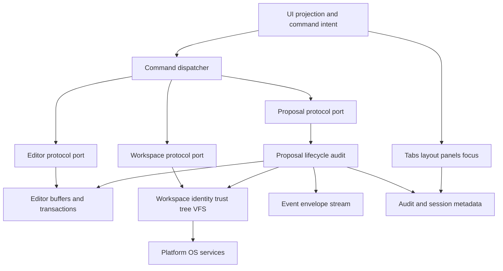

# Devil IDE — Architecture Review for Phases 5-6 v0.1

Status: **HOLD FOR REQUIRED CHANGES**

## Review scope

This review covers phase 5 multi-tab UI shell and session restore, and phase 6 save pipeline, conflict state, and proposal lifecycle.

Primary source artifacts reviewed:

- Phase 5 and phase 6 roadmap scope in [`plans/foundational-core-ide-platform-roadmap-v0.1.md`](plans/foundational-core-ide-platform-roadmap-v0.1.md:167).
- Phase 5 and phase 6 implementation tasks in [`plans/foundational-core-ide-platform-implementation-plan-v0.1.md`](plans/foundational-core-ide-platform-implementation-plan-v0.1.md:134).
- Phase transition gates in [`plans/foundational-core-ide-platform-implementation-plan-v0.1.md`](plans/foundational-core-ide-platform-implementation-plan-v0.1.md:257).
- Core ownership, mutation, latency, and save-pipeline rules in [`plans/ide-core-architecture-spec-v0.1.md`](plans/ide-core-architecture-spec-v0.1.md:47) and [`plans/ide-core-architecture-spec-v0.1.md`](plans/ide-core-architecture-spec-v0.1.md:329).
- Current UI shell spike in [`crates/devil-ui/src/ui.rs`](crates/devil-ui/src/ui.rs:64).
- Current application save path in [`crates/devil-app/src/lib.rs`](crates/devil-app/src/lib.rs:118).
- Current workspace write path in [`crates/devil-project/src/lib.rs`](crates/devil-project/src/lib.rs:1063).
- Current session storage record in [`crates/devil-storage/src/lib.rs`](crates/devil-storage/src/lib.rs:41).
- Current proposal and event contracts in [`crates/devil-protocol/src/lib.rs`](crates/devil-protocol/src/lib.rs:783) and [`crates/devil-protocol/src/lib.rs`](crates/devil-protocol/src/lib.rs:1725).

## Executive outcome

The phase 5 and phase 6 direction is architecturally correct, but the plan is not implementation-ready without stronger contract and sequencing guards.

- **Phase 5 can proceed only as a replacement of spike UI ownership**, not as incremental extension of the current shell. Current [`Shell`](crates/devil-ui/src/ui.rs:66) owns [`EditorSession`](crates/devil-editor/src/lib.rs:1065) and directly mutates text through [`Shell::handle_command()`](crates/devil-ui/src/ui.rs:101), which contradicts the phase 5 requirement that commands dispatch through protocol ports and never mutate text directly in [`plans/foundational-core-ide-platform-roadmap-v0.1.md`](plans/foundational-core-ide-platform-roadmap-v0.1.md:175).
- **Phase 6 must be blocked until the save and proposal contracts are tightened.** Current [`AppComposition::save_active_buffer()`](crates/devil-app/src/lib.rs:119) requests a save DTO and immediately calls [`WorkspaceActor::write_file_text()`](crates/devil-project/src/lib.rs:1064), bypassing proposal validation, preview, conflict state, and audit lifecycle expected by [`plans/foundational-core-ide-platform-implementation-plan-v0.1.md`](plans/foundational-core-ide-platform-implementation-plan-v0.1.md:154).
- **The phase 5-to-6 gate should be treated as hard.** The documented stop condition says phase 6 must not start when UI directly mutates text or workspace state in [`plans/foundational-core-ide-platform-implementation-plan-v0.1.md`](plans/foundational-core-ide-platform-implementation-plan-v0.1.md:258).
- **The phase 6-to-7 gate should be treated as hard.** The documented stop condition says phase 7 must not start when a stale proposal can apply or an external overwrite can clobber data in [`plans/foundational-core-ide-platform-implementation-plan-v0.1.md`](plans/foundational-core-ide-platform-implementation-plan-v0.1.md:259).

## Phase 5 review — Multi-tab UI shell and session restore

### Architecture fit

The intended phase 5 architecture is sound: the UI should own view projection, focus, tab ergonomics, command palette state, viewport layout, and panel surfaces, while editor and workspace remain authoritative for text and workspace identity. This aligns with the UI non-ownership rule in [`plans/ide-core-architecture-spec-v0.1.md`](plans/ide-core-architecture-spec-v0.1.md:47), editor ownership rules in [`plans/ide-core-architecture-spec-v0.1.md`](plans/ide-core-architecture-spec-v0.1.md:426), and phase 5 tasks in [`plans/foundational-core-ide-platform-implementation-plan-v0.1.md`](plans/foundational-core-ide-platform-implementation-plan-v0.1.md:136).

### Current-state gaps

1. **UI owns an editor session instead of projections.** [`Shell`](crates/devil-ui/src/ui.rs:66) stores [`EditorSession`](crates/devil-editor/src/lib.rs:1065), causing the UI shell to hold editor state directly.
2. **UI commands mutate text directly.** [`Shell::handle_command()`](crates/devil-ui/src/ui.rs:101) invokes editor mutation methods directly, while phase 5 requires protocol-port dispatch for open, close, save, split, reveal, and search in [`plans/foundational-core-ide-platform-implementation-plan-v0.1.md`](plans/foundational-core-ide-platform-implementation-plan-v0.1.md:141).
3. **No production tab model exists.** The current UI surface exposes an explorer projection only, while phase 5 requires tab groups, file-buffer binding, dirty indicators, pinned and preview flags, active tab, split metadata, and close-save prompts in [`plans/foundational-core-ide-platform-implementation-plan-v0.1.md`](plans/foundational-core-ide-platform-implementation-plan-v0.1.md:140).
4. **Session persistence is too narrow.** [`SessionRecord`](crates/devil-storage/src/lib.rs:43) persists workspace id, workspace path, and trust state only. It does not persist open tabs, active buffer, layout, explorer expansion, panel state, or last workspace as required by [`plans/foundational-core-ide-platform-implementation-plan-v0.1.md`](plans/foundational-core-ide-platform-implementation-plan-v0.1.md:142).
5. **The storage protocol does not expose session restore operations.** [`StorageRepositoryRequest`](crates/devil-protocol/src/lib.rs:1803) supports workspace config and file metadata only, which leaves phase 5 session restore outside the stable service-port boundary.

### Required phase 5 changes

1. Replace [`Shell`](crates/devil-ui/src/ui.rs:66) with projection-only shell state that contains layout, explorer projection, tab groups, panel state, command palette state, focus target, and status projection.
2. Remove direct text mutation from [`Shell::handle_command()`](crates/devil-ui/src/ui.rs:101). UI command handling should emit typed command requests to app-level protocol ports or command-dispatch services.
3. Introduce protocol DTOs for UI session projection, tab groups, active tab, split metadata, dirty indicators, pinned and preview flags, explorer expansion, panel state, and focus target.
4. Extend session persistence beyond [`SessionRecord`](crates/devil-storage/src/lib.rs:43) so restore can reconstruct open tabs and layout without restoring full text snapshots.
5. Gate session loading behind trust resolution, consistent with the phase 5 load-after-trust task in [`plans/foundational-core-ide-platform-implementation-plan-v0.1.md`](plans/foundational-core-ide-platform-implementation-plan-v0.1.md:143).
6. Add phase 5 validation for duplicate open behavior, split behavior, dirty close prompts, restart restore, focus retention, resize behavior, and no direct UI mutation.

## Phase 6 review — Save pipeline, conflict state, and proposal lifecycle

### Architecture fit

The intended phase 6 architecture is essential and correctly sequenced. It enforces the non-negotiable deterministic mutation rule in [`plans/ide-core-architecture-spec-v0.1.md`](plans/ide-core-architecture-spec-v0.1.md:61), the central file mutation policy in [`plans/ide-core-architecture-spec-v0.1.md`](plans/ide-core-architecture-spec-v0.1.md:329), and the phase 6 goal that every durable mutation be explicit, versioned, previewable, auditable, and safe in [`plans/foundational-core-ide-platform-implementation-plan-v0.1.md`](plans/foundational-core-ide-platform-implementation-plan-v0.1.md:150).

### Current-state gaps

1. **The app save flow bypasses proposals.** [`AppComposition::save_active_buffer()`](crates/devil-app/src/lib.rs:119) calls [`EditorEngine::request_save()`](crates/devil-editor/src/lib.rs:904), then directly calls [`WorkspaceActor::write_file_text()`](crates/devil-project/src/lib.rs:1064). This bypasses [`ProposalRequest`](crates/devil-protocol/src/lib.rs:1557), preview, approval, stale rejection, diagnostics, and audit state.
2. **Workspace writes do not compare against an explicit last-read or last-save fingerprint.** [`WorkspaceActor::write_file_text()`](crates/devil-project/src/lib.rs:1064) enforces path and capability checks, then performs atomic write with fallback through [`write_file_text_atomic`](crates/devil-project/src/lib.rs:1080), but it does not reject stale disk content before writing.
3. **Fallback semantics are too permissive.** [`WorkspaceActor::write_file_text()`](crates/devil-project/src/lib.rs:1080) falls back to non-atomic write when atomic write fails. Phase 6 needs explicit fallback policy because external overwrite must never be silently clobbered in [`plans/foundational-core-ide-platform-roadmap-v0.1.md`](plans/foundational-core-ide-platform-roadmap-v0.1.md:188).
4. **Conflict state is under-modeled.** [`FileConflictState`](crates/devil-protocol/src/lib.rs:502) has a generic reason string, but phase 6 requires clean, dirty, saving, save failed, disk changed clean, conflict dirty, reload available, keep-both pending, and compare pending states in [`plans/foundational-core-ide-platform-implementation-plan-v0.1.md`](plans/foundational-core-ide-platform-implementation-plan-v0.1.md:156).
5. **Proposal DTOs are close but incomplete.** [`WorkspaceProposal`](crates/devil-protocol/src/lib.rs:783) contains principal, capability, correlation, preconditions, preview, and timing, but the implementation plan also requires trust decision, required capability, diagnostics, and audit lifecycle fields in [`plans/foundational-core-ide-platform-implementation-plan-v0.1.md`](plans/foundational-core-ide-platform-implementation-plan-v0.1.md:157).
6. **Save proposal payload is too small for phase 6 safety.** [`SaveFileProposal`](crates/devil-protocol/src/lib.rs:873) contains file identity and snapshot id only. The save lifecycle needs buffer version, file content version, workspace generation, expected fingerprint, save intent, and conflict policy either in the payload or in mandatory preconditions.
7. **Proposal lifecycle responses do not express audit-grade outcomes.** [`ProposalResponse`](crates/devil-protocol/src/lib.rs:1568) returns valid, preview, applied, or denied, but phase 6 needs created, validated, approved, rejected, applied, failed, rolled back, conflict, and stale states.
8. **Observability contracts exist but are not implemented.** [`EventEnvelope`](crates/devil-protocol/src/lib.rs:1725) exists, but [`crates/devil-observability/src/lib.rs`](crates/devil-observability/src/lib.rs:1) remains a placeholder. Phase 6 requires proposal and conflict observability events in [`plans/foundational-core-ide-platform-implementation-plan-v0.1.md`](plans/foundational-core-ide-platform-implementation-plan-v0.1.md:160).
9. **Filesystem and workspace ADRs are not accepted artifacts.** The core architecture requires ADR decisions for file system abstraction, atomic save, conflict detection, path policy, workspace state, trust policy, watcher behavior, and identity strategy in [`plans/ide-core-architecture-spec-v0.1.md`](plans/ide-core-architecture-spec-v0.1.md:962). Phase 6 should not finalize save semantics without those decisions.

### Required phase 6 changes

1. Create a proposal service in app or workspace composition that implements [`ProposalPort`](crates/devil-protocol/src/lib.rs:1847) and mediates validation, preview, approval, application, rollback, conflict, and audit outcomes.
2. Replace direct save dispatch in [`AppComposition::save_active_buffer()`](crates/devil-app/src/lib.rs:119) with creation of a [`WorkspaceProposal`](crates/devil-protocol/src/lib.rs:783) whose payload is [`SaveFileProposal`](crates/devil-protocol/src/lib.rs:873) and whose preconditions include buffer version, file content version, snapshot id, workspace generation, and expected disk fingerprint.
3. Extend [`FileConflictState`](crates/devil-protocol/src/lib.rs:502) into an explicit conflict-state enum or typed state machine with reload, keep-both, compare, save-failed, and conflict-dirty transitions.
4. Make [`WorkspaceActor::write_file_text()`](crates/devil-project/src/lib.rs:1064) an internal VFS operation or replace it with a save-pipeline method that requires proposal context and expected fingerprint metadata.
5. Define atomic fallback policy as fail-closed by default unless an explicit fallback capability and conflict-safe precondition are present.
6. Persist audit metadata for proposal lifecycle events and save outcomes through storage contracts, without storing full source snapshots by default.
7. Emit [`EventEnvelope`](crates/devil-protocol/src/lib.rs:1725) events for proposal created, validated, previewed, approved, rejected, applied, failed, rolled back, stale, and conflict.
8. Add tests that prove external modification never clobbers disk content, stale proposals are rejected, conflict-dirty buffers preserve unsaved text, keep-both produces a distinct safe file identity, and batch apply rolls back on failure.

## Proposed phase 5-6 ownership model

## Gate recommendations

### Phase 4 to phase 5

Conditionally allow phase 5 only after phase 4 evidence is accepted under the transition rule in [`plans/foundational-core-ide-platform-implementation-plan-v0.1.md`](plans/foundational-core-ide-platform-implementation-plan-v0.1.md:257). Phase 5 implementation must start by replacing the current UI shell ownership model, not by adding tabs around [`EditorSession`](crates/devil-editor/src/lib.rs:1065).

### Phase 5 exit

Do not mark phase 5 complete until all of the following are true:

- UI state is projection-only and contains no editor engine or workspace actor ownership.
- Commands dispatch through ports or app-level command services instead of direct text mutation.
- Duplicate file open focuses existing tab unless an explicit split is requested.
- Session restore persists and reloads tabs, active tab, split metadata, explorer expansion, panel state, focus, and last workspace after trust resolution.
- Tests cover tab projection, session persistence, restart restore, focus, resize, dirty indicators, close prompts, and direct-mutation absence.

### Phase 5 to phase 6

Block phase 6 while any UI command can bypass proposal or workspace authority. This follows the documented phase 5-to-6 stop condition in [`plans/foundational-core-ide-platform-implementation-plan-v0.1.md`](plans/foundational-core-ide-platform-implementation-plan-v0.1.md:258).

### Phase 6 exit

Do not mark phase 6 complete until all durable mutation paths are proposal-mediated, version-checked, previewable, auditable, and conflict-safe. The phase 6-to-7 stop condition in [`plans/foundational-core-ide-platform-implementation-plan-v0.1.md`](plans/foundational-core-ide-platform-implementation-plan-v0.1.md:259) should be enforced with tests for stale proposal application and external overwrite clobbering.

## Final recommendation

**Hold phases 5-6 for required architecture changes.** The roadmap intent is correct, but current implementation and contracts need explicit projection-only UI, richer session restore DTOs, an implemented proposal lifecycle, conflict-state modeling, fail-closed save preconditions, and audit-grade observability before these phases can be approved for completion or downstream phase entry.
