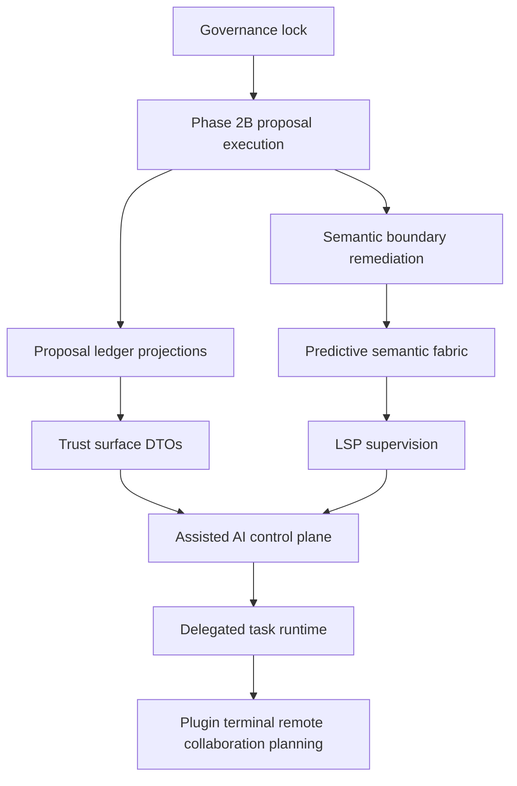

# Control-First Adaptive IDE Granular Implementation Plan v0.1

Status: Execution planning artifact
Mode: Principal systems architecture and technical project management
Inputs: [`control-first-adaptive-ide-technical-design-v0.1.md`](plans/control-first-adaptive-ide-technical-design-v0.1.md:1), [`phase-status-ledger.md`](plans/phase-status-ledger.md:1), [`remaining-implementation-tasks-plan-v0.1.md`](plans/remaining-implementation-tasks-plan-v0.1.md:1), [`ADR-0015-streaming-text-viewport.md`](plans/adrs/ADR-0015-streaming-text-viewport.md:1), [`ADR-0016-generalized-proposal-service.md`](plans/adrs/ADR-0016-generalized-proposal-service.md:1), [`ADR-0017-semantic-fabric-indexing.md`](plans/adrs/ADR-0017-semantic-fabric-indexing.md:1), and [`ADR-0018-lsp-runtime-supervision.md`](plans/adrs/ADR-0018-lsp-runtime-supervision.md:1).
Non-scope: Source implementation by this planning mode, runtime activation without phase evidence, and calendar estimates.

---

## 1. Planning thesis

The research establishes that developers want AI leverage without agency loss: fast manual editing, high-quality semantic assistance, reviewable delegated work, and governable autonomy. The finalized design maps that thesis to existing Legion IDE strengths: proposal-mediated saves through [`SaveWorkflowService`](crates/devil-app/src/lib.rs:935), workspace write authority through [`WorkspaceSaveRequest`](crates/devil-project/src/lib.rs:133), projection-only UI through [`ActiveBufferProjection`](crates/devil-ui/src/ui.rs:86), deterministic editor ownership through [`EditorEngine`](crates/devil-editor/src/lib.rs:340), protocol boundaries through [`WorkspaceProposal`](crates/devil-protocol/src/lib.rs:1472), and metadata-only observability through [`proposal_audit_record()`](crates/devil-observability/src/lib.rs:394).

Implementation must maximize substrate parallelism, not unsafe runtime parallelism. Governance, DTO design, projection design, evidence scaffolding, static audits, and tests can run concurrently. Mutation-capable runtime behavior must remain serialized behind proposal mediation, phase evidence, dependency policy, and ADR gates.

---

## 2. Critical path and blockers



Critical blockers:

1. [`phase-status-ledger.md`](plans/phase-status-ledger.md:67) makes Phase 2B generalized proposal execution the next critical code work.
2. [`remaining-implementation-tasks-plan-v0.1.md`](plans/remaining-implementation-tasks-plan-v0.1.md:27) now records Phase 2 and Phase 3 as accepted while all AI, plugin, remote, and collaboration writes remain individually gated.
3. [`ADR-0015-streaming-text-viewport.md`](plans/adrs/ADR-0015-streaming-text-viewport.md:16) provides streaming text guardrails but does not activate placeholder runtimes.
4. [`ADR-0018-lsp-runtime-supervision.md`](plans/adrs/ADR-0018-lsp-runtime-supervision.md:11) requires LSP to consume streaming snapshots and proposal substrate without blocking input or saves.
5. [`dependency-policy.md`](plans/dependency-policy.md:88) limits [`devil-index`](crates/devil-index/src/lib.rs:1) to [`devil-protocol`](crates/devil-protocol/src/lib.rs:1), [`devil-storage`](crates/devil-storage/src/lib.rs:1), and [`devil-text`](crates/devil-text/src/lib.rs:1) during Phase 3 activation.

---

## 3. Parallel workstream matrix

| Workstream | May start now | Key dependency | Must not parallelize with | Acceptance gate |
|---|---:|---|---|---|
| Governance and evidence | Yes | [`xtask::validate_dependency_policy()`](xtask/src/main.rs:117) | Runtime activation beyond accepted gates | Conservative phase markers and green dependency policy |
| Proposal execution | Yes | [`AppProposalCoordinator`](crates/devil-app/src/lib.rs:354), [`ProposalRequest`](crates/devil-protocol/src/lib.rs:3727), [`ProposalResponse`](crates/devil-protocol/src/lib.rs:3746) | LSP apply, AI edits, plugin writes, remote writes, collaboration writes | Phase 2 evidence updated with apply, rollback, denial, audit tests |
| Proposal UI projection | Yes, DTO and projection only | [`Shell`](crates/devil-ui/src/ui.rs:239), [`CommandDispatchIntent`](crates/devil-ui/src/ui.rs:154) | UI-side apply or editor state ownership | UI emits intents only |
| Viewport non-regression | Yes | [`ActiveBufferProjection`](crates/devil-ui/src/ui.rs:86), [`TextSnapshot`](crates/devil-text/src/lib.rs:240) | Full-source UI projection regressions | Large files remain viewport-only |
| Semantic boundary remediation | Accepted Phase 3 scope | `RepositoryDiscoveryImporter`, descriptor/lease source inputs, syntax-cache freshness, metadata storage | AI/plugin/remote/collaboration activation | No production disk scan or unbounded full-source persistence in [`devil-index`](crates/devil-index/src/lib.rs:1) |
| Semantic runtime | After semantic boundary remediation | [`IndexingActor`](crates/devil-index/src/lib.rs:253) | AI activation | Bounded queues, cancellation, no input or save blocking |
| LSP supervision | After proposal and semantic runtime gates | [`ADR-0018`](plans/adrs/ADR-0018-lsp-runtime-supervision.md:63) | Direct buffer or disk mutation | DTO-only output and proposal-only mutation |
| Trust surfaces | DTO and projection now | [`event_metadata_record()`](crates/devil-observability/src/lib.rs:376), [`InMemoryStorageRepositoryPort`](crates/devil-storage/src/lib.rs:209) | Raw source or prompt persistence | Metadata-only context and privacy records |
| Assisted AI | Planning now, runtime later | [`ModelProvider`](crates/devil-ai/src/lib.rs:216), semantic queries, proposal service | Direct AI mutation or hidden egress | AI outputs proposals or explanations only |
| Delegated agents | ADR and schema planning only | [`devil-agent`](crates/devil-agent/src/lib.rs:1), [`devil-tracker`](crates/devil-tracker/src/lib.rs:1) | Self-approving or direct mutation | Task state machine with proposal-only writes |

---

## 4. Phase P0: governance, phase gates, and non-regression scaffolding

Goal: freeze the safe execution envelope before adding new runtime power.

### P0.1 Phase ledger and dependency policy synchronization

Can run concurrently with P0.2, P0.3, P2.1, P5.1.

Objectives:
- Update [`phase-status-ledger.md`](plans/phase-status-ledger.md:1) only after implementation evidence exists; before that, keep future phases marked blocked or planned.
- Keep [`dependency-policy.md`](plans/dependency-policy.md:1) aligned with every new protocol symbol, crate dependency, and placeholder activation.
- Update [`xtask::validate_dependency_policy()`](xtask/src/main.rs:117) whenever policy text adds or removes literal requirements checked by tooling.

Architectural constraints:
- No placeholder crate can become active without ADR, policy entry, and contract tests.
- [`devil-protocol`](crates/devil-protocol/src/lib.rs:1) remains the only cross-domain DTO and ID boundary.
- [`devil-ui`](crates/devil-ui/src/lib.rs:1) must not gain dependencies on [`devil-editor`](crates/devil-editor/src/lib.rs:1), [`devil-project`](crates/devil-project/src/lib.rs:1), or [`devil-storage`](crates/devil-storage/src/lib.rs:1).

ADR adherence:
- Supports [`ADR-0016`](plans/adrs/ADR-0016-generalized-proposal-service.md:1) by preventing ad hoc mutation channels.
- Supports [`ADR-0017`](plans/adrs/ADR-0017-semantic-fabric-indexing.md:1) by gating semantic runtime activation.

Acceptance criteria:
- `cargo run -p xtask -- check-deps` passes.
- Policy explicitly states whether new runtime surfaces are inert, DTO-only, or active.
- No future phase status is marked accepted without evidence links.

### P0.2 Static mutation-path audit

Can run concurrently with all DTO-only work.

Objectives:
- Audit [`devil-app`](crates/devil-app/src/lib.rs:1), [`devil-project`](crates/devil-project/src/lib.rs:1), [`devil-editor`](crates/devil-editor/src/lib.rs:1), and [`devil-ui`](crates/devil-ui/src/lib.rs:1) for mutation entry points.
- Document every permitted write path and classify it as direct user edit, save proposal, generalized workspace proposal, or test-only helper.
- Add or update tests proving stale, conflict, denial, and failure outcomes preserve dirty editor text.

Architectural constraints:
- Save path must remain [`AppComposition::save_active_buffer()`](crates/devil-app/src/lib.rs:1716) to [`SaveWorkflowService`](crates/devil-app/src/lib.rs:935) to [`WorkspaceActor::save_file_with_proposal()`](crates/devil-project/src/lib.rs:2477).
- Workspace writes require expected fingerprint, file content version, workspace generation, buffer version, snapshot id, payload length, non-zero correlation, and non-nil causality.

Acceptance criteria:
- Existing test [`workspace_vfs_integration_external_overwrite_between_open_and_save_yields_conflict`](crates/devil-app/tests/workspace_vfs_integration.rs:1) remains green.
- P0 audit evidence is recorded in [`p0-governance-mutation-path-audit.md`](plans/evidence/p0-governance-mutation-path-audit.md:1).
- Any mutation path not using proposals is either direct user editor input or removed.

---

## 5. Phase P1: generalized proposal execution substrate

Goal: make every non-user-direct mutation travel through one lifecycle, validation, preview, approval, apply, audit, and rollback substrate. This is the critical path for all later AI, LSP, plugin, remote, and collaboration work.

### P1.1 Proposal lifecycle state-machine hardening

Can run concurrently with P1.2 and P1.6; must complete before P1.3, P1.4, P1.5, and P1.7 integration.

Objectives:
- Harden [`AppProposalCoordinator`](crates/devil-app/src/lib.rs:354) as the app-owned proposal lifecycle coordinator unless an ADR approves a new crate.
- Enforce legal transitions for [`ProposalLifecycleState`](crates/devil-protocol/src/lib.rs:1969) across [`ProposalRequest`](crates/devil-protocol/src/lib.rs:3727) variants.
- Preserve diagnostics for missing context, invalid transition, stale proposal, expired proposal, and denied validation.

Architectural constraints:
- Lifecycle state records must carry non-zero [`CorrelationId`](crates/devil-protocol/src/lib.rs:62) and non-nil [`CausalityId`](crates/devil-protocol/src/lib.rs:82).
- State may be retained in memory initially, but audit projections must be metadata-only.
- No proposal can skip validation before preview, approval, or apply.

Acceptance criteria:
- Tests cover Created to Validated to Previewed to Approved to Applied.
- Tests cover Created to Validated to Denied, Approved to Stale, Approved to Conflict, and Approved to Failed.
- Invalid direct Created to Applied transition returns [`ProposalResponse`](crates/devil-protocol/src/lib.rs:3746) with diagnostics and no mutation.

### P1.2 Total target coverage and deny-by-default validation

Can run concurrently with P1.1, P1.6, P2.1.

Objectives:
- Make target discovery total for [`ProposalPayload`](crates/devil-protocol/src/lib.rs:1507), including nested [`BatchProposalPayload`](crates/devil-protocol/src/lib.rs:1691).
- Validate every affected file, workspace target, terminal target, and metadata-only target before preview.
- Reject unknown, ambiguous, duplicate, missing-precondition, unsafe, or unsupported targets.

Architectural constraints:
- Validation belongs in app/domain coordination, not UI.
- File validations must use [`WorkspaceFileIdentity`](crates/devil-protocol/src/lib.rs:218) and workspace authority rather than path strings alone.
- Batch validation must fail closed when any nested target is unsupported unless batch policy explicitly allows partial failure.

Acceptance criteria:
- Unit tests cover each [`ProposalPayload`](crates/devil-protocol/src/lib.rs:1507) variant.
- Batch target coverage tests cover nested duplicate targets and mixed target categories.
- Unknown capability or unsupported terminal command returns Denied or Unsupported without mutation.

### P1.3 Open-buffer apply executor

Depends on P1.1 and P1.2; can integrate before P1.4 if tests isolate editor-buffer proposals.

Objectives:
- Route open-buffer text edits through [`EditorEngine`](crates/devil-editor/src/lib.rs:340) transactions rather than direct text replacement in UI or workspace.
- Capture buffer version, snapshot id, and content fingerprint preconditions before mutation.
- Return stale or conflict when the open buffer changed between approval and apply.

Architectural constraints:
- Must preserve undo and redo semantics.
- Must not materialize full text for large files beyond ADR-0015 bounded cases.
- Apply must be cancellable before mutation and atomic after commit for a single editor transaction.

Acceptance criteria:
- Applying a valid text edit changes only the target buffer and creates an undoable transaction.
- Stale buffer version rejects apply and preserves dirty content.
- Large-file edit tests do not require full-source UI projection.

### P1.4 Closed-file workspace apply executor

Depends on P1.1 and P1.2; can run concurrently with P1.3 after route contracts are stable.

Objectives:
- Route create, delete, rename, save, and workspace edit payloads through [`WorkspaceActor`](crates/devil-project/src/lib.rs:1158) authority.
- Use request shapes consistent with [`WorkspaceSaveRequest`](crates/devil-project/src/lib.rs:133) and existing create, delete, and rename request structs.
- Preserve fail-closed non-atomic write fallback behavior.

Architectural constraints:
- Workspace actor must remain the owner of file identity, path boundary, generation, and VFS state.
- Closed-file apply may not bypass security policy in [`devil-security`](crates/devil-security/src/lib.rs:1).
- Partial file writes are not allowed unless the batch contract explicitly models rollback and evidence proves it.

Acceptance criteria:
- Create, delete, rename, save, and workspace edit proposal tests cover success, denial, stale, conflict, and path escape.
- Failed closed-file apply emits metadata-only audit and does not alter editor dirty buffers.
- Path boundary tests in [`path_boundary.rs`](crates/devil-project/tests/path_boundary.rs:1) remain green.

### P1.5 Batch planner and rollback contract

Depends on P1.1 and P1.2; may design in parallel with P1.3 and P1.4 but must integrate after both executors are available.

Objectives:
- Complete [`BatchPreflightPlan`](crates/devil-app/src/lib.rs:265), [`BatchExecutionContract`](crates/devil-app/src/lib.rs:298), and [`ProposalBatchRollbackPolicy`](crates/devil-protocol/src/lib.rs:1532) behavior.
- Explicitly model atomic, best-effort, and dry-run plans.
- Build rollback steps before mutation for all reversible operations.

Architectural constraints:
- Batch apply must preflight every item before the first mutation.
- Rollback must emit audit before final success or failure response.
- Irreversible items require explicit denial unless the proposal policy accepts irreversible execution.

Acceptance criteria:
- Tests cover all-success atomic batch, mid-batch failure with rollback success, rollback failure, unsupported mixed batch, and dry-run.
- Partial failure records contain metadata only.
- No batch item can self-approve or bypass lifecycle state.

### P1.6 Proposal ledger projection and UI intents

Can run concurrently with P1.1 and P1.2; must not depend on source mutation internals.

Objectives:
- Add projection DTOs in [`devil-protocol`](crates/devil-protocol/src/lib.rs:1) for proposal ledger rows, context manifest summaries, risk labels, privacy labels, and diff summaries.
- Extend [`ShellProjectionSnapshot`](crates/devil-ui/src/ui.rs:126) or a sibling projection type to display proposal state without owning it.
- Add [`CommandDispatchIntent`](crates/devil-ui/src/ui.rs:154) variants for approve, reject, preview, rollback, cancel, and open proposal details.

Architectural constraints:
- UI may emit intents only; app resolves intents to [`ProposalRequest`](crates/devil-protocol/src/lib.rs:3727).
- UI must not contain proposal lifecycle state machine, diff apply logic, editor text ownership, or workspace path authority.
- Privacy labels must not require raw prompt or source storage.

Acceptance criteria:
- UI tests prove projection rendering from static snapshots.
- Intent mapping tests prove UI commands do not mutate editor or workspace state directly.
- Large proposal diffs can be represented as summaries or chunk descriptors rather than full source.

### P1.7 Audit-before-success and rollback observability

Depends on P1.1 through P1.5.

Objectives:
- Emit metadata-only proposal audit records before returning successful apply or rollback results.
- Ensure [`event_metadata_record()`](crates/devil-observability/src/lib.rs:376) and [`proposal_audit_record()`](crates/devil-observability/src/lib.rs:394) are used consistently.
- Persist audit summaries through [`InMemoryStorageRepositoryPort`](crates/devil-storage/src/lib.rs:209) or an approved port implementation.

Architectural constraints:
- Observability rejects zero correlation, nil causality, and zero event sequence.
- Audit records must not store full source, prompts, secrets, terminal output, or provider payloads by default.
- Apply success must fail closed if audit cannot be emitted where audit-before-success is required.

Acceptance criteria:
- Tests prove event ordering for validation, approval, apply, audit, and final response.
- Audit sink failure before success causes failed or denied proposal response with no hidden successful mutation.
- Existing redaction tests in [`devil-observability`](crates/devil-observability/src/lib.rs:1) remain green.

---

## 6. Phase P2: viewport and foundation-mode follow-up

Goal: preserve fast manual editing and ADR-0015 large-file behavior while richer proposals, semantic consumers, and trust surfaces are added.

### P2.1 Viewport non-regression harness

Can run concurrently with P1.1 through P1.7.

Objectives:
- Add tests around [`ActiveBufferProjection`](crates/devil-ui/src/ui.rs:86), [`TextLineSlice`](crates/devil-text/src/lib.rs:215), [`TextChunkDescriptor`](crates/devil-text/src/lib.rs:151), and [`TextSnapshot`](crates/devil-text/src/lib.rs:240).
- Prove large files render via viewport slices and degraded indicators rather than full source.
- Keep manual editing latency independent from semantic, AI, and proposal preview work.

ADR adherence:
- Implements [`ADR-0015`](plans/adrs/ADR-0015-streaming-text-viewport.md:33) by treating full-source projection as an explicit bounded small-buffer exception.

Acceptance criteria:
- Large-file tests fail if UI projections expose full text.
- [`performance_suite.rs`](crates/devil-editor/tests/performance_suite.rs:1) remains usable as a perf listing and regression signal.
- Small-buffer preview still works within the existing 5 MiB full-cache budget in [`devil-text`](crates/devil-text/src/lib.rs:11).

### P2.2 Snapshot lease consumer contract

Can run concurrently with semantic DTO design.

Objectives:
- Define contract tests for consumers that read text through snapshot descriptors, chunk descriptors, and bounded leases.
- Make stale lease behavior explicit: consumer must resynchronize rather than apply stale results.
- Document that semantic, LSP, AI context, and proposal preview consumers may not own editor text.

Architectural constraints:
- [`EditorEngine`](crates/devil-editor/src/lib.rs:340) remains text owner.
- [`TextSnapshot::try_full_text()`](crates/devil-text/src/lib.rs:349) remains bounded and non-default for large files.
- Consumers store hashes, ranges, descriptors, and metadata rather than source bodies.

Acceptance criteria:
- Contract tests cover valid chunk read, expired lease, stale snapshot id, and large-file full-text denial.
- No new crate depends on [`devil-editor`](crates/devil-editor/src/lib.rs:1) for read access unless an ADR explicitly allows it.

---

## 7. Phase P3: semantic-index boundary remediation

Goal: make semantic indexing workspace-authored, descriptor-first, freshness-aware, and privacy-bounded before accepting Phase 3.

### P3.1 Workspace-authored discovery DTOs

Can design concurrently with P1; runtime integration waits for P1 acceptance.

Objectives:
- Replace production use of direct filesystem scanning in [`RepositoryScanner::scan()`](crates/devil-index/src/lib.rs:787) with workspace-authored discovery DTOs from [`devil-project`](crates/devil-project/src/lib.rs:1) through [`devil-protocol`](crates/devil-protocol/src/lib.rs:1).
- Preserve test-only filesystem scanners behind explicit test or fixture boundaries.
- Include workspace generation, file identity, path policy result, language hint, privacy scope, and content fingerprint in discovery records.

Architectural constraints:
- [`devil-index`](crates/devil-index/src/lib.rs:1) must not become a workspace authority.
- Path boundary and trust decisions stay in [`devil-project`](crates/devil-project/src/lib.rs:1) and [`devil-security`](crates/devil-security/src/lib.rs:1).

Acceptance criteria:
- Production index flows accept workspace discovery deltas rather than arbitrary root paths.
- Dependency policy remains green and forbids [`devil-index`](crates/devil-index/src/lib.rs:1) from depending on [`devil-project`](crates/devil-project/src/lib.rs:1).
- Tests prove ignored, denied, external, and deleted files produce safe discovery outcomes.

### P3.2 Descriptor-first source inputs

Can run after P2.2 contract definitions; may parallelize with P3.3.

Objectives:
- Refactor [`SourceDocument`](crates/devil-index/src/lib.rs:937) to avoid mandatory full source ownership.
- Parse or index from chunk descriptors and bounded text windows where possible.
- Keep small-buffer full-text indexing as an explicit optimization with size and policy caps.

ADR adherence:
- Required by [`ADR-0015`](plans/adrs/ADR-0015-streaming-text-viewport.md:93) and [`ADR-0017`](plans/adrs/ADR-0017-semantic-fabric-indexing.md:49).

Acceptance criteria:
- Large-file semantic tests do not call [`TextSnapshot::try_full_text()`](crates/devil-text/src/lib.rs:349) as the default path.
- Semantic records reference ranges, chunk hashes, and file identities, not owned source strings.

### P3.3 Freshness and privacy-aware syntax cache

Can parallelize with P3.2.

Objectives:
- Extend [`SyntaxCacheKey`](crates/devil-index/src/lib.rs:1066) beyond content hash, language id, and grammar version to include privacy scope, workspace generation, schema version, and parser or model version where applicable.
- Invalidate semantic records when workspace generation, privacy scope, grammar version, or content fingerprint changes.
- Record metadata-only cache events.

Architectural constraints:
- Cache keys must not encode raw source or secret values.
- Privacy scope changes must force invalidation rather than serving stale cross-scope records.

Acceptance criteria:
- Tests prove privacy scope change invalidates syntax and semantic cache records.
- Tests prove same content hash with different language or grammar version does not collide.

### P3.4 Metadata-only semantic persistence

Can parallelize with P3.3 after DTO shapes exist.

Objectives:
- Define semantic record storage through [`devil-storage`](crates/devil-storage/src/lib.rs:1) using file identity, ranges, hashes, symbol ids, relation ids, and timestamps.
- Avoid persistence of full source text, raw prompts, or external provider responses.
- Support deterministic cleanup on file deletion, path denial, workspace generation change, and privacy scope revocation.

Acceptance criteria:
- Storage tests prove metadata records round trip without source bodies.
- Deletion and privacy revocation remove related semantic records.
- Observability records remain metadata-only.

---

## 8. Phase P4: predictive semantic fabric and LSP supervision

Goal: deliver responsive semantic assistance without compromising manual editing, proposal mediation, or streaming text constraints.

### P4.1 Actor-owned semantic scheduling

Depends on P3 acceptance.

Objectives:
- Activate [`IndexingActor`](crates/devil-index/src/lib.rs:253) as the owner of indexing queues, priorities, cancellation, and backpressure.
- Support foreground viewport priority, recent-edit priority, background workspace crawl, and cancellation on superseded snapshots.
- Emit metadata events for queue depth, cancellation, stale results, and failure.

Architectural constraints:
- Index work must not block editor input, save, or proposal apply.
- All inputs arrive as workspace discovery deltas, descriptors, chunk leases, and protocol DTOs.
- Backpressure must drop or coalesce stale work before blocking interactive workflows.

Acceptance criteria:
- Tests cover queue priority, cancellation, stale-result suppression, and bounded memory behavior.
- Manual edit and save tests remain green under queued indexing load.

### P4.2 Lexical maps, graph records, and query API

Depends on P3.2 through P3.4.

Objectives:
- Materialize lexical symbol maps, syntax-derived relation records, and metadata-only query responses.
- Add protocol query DTOs for go-to-symbol, references, outline, semantic context manifest selection, and trust-surface explanations.
- Keep vector embedding ingestion deferred until privacy and model policy ADR exists.

Architectural constraints:
- Queries return file identities, ranges, summaries, and confidence, not direct mutation commands.
- Query responses must include freshness and privacy scope metadata.

Acceptance criteria:
- Query tests cover current file, cross-file relation, stale cache rejection, and privacy-denied results.
- Dependency policy remains green.

### P4.3 LSP supervision substrate

Depends on P1 and P4.1; may start protocol planning earlier.

Objectives:
- Add supervised LSP worker boundaries consistent with [`ADR-0018`](plans/adrs/ADR-0018-lsp-runtime-supervision.md:63).
- Normalize diagnostics, hover, completion, references, code actions, formatting, rename, and workspace edits into protocol DTOs.
- Route edit-producing LSP responses into [`WorkspaceProposal`](crates/devil-protocol/src/lib.rs:1472).

Architectural constraints:
- LSP workers never mutate buffers or disk directly.
- LSP responses include snapshot id, workspace generation, server id, request id, and freshness metadata.
- Stale responses are suppressed or downgraded to diagnostics without apply rights.

Acceptance criteria:
- Rename, format, and code action tests prove proposal-only mutation.
- Stale LSP response tests prove no mutation and metadata-only audit.
- LSP queue load does not block editor input or save tests.

---

## 9. Phase P5: trust-layer surfaces

Goal: expose agency-preserving controls demanded by the research while preserving projection-only UI and metadata-only storage.

### P5.1 Trust DTOs and mode policy projections

Can start after P1.6 DTO shape is known; runtime approval depends on P1.

Objectives:
- Define protocol DTOs for mode badge, context manifest, proposal ledger summary, privacy inspector, permission prompt, cost budget, risk budget, and rollback availability.
- Treat Foundation, Assisted, Delegated, and Autonomous modes as policy levels, not separate products.
- Make every displayed trust artifact derivable from metadata, proposal state, semantic freshness, and provider capability metadata.

Architectural constraints:
- DTOs live in [`devil-protocol`](crates/devil-protocol/src/lib.rs:1).
- Rendering lives in [`devil-ui`](crates/devil-ui/src/ui.rs:1) as snapshots and intents.
- Policy resolution belongs in app or a future approved policy service, not UI.

Acceptance criteria:
- Contract tests prove DTO serialization stability in [`dto_contracts.rs`](crates/devil-protocol/tests/dto_contracts.rs:1).
- UI tests render trust snapshots without access to editor text or workspace actor.

### P5.2 Privacy inspector and context manifest

Can parallelize with P5.1 after DTOs exist.

Objectives:
- Build context manifest records listing files, ranges, semantic facts, model provider, local or remote path, privacy scope, and egress status.
- Build privacy inspector projection that explains why context is included, excluded, redacted, or denied.
- Use the trust surface as the approval gateway for AI and delegated work.

Architectural constraints:
- No raw source or prompts stored by default.
- Egress decisions must be explicit and auditable.
- User approval, workspace trust, privacy scope, and model capability must be present before remote provider calls.

Acceptance criteria:
- Tests prove denied files do not appear in AI context.
- Tests prove redacted context records retain enough metadata for audit.
- Provider calls are impossible without approved context manifest in assisted mode.

---

## 10. Phase P6: assisted AI control plane

Goal: add AI assistance that explains, proposes, and previews without taking unreviewed action.

### P6.1 Provider routing and capability policy

Depends on P1 and P5; semantic query integration benefits from P4.2.

Objectives:
- Expand [`ModelProvider`](crates/devil-ai/src/lib.rs:216) integration into app-level orchestration without letting providers mutate workspace state.
- Route provider selection through workspace trust, privacy scope, cost budget, risk budget, and local versus remote policy.
- Emit provider activity as metadata-only observability records.

Architectural constraints:
- Provider output that edits files becomes [`WorkspaceProposal`](crates/devil-protocol/src/lib.rs:1472).
- Provider output that explains code must cite context manifest entries and freshness metadata.
- Provider errors or budget exhaustion must produce visible trust-state updates, not silent fallback to unsafe providers.

Acceptance criteria:
- Tests prove provider cannot be called without approved context manifest and capability policy.
- Tests prove edit output is transformed to proposal payloads and not applied directly.
- Observability redacts prompts and source by default.

### P6.2 AI context manifest to proposal flow

Depends on P1, P4.2, P5.2.

Objectives:
- Implement the flow: user intent to context manifest to provider request to generated diff to proposal validation to preview to user approval.
- Ensure stale semantic or editor snapshots invalidate generated proposals before apply.
- Support explain-only responses that never create proposals.

Acceptance criteria:
- Assisted edit test covers successful proposal creation, stale context denial, privacy denial, budget denial, and provider failure.
- Explain-only test proves no mutation-capable proposal is created.
- Generated proposals use same lifecycle and audit path as human-created proposals.

---

## 11. Phase P7: delegated task runtime

Goal: support reviewable delegated work using explicit plans, checkpoints, proposal batches, and rollback, without self-approval or hidden mutation.

### P7.1 Tracker ledger and task state machine

Requires ADR, policy update, and contract tests before activating [`devil-tracker`](crates/devil-tracker/src/lib.rs:1).

Objectives:
- Define task states: Draft, Planned, AwaitingPermission, Running, Paused, AwaitingReview, Completed, Failed, Cancelled, RolledBack.
- Store task plans, checkpoints, proposal ids, audit ids, risk budget, and context manifest ids.
- Keep task records metadata-only by default.

Architectural constraints:
- Task runtime cannot mutate editor or workspace except by generating proposals.
- Task checkpoint rollback uses proposal rollback contracts, not raw snapshots.
- Users approve permission escalation and proposal apply actions.

Acceptance criteria:
- Tracker contract tests prove state transitions and denial paths.
- Task cancellation cancels queued provider, semantic, and LSP work where applicable.
- No task state grants direct write authority.

### P7.2 Agent orchestration shell

Requires P1, P5, P6, and P7.1 acceptance.

Objectives:
- Activate [`devil-agent`](crates/devil-agent/src/lib.rs:1) only as an orchestrator over context manifests, providers, semantic queries, trackers, and proposals.
- Support visible plan generation, plan revision, checkpointing, bounded execution, and proposal batch output.
- Keep autonomous mode disabled until a later ADR defines approval delegation rules.

Architectural constraints:
- Agent has no file system authority.
- Agent has no editor text ownership.
- Agent has no self-approval path.
- All generated edits become proposal payloads and all external calls are privacy-gated.

Acceptance criteria:
- Delegated refactor test creates task plan, context manifest, generated batch proposal, user approval request, and audit record.
- Agent failure leaves workspace unchanged unless previously approved proposals were applied and audited.

---

## 12. Phase P8: plugin, terminal, collaboration, remote, and autonomy planning

Goal: avoid premature runtime expansion while preparing safe future boundaries.

Concurrent planning tasks:
- Draft terminal ADR: commands are proposals with sandbox, cwd, environment, output retention, and approval policy. Use [`ProposalPayload::TerminalCommand`](crates/devil-protocol/src/lib.rs:1507) as DTO seed only.
- Draft plugin ADR: plugins emit intents, DTOs, and proposals through a capability broker; no direct editor, workspace, provider, or storage access.
- Draft collaboration ADR: remote participant edits become attributable proposals or direct-user edits under explicit session policy; conflict resolution uses workspace generation and buffer versions.
- Draft remote workspace ADR: remote file operations preserve the same precondition, fingerprint, generation, and fail-closed semantics as local workspace saves.
- Draft autonomy ADR: autonomous apply can only be enabled after proposal execution, trust surfaces, tracker, rollback, and audit reach accepted evidence status.

Acceptance criteria:
- Each future runtime has an ADR, dependency policy entry, threat model, DTO contract tests, and phase status entry before code activation.
- No future runtime bypasses [`WorkspaceProposal`](crates/devil-protocol/src/lib.rs:1472), projection-only UI, metadata-only observability, or ADR-0015 large-file rules.

---

## 13. Integration sequencing checklist

1. Land P0 governance and audit updates before mutating runtime code.
2. Land P1.1 and P1.2 first; they are prerequisites for safe apply behavior.
3. Land P1.3 and P1.4 as isolated executor slices with tests.
4. Land P1.5 only after executor preconditions and rollback contracts are proven.
5. Land P1.6 and P1.7 before claiming Phase 2B acceptance.
6. Keep P2 viewport tests running throughout P1 through P8.
7. Start P3 DTO design early but do not accept Phase 3 until production index flows are workspace-authored and descriptor-first.
8. Activate P4 semantic actor before LSP supervision; LSP edit outputs must route through P1.
9. Add P5 trust projections before P6 assisted AI runtime.
10. Add P7 delegated runtime only after P1, P5, and P6 are accepted.
11. Keep P8 runtime surfaces ADR-only until their phase gates are explicitly satisfied.

---

## 14. Global validation command set

Run these gates before phase acceptance and after each high-risk integration slice:

```text
cargo run -p xtask -- check-deps
cargo fmt --all --check
cargo check --workspace --all-targets
cargo test --workspace --all-targets
cargo clippy --workspace --all-targets -- -D warnings
cargo deny check
```

Targeted validation examples:

```text
cargo test -p devil-app --test workspace_vfs_integration workspace_vfs_integration_external_overwrite_between_open_and_save_yields_conflict
cargo test -p devil-editor --test performance_suite -- --list
cargo test -p devil-protocol --test dto_contracts
cargo test -p devil-project --test path_boundary
cargo test -p devil-project --test watcher_recovery
```

---

## 15. Stop conditions and rollback strategy

Stop implementation immediately if any of these conditions appear:

- UI code starts owning editor sessions, text buffers, workspace actor handles, or proposal lifecycle state.
- Any non-user-direct mutation path applies edits without [`WorkspaceProposal`](crates/devil-protocol/src/lib.rs:1472).
- Workspace writes bypass fingerprint, generation, buffer version, snapshot id, correlation, or causality preconditions.
- Large-file rendering requires full-source materialization outside bounded small-buffer mode.
- Observability, storage, semantic cache, tracker, memory, or AI records persist full source, prompts, secrets, terminal output, or provider payloads by default.
- Placeholder crates become active without ADR, dependency policy updates, and contract tests.
- LSP, AI, plugin, remote, collaboration, or terminal runtime applies edits directly.

Rollback strategy:

- Revert the smallest phase slice that introduced the violation.
- Preserve accepted lower-phase evidence and tests.
- Add a regression test that fails on the discovered boundary breach.
- Update the relevant ADR or phase ledger only after the corrected slice passes global gates.

---

## 16. Handoff summary for implementation agents

Immediate serial critical path: P0 governance and audit, then P1.1 lifecycle, P1.2 validation, P1.3 open-buffer apply, P1.4 closed-file apply, P1.5 batch rollback, P1.6 ledger projection, and P1.7 audit-before-success.

Immediate safe parallel work: P2 viewport non-regression, P5 trust DTO design, P3 discovery DTO planning, P3 cache key design, and P8 ADR drafts.

Blocked runtime work: semantic actor acceptance waits for P3 remediation; LSP supervision waits for P1 and P4; assisted AI waits for P1, P5, and preferably P4 queries; delegated agents wait for P1, P5, P6, and tracker ADR; plugin, terminal, remote, collaboration, and autonomous apply remain ADR-only until separately accepted.

This plan intentionally keeps the product strategy from the research report aligned with the strongest current architectural invariants: control-first agency, projection-only UI, proposal-only mutation, streaming text scalability, protocol-owned boundaries, metadata-only audit, and fail-closed workspace writes.

