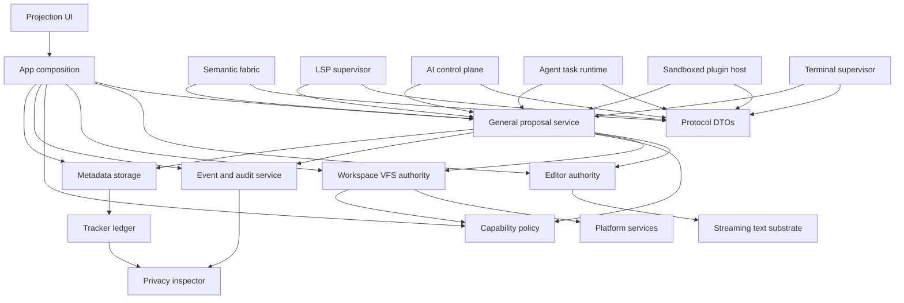
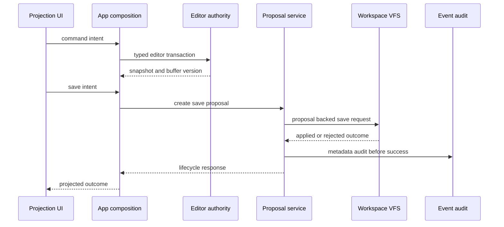
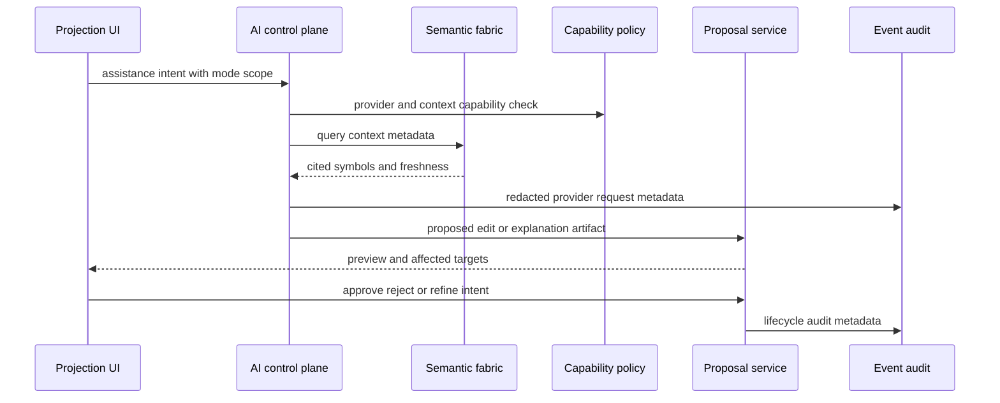
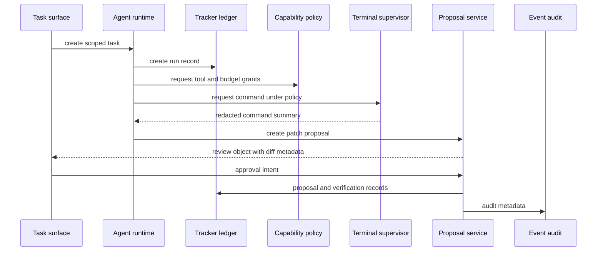

# Control-First Adaptive IDE Technical Design v0.1

Status: Draft for architecture review  
Mode: Principal systems architecture planning  
Scope: Research comparison, prioritization, target architecture, integration design, and phased implementation roadmap  
Non-scope: Source-code implementation, runtime activation without accepted gates, and calendar estimates

---

## 1. Executive conclusion

The research report's highest-value finding is that developers want AI leverage without losing agency. The winning product shape is control-first and mode-fluid: excellent manual editing remains sacred, while assistance, delegation, and opt-in autonomy become progressively more capable through visible context, explicit permissions, reviewable proposals, audit metadata, and rollback.

The current architecture is unusually aligned with that thesis. The strongest foundations are proposal-mediated saves through [`SaveWorkflowService`](../crates/legion-app/src/lib.rs:935), fail-closed workspace mutation through [`WorkspaceActor::save_file_with_proposal()`](../crates/legion-project/src/lib.rs:1620), projection-only UI through [`ActiveBufferProjection`](../crates/legion-ui/src/ui.rs:86), deterministic editor ownership through [`EditorEngine`](../crates/legion-editor/src/lib.rs:312), deny-by-default policy through [`DenyByDefaultBroker`](../crates/legion-security/src/lib.rs:708), and metadata-only event and proposal audit helpers through [`event_metadata_record()`](../crates/legion-observability/src/lib.rs:376) and [`proposal_audit_record()`](../crates/legion-observability/src/lib.rs:394).

The primary architectural gap is not AI itself. The gap is the missing control substrate around AI and other advanced actors: generalized proposals, semantic fabric, policy-bound AI execution, tracker and privacy-inspector records, sandboxed plugins, LSP supervision, terminal execution governance, collaboration, and remote execution. These must consume the existing protocol, proposal, event, storage, and policy patterns rather than bypassing them.

---

## 2. Research findings compared with current system reality

| Research-backed product need | Current architecture fit | Current gap | Architectural implication |
|---|---|---|---|
| Fast manual editing must remain excellent without AI | Strong ownership direction through [`EditorEngine`](../crates/legion-editor/src/lib.rs:312) and projection-only UI through [`ActiveBufferProjection`](../crates/legion-ui/src/ui.rs:86) | Full-source compatibility and large-file limits still constrain production-grade responsiveness | Keep Foundation mode first and preserve non-blocking viewport, chunk, and transaction event paths from [`ADR-0015`](adrs/ADR-0015-streaming-text-viewport.md:14) |
| AI assistance must be inspectable and reviewable | Durable save mutation already uses [`WorkspaceProposal`](../crates/legion-protocol/src/lib.rs:1472) | Proposal handling is still not universal for all mutation sources | Complete generalized proposal orchestration around [`ProposalPayload`](../crates/legion-protocol/src/lib.rs:1508), [`BatchProposalPayload`](../crates/legion-protocol/src/lib.rs:1630), and lifecycle commands accepted in [`ADR-0016`](adrs/ADR-0016-generalized-proposal-service.md:15) |
| Developers want visible context, provenance, and lower verification burden | Observability defaults to metadata-only records through [`event_metadata_record()`](../crates/legion-observability/src/lib.rs:376) | No context manifest, privacy inspector, or durable AI run ledger exists | Add protocol-first context manifest, proposal ledger projections, and tracker-backed privacy surfaces before active cloud AI |
| Delegated work should be task objects, not chat transcripts | Placeholder crates exist for agent, tracker, and memory | No agent state machine, task ledger, approval ledger, or verification workflow | Activate agent runtime only after semantic fabric and generalized proposals, with agents as clients of proposal, policy, tracker, and event ports |
| Autonomy must be opt-in, bounded, and reversible | Policy and proposal gates already favor fail-closed behavior | Policy context is not yet rich enough for autonomous tools, terminal commands, provider egress, or sandbox execution | Expand capability context, risk budgets, principal scopes, network allowlists, and audit-before-success rules |
| Plugin and tool ecosystems create value but also sprawl and risk | Protocol DTO direction exists; dependency policy has planned runtime placeholders | No WASM runtime, ABI, manifest validation, quotas, or plugin storage namespace exists | Introduce sandboxed plugin runtime after ADR, dependency policy, protocol contracts, and proposal-mediated write paths |
| Remote and collaborative work are now expected in top-tier tools | Workspace actor is local and durable; proposals capture mutation intent | No remote workspace identity, encrypted transport, operation log, presence, or collaborative proposal semantics | Defer until local proposal, semantic, policy, audit, and storage foundations are complete |

---

## 3. Prioritized enhancement portfolio

Priority is based on business impact, technical feasibility, and alignment with current architecture. The highest priority items either unlock multiple later capabilities or directly reinforce the research-backed trust thesis.

| Priority | Enhancement | Business impact | Technical feasibility | Architecture alignment | Decision |
|---|---|---|---|---|---|
| P0 | Foundation mode hardening and viewport-first text substrate | Highest: prevents churn from poor usability and makes Legion IDE credible without AI | High: accepted design exists in [`ADR-0015`](adrs/ADR-0015-streaming-text-viewport.md:14) and evidence exists in [`editor-text-substrate.md`](evidence/phase-1/editor-text-substrate.md:5) | Highest: preserves editor ownership and projection-only UI | Treat as release-critical substrate and keep as prerequisite for all runtime surfaces |
| P0 | Universal proposal lifecycle and proposal ledger | Highest: makes every AI, LSP, plugin, terminal, remote, and collaboration mutation reviewable | High: DTOs already include [`WorkspaceProposal`](../crates/legion-protocol/src/lib.rs:1472), [`ProposalPayload`](../crates/legion-protocol/src/lib.rs:1508), and batch constructs | Highest: directly extends the current save safety model | Complete app-domain orchestration before active AI or LSP write paths |
| P0 | Trust layer surfaces: mode badge, context manifest, proposal ledger, privacy inspector | Highest: differentiates the product on agency, explainability, and enterprise governance | Medium: requires tracker/storage/protocol additions but can start as metadata projections | Highest: matches metadata-only observability and protocol boundary direction | Implement as product-facing projections backed by protocol and storage metadata |
| P1 | Predictive semantic fabric and supervised LSP fusion | High: enables best-in-class navigation, completions, reviewable refactors, and AI context quality | Medium: [`ADR-0017`](adrs/ADR-0017-semantic-fabric-indexing.md:15) is accepted, but runtime work is substantial | High: bounded actor-owned fabric fits dependency policy | Activate after proposal service can receive code actions and refactors safely |
| P1 | Policy-bound assisted AI control plane | High: unlocks high-trust assistance, local providers, BYOK, cloud routing, and context-aware suggestions | Medium: provider abstraction exists but orchestration is absent | High if all outputs are proposals and all provider activity emits redacted events | Implement assistance before delegation; local-first and metadata-first by default |
| P2 | Delegated task runtime and agent command center | High: creates differentiated background execution and task management | Medium-low until semantic, proposal, tracker, terminal, and policy surfaces mature | High if agents remain clients, not mutation authorities | Introduce as review-first task objects with explicit policies and verification states |
| P2 | Sandboxed plugin runtime | Medium-high: ecosystem value and extensibility | Medium-low due to ABI, WASI, quotas, security, and marketplace governance | High if all host calls are capability-scoped and writes are proposals | Defer until core product surfaces stabilize and plugin ADR is accepted |
| P3 | Collaboration and remote workspace agent | Medium-high for teams and enterprise | Low until storage, event log, operation log, and remote transport contracts exist | Medium-high if built on proposal, event, policy, and storage contracts | Defer behind local control substrate, semantic fabric, and audit replay |
| P3 | Opt-in autonomous automation | High for premium monetization and enterprise automation | Low until agent runtime, terminal policy, remote isolation, and verification mature | Medium-high only if bounded and reversible | Limit initial autonomy to safe, repeatable workflows with approval gates |

---

## 4. Updated architectural blueprint

### 4.1 Control-first architectural doctrine

1. Manual editing is always the fastest path. Editor input, viewport rendering, and save workflows never wait on indexing, LSP, AI, plugins, remote transport, or collaboration replay.
2. UI is a projection renderer and command-intent surface only. It may show mode state, context manifests, proposal previews, task cards, privacy decisions, and status, but it never owns editor buffers, workspace VFS, proposal execution, or durable mutation.
3. All non-user-direct mutation enters through proposals. AI patches, LSP code actions, plugin commands, terminal-generated edits, remote operations, and collaboration operations are represented as [`WorkspaceProposal`](../crates/legion-protocol/src/lib.rs:1472) payloads and validated by app-owned proposal orchestration.
4. Protocol is the boundary. Cross-domain identities, DTOs, ports, event envelopes, proposal payloads, context manifests, policy decisions, and storage records live in or flow through [`legion-protocol`](../crates/legion-protocol/src/lib.rs:1).
5. Observability and replay are metadata-first. Events and audits store IDs, hashes, byte counts, redaction hints, lifecycle states, policy decisions, and causality; they do not persist full source or raw secrets by default.
6. Runtime activation is phase-gated. New LSP, terminal, plugin, agent, tracker, memory, remote, and collaboration runtime behavior requires accepted ADRs, dependency-policy coverage, protocol contracts, contract tests, ownership tests, and evidence.

### 4.2 Target component map

### 4.3 Target data-flow principles

#### Manual edit and save flow

Integration points:

- Save preconditions remain anchored in [`WorkspaceSaveRequest`](../crates/legion-project/src/lib.rs:133): expected fingerprint, file content version, workspace generation, buffer version, snapshot ID, payload length, correlation ID, and causality ID.
- Staleness remains typed through [`ProposalVersionPreconditions::is_stale()`](../crates/legion-protocol/src/lib.rs:1410).
- Non-atomic fallback remains disabled and fail-closed.

#### Assisted AI suggestion flow

Integration points:

- The AI control plane must never call editor or workspace mutation authorities directly.
- Generated edits become [`ProposalPayload`](../crates/legion-protocol/src/lib.rs:1508) variants, including text edits, workspace edits, or batches.
- Context manifests cite snapshot IDs, symbol IDs, file IDs, diagnostics, tests, terminal summaries, policy decisions, and privacy scopes; they do not persist unbounded prompt or source text by default.

#### Delegated task flow

Integration points:

- The task object is the product primitive: goal, scope, context manifest, permissions, proposal IDs, verification output, risk budget, cost budget, and final disposition.
- Agent states are explicit: observing, planning, proposing, waiting for approval, applying, verifying, recovering, and blocked.
- Terminal execution is capability-gated and summarized; risky commands require explicit approval and redacted observability.

---

## 5. New services and component modifications

### 5.1 General proposal service

Ownership: app-domain orchestration first, not a new crate by default, consistent with [`implementation-plan.md`](implementation-plan.md:140) and [`ADR-0016`](adrs/ADR-0016-generalized-proposal-service.md:17).

Responsibilities:

- Replace save-specific coordination with a total proposal lifecycle service.
- Support lifecycle states created, validated, previewed, approved, rejected, applied, denied, failed, rolled back, stale, conflict, and cancelled.
- Use total payload visitors for affected targets based on [`ProposalAffectedTarget`](../crates/legion-protocol/src/lib.rs:1577).
- Apply current save route exactly as today through workspace authority.
- Deny runtime apply for future AI, LSP, plugin, terminal, remote, and collaboration payloads until each runtime gate is accepted.
- Emit or persist audit metadata before reporting success.

Required modifications:

- Replace save-only assumptions in app proposal routing with total visitors for [`ProposalPayload`](../crates/legion-protocol/src/lib.rs:1508).
- Add deterministic preview models for every payload kind.
- Use [`ProposalBatchAtomicity`](../crates/legion-protocol/src/lib.rs:1532), rollback policy, dependency edges, and partial-failure records for multi-target operations.
- Add contract tests in [`dto_contracts.rs`](../crates/legion-protocol/tests/dto_contracts.rs:653) and integration tests that prove current save conflict behavior remains unchanged.

### 5.2 Control surface projection service

Ownership: app-domain projection service consumed by UI.

Responsibilities:

- Project mode badge state: foundation, assisted, delegated, autonomous, and air-gap status.
- Project proposal ledger: proposal list, selected preview, affected targets, lifecycle status, warnings, and rollback availability.
- Project context manifest: what files, symbols, diagnostics, tests, terminal summaries, model providers, and memory items influenced an AI response.
- Project privacy inspector: provider, model, route, redaction decision, policy grant, capability request, cost/risk budget, and transmitted metadata categories.

Integration points:

- UI receives projection data and dispatches intents only.
- Projection records should be derived from proposal, event, tracker, storage, semantic, and policy metadata.
- Raw source text, raw prompts, raw terminal output, secrets, and full provider payloads stay out of durable projection storage by default.

### 5.3 Semantic fabric service

Ownership: [`legion-index`](../crates/legion-index/src/lib.rs:1), activated only under accepted [`ADR-0017`](adrs/ADR-0017-semantic-fabric-indexing.md:15) and dependency policy entries in [`dependency-policy.md`](dependency-policy.md:88).

Responsibilities:

- Maintain actor-owned bounded queues with admission outcomes, priority scheduling, cancellation, and backpressure.
- Consume snapshot descriptors, chunk leases, changed ranges, file identities, watcher deltas, LSP DTOs, and metadata event envelopes.
- Produce lexical maps, syntax caches, graph records, query responses, freshness markers, and degraded-result metadata.
- Cancel obsolete work using semantic cancellation reasons such as [`SemanticCancellationReason`](../crates/legion-protocol/src/lib.rs:2812).
- Route semantic refactors, code actions, and rename edits through proposals.

Required modifications:

- Keep normal runtime indexing away from full-source copies.
- Use content hash, grammar version, model version, privacy scope, workspace generation, file identity, and schema version as invalidation keys.
- Defer vector indexing and embeddings until a dedicated ADR covers provenance, privacy, model identity, invalidation, retention, and dependency changes.

### 5.4 LSP supervisor

Ownership: future phase-gated runtime surface, not an ad hoc app helper.

Responsibilities:

- Supervise server lifecycle, transport, restart policy, workspace trust checks, document sync, stale response suppression, and cancellation.
- Normalize diagnostics, completions, hover, semantic tokens, definitions, references, formatting, rename, and code actions into protocol DTOs.
- Fuse LSP results into the semantic fabric without blocking editor input.
- Convert edit-producing responses into proposals and deny any unsafe unrepresentable mutation.

Integration points:

- Consumes streaming snapshots and chunk leases from the editor/text substrate.
- Emits metadata-only events and uses capability policy for server startup and process access.
- Sends all mutation-capable outputs to proposal orchestration.

### 5.5 AI control plane

Ownership: [`legion-ai`](../crates/legion-ai/src/lib.rs:1) plus provider adapters in [`legion-ai-providers`](../crates/legion-ai-providers/src/lib.rs:1), activated after proposal and semantic gates.

Responsibilities:

- Route model requests across local, BYOK, and cloud providers under policy.
- Support streaming, structured outputs, embeddings metadata placeholders, reranking metadata, cancellation, provider health, cost metadata, and privacy labels.
- Assemble context manifests from editor snapshots, semantic symbols, diagnostics, terminal summaries, tracker tasks, memory records, and user selections.
- Emit redacted provider events and persist run metadata through tracker/storage.
- Produce proposals or explanation artifacts, not direct mutations.

Security requirements:

- Default to local-provider-first activation.
- Cloud provider use requires explicit network policy, provider allowlist, workspace trust, redaction, cost budget, and air-gap enforcement.
- Prompt-injection defenses must treat repository content, terminal output, plugin content, and remote content as untrusted data.

### 5.6 Agent task runtime and tracker ledger

Ownership: future activation of [`legion-agent`](../crates/legion-agent/src/lib.rs:1) and [`legion-tracker`](../crates/legion-tracker/src/lib.rs:1) after accepted ADRs and dependency-policy updates.

Responsibilities:

- Represent delegated work as durable task objects rather than chat transcripts.
- Track state transitions, selected context, provider calls, tool calls, policy decisions, proposal IDs, approvals, verification output, recovery attempts, and blocked states.
- Enforce scoped tool grants, risk budgets, cost budgets, environment constraints, and approval gates.
- Expose command-center projections to UI without giving UI execution authority.

### 5.7 Terminal supervisor

Ownership: future phase-gated runtime surface using existing platform process and PTY scaffolding only after terminal ADR acceptance.

Responsibilities:

- Mediate process execution, shell sessions, environment variables, working directory, timeout, kill/restart, scrollback retention, and redaction.
- Classify commands by read, mutate, terminal, network, language-server, or destructive classes using security policy.
- Provide redacted summaries to tracker, AI, and privacy inspector.
- Route file mutations from terminal workflows through explicit proposals when possible; otherwise classify them as external workspace changes observed by watcher and conflict machinery.

### 5.8 Sandboxed plugin runtime

Ownership: future [`legion-plugin`](../plans/dependency-policy.md:122) crate only after ADR, dependency policy, ABI contracts, tests, and evidence.

Responsibilities:

- Validate plugin manifests, signatures, compatibility ranges, contribution points, activation events, and capability declarations.
- Run plugins under WASI or equivalent sandbox with no ambient filesystem, network, process, editor, workspace, AI, memory, or storage access.
- Provide host calls only through protocol DTOs, policy checks, quotas, and cancellation.
- Namespace plugin state storage and emit redacted plugin events.
- Route plugin writes through proposals.

---

## 6. Strict integration points

| Source subsystem | Allowed inputs | Allowed outputs | Forbidden behavior |
|---|---|---|---|
| UI | App projections, mode badge, viewport slices, proposal previews, task projections | Command intents, selection intents, approve/reject/cancel/refine intents | Owning editor buffers, applying proposals, writing files, holding workspace VFS authority |
| Editor | Typed editor commands, workspace-opened content, proposal-approved editor transactions | Snapshots, buffer versions, transaction descriptors, viewport projections | Writing disk, calling AI/provider/network, blocking on semantic or LSP work |
| Workspace | App/proposal-mediated VFS requests, platform watcher events, trust decisions | File identities, fingerprints, watcher deltas, save outcomes, conflict outcomes | Accepting writes without proposal/version/fingerprint/capability preconditions |
| Proposal service | Proposed payloads, preconditions, policy context, lifecycle commands | Lifecycle responses, previews, rollback records, audit events | Applying unsupported future runtime payloads, skipping audit on success, persisting raw source by default |
| Semantic fabric | Snapshot descriptors, chunk leases, file metadata, LSP DTOs, watcher deltas | Query responses, graph metadata, stale markers, refactor proposals | Direct editor/workspace mutation, full-source durable persistence, blocking editor input |
| AI control plane | Context manifests, semantic queries, policy grants, provider config | Redacted events, model responses, proposals, explanations | Direct mutation, hidden network egress, unrestricted tool calls, storing raw prompts by default |
| Agent runtime | Task definitions, scoped grants, context manifests, proposal responses | Task records, tool-call records, proposals, verification records | Self-approval, unbounded terminal/network execution, direct disk edits |
| Plugin runtime | Manifest grants, projection-safe context providers, host-call requests | Contribution projections, metadata events, proposals | Ambient host access, direct file/process/network access, unbounded CPU or memory |
| Terminal supervisor | Explicit shell/session requests and command policy | Redacted output summaries, exit status, observed side-effect metadata | Untrusted mutation, secret leakage, command execution outside policy |

---

## 7. Phased engineering roadmap

### Phase A: Governance and architecture truth lock

Objectives:

- Ensure every current and planned runtime surface has dependency-policy coverage before activation.
- Keep placeholder crates inert until their ADR, policy, protocol, test, and evidence gates exist.
- Convert stale architecture-review claims into historical notes where they conflict with current save/projection behavior.

Implementation steps:

1. Verify [`dependency-policy.md`](dependency-policy.md:1) covers all current crates and planned runtime placeholders.
2. Keep [`xtask::validate_dependency_policy()`](../xtask/src/main.rs:117) aligned with policy sections and required protocol symbols.
3. Add architecture-gate tests proving UI remains projection-only, saves remain proposal-mediated, and raw source is not persisted by default.
4. Require an accepted ADR for any runtime activation in index, LSP, terminal, plugin, agent, tracker, memory, remote, or collaboration surfaces.

### Phase B: Foundation mode and scalable editor substrate

Objectives:

- Make manual editing excellent with AI disabled.
- Preserve viewport-first rendering, chunked snapshots, degraded large-file status, and non-blocking transaction event fanout.

Implementation steps:

1. Finish renderer-backed UI evidence for viewport-only rendering and input responsiveness.
2. Ensure UI full-source projection exists only in explicitly bounded small-buffer mode.
3. Keep large-file degraded mode user-visible, with bounded search and disabled or stale expensive overlays.
4. Validate transaction event consumers cannot block editor input or save paths.
5. Preserve current save conflict and dirty-buffer behavior in integration tests.

Scalability constraints:

- Large files must avoid full-source UI projection.
- Snapshot leases must pin only bounded chunks unless explicitly eligible for small-buffer full-source mode.
- Background consumers must resynchronize rather than blocking editor transactions.

### Phase C: Universal proposal lifecycle and trust ledger

Objectives:

- Make every mutation source representable, previewable, auditable, and reversible where supported.
- Add product-visible proposal ledger projections.

Implementation steps:

1. Complete app-domain generalized proposal service implementation.
2. Replace save-only affected-target logic with total visitors across all proposal payloads.
3. Implement preview, approval, rejection, cancellation, stale, conflict, failed, applied, rollback, and partial-failure transitions.
4. Keep future runtime payloads validateable or previewable as metadata-only denied stubs until their gates land.
5. Persist proposal audit metadata and event metadata before reporting success.
6. Add proposal ledger projection for UI with affected targets, warnings, policy decisions, and lifecycle status.

Risk mitigation:

- Save behavior remains the regression anchor.
- Unsupported routes fail closed.
- Batch atomicity claims are validated before mutation.
- Dirty editor text is preserved on rejected, stale, denied, conflict, or failed outcomes.

### Phase D: Trust layer product surfaces

Objectives:

- Productize the research-backed control thesis before deep autonomy.
- Make mode, context, privacy, and provenance visible.

Implementation steps:

1. Define protocol DTOs for mode badge state, context manifests, privacy-inspector records, risk budgets, cost budgets, and provider route metadata.
2. Store metadata-only records in durable storage through migration-governed repositories.
3. Add UI projections for mode badge, proposal ledger, context manifest, privacy inspector, and task status.
4. Add redaction tests proving no raw source, secrets, raw prompts, or raw terminal output are persisted by default.
5. Add policy context checks for provider egress, terminal commands, plugin host calls, and autonomous transitions.

Security considerations:

- Air-gap and local-provider-only modes must be enforceable policy states.
- Provider requests require explicit workspace trust, network allowlists, redaction, and audit metadata.
- Prompt-injection content is treated as untrusted input regardless of source.

### Phase E: Predictive semantic fabric and LSP fusion

Objectives:

- Build the semantic substrate for high-quality assistance, navigation, refactoring, and AI context.

Implementation steps:

1. Activate [`legion-index`](../crates/legion-index/src/lib.rs:1) under existing dependency policy only.
2. Implement bounded queue admission, priority scheduling, cancellation, backpressure, and stale-result metadata.
3. Replace normal full-source indexing with descriptor, changed-range, chunk-lease, or explicitly degraded bounded inputs.
4. Add lexical maps, syntax worker pools, graph extraction, cache freshness, and query APIs.
5. Add supervised LSP runtime only after ADR acceptance, with normalized diagnostics, completions, semantic tokens, hover, definitions, references, formatting, rename, and code actions.
6. Route LSP rename, format, organize imports, and code actions through proposals.

Scalability constraints:

- Open-buffer work outranks background scans.
- Obsolete parse, LSP, ranking, and query-refresh jobs are cancelled.
- Query results expose freshness and degradation.
- Semantic work cannot block editor input or save workflows.

### Phase F: Assisted AI control plane

Objectives:

- Deliver low-autonomy, high-trust assistance with visible context and reviewable proposals.

Implementation steps:

1. Extend AI provider contracts for streaming, structured output, cancellation, cost metadata, provider health, and route metadata.
2. Implement local-provider adapters before cloud adapters.
3. Add provider routing under policy with explicit local, BYOK, cloud, and air-gap states.
4. Generate context manifests from semantic queries, editor snapshot descriptors, diagnostics, tests, terminal summaries, tracker tasks, and user selections.
5. Emit redacted provider request and response metadata.
6. Convert patch outputs into proposals and non-mutating outputs into explanation artifacts with citations.

Risk mitigation:

- AI cannot mutate editor, workspace, terminal, tracker, memory, settings, or storage directly.
- Cloud egress is off unless policy allows it.
- Model output is not trusted as policy authority.
- Verification output becomes part of proposal or tracker metadata.

### Phase G: Delegated task runtime

Objectives:

- Introduce background task delegation as review-first task objects with explicit scopes.

Implementation steps:

1. Activate tracker schema for task records, run records, approval records, tool-call records, context manifests, proposal links, and verification records.
2. Implement agent state machine with observing, planning, proposing, waiting for approval, applying, verifying, recovering, and blocked states.
3. Add task command-center projection: goal, scope, selected context, policy grants, proposed diffs, tests, lint output, risk status, and merge readiness.
4. Gate terminal, network, provider, plugin, and workspace interactions by task-level policy and budgets.
5. Add recovery semantics for cancelled, failed, stale, denied, or conflict outcomes.

Security considerations:

- No self-approval for risky transitions.
- Command execution must be least-privilege and auditable.
- Secret access is denied unless explicitly scoped and redacted.
- Task records persist metadata, not raw source snapshots.

### Phase H: Sandboxed plugin runtime

Objectives:

- Enable ecosystem extensibility without reintroducing plugin sprawl, direct mutation, or ambient authority.

Implementation steps:

1. Accept WASM plugin ABI and host-call ADR.
2. Update [`dependency-policy.md`](dependency-policy.md:122), [`Cargo.toml`](../Cargo.toml:1), and dependency validation before creating or activating a plugin crate.
3. Define manifest schema, signatures, compatibility ranges, contribution descriptors, activation events, quotas, and capability declarations in protocol DTOs.
4. Run plugins with no ambient capabilities and with per-plugin CPU, memory, storage, network, and host-call budgets.
5. Route reads through scoped context providers and writes through proposals.
6. Persist plugin state under namespaced storage with migration and quota enforcement.

### Phase I: Remote workspace and collaboration substrate

Objectives:

- Add team and remote workflows only after local proposal, semantic, policy, event, and storage contracts are durable.

Implementation steps:

1. Define distributed identity, remote workspace authority, encrypted transport, operation log, presence, version vector, and remote proposal DTOs.
2. Introduce remote workspace agents with scoped filesystem, process, LSP, index, and terminal services.
3. Add local optimistic projections with conflict-safe reconciliation.
4. Model collaborative edits through operation log or CRDT contracts that preserve editor authority and proposal-mediated durable writes.
5. Add shared proposal review, collaborative approvals, and metadata replay drills.

Risk mitigation:

- Remote agents cannot bypass local policy.
- Collaboration convergence tests must run before multi-user mutation is enabled.
- Remote and collaboration events carry distributed correlation and redaction metadata.

### Phase J: Opt-in autonomous automation

Objectives:

- Enable bounded autonomy for repeatable workflows only after the control substrate is mature.

Initial safe lanes:

- Dependency update proposals.
- Flaky test investigation.
- PR summaries and review checklists.
- Compliance checks.
- Repetitive refactor proposals.
- Overnight verification in isolated environments.

Implementation rules:

- Autonomy is disabled by default.
- Each run has explicit scope, budget, environment snapshot, secret policy, network policy, rollback expectation, and approval gates.
- Dangerous transitions require human approval.
- Every mutation is a proposal and every provider/tool action emits metadata-only audit records.

---

## 8. Dependency management strategy

1. Preserve current dependency direction in [`dependency-policy.md`](dependency-policy.md:9).
2. Do not introduce runtime crates until the matching ADR and policy entry are accepted.
3. Keep [`legion-protocol`](../crates/legion-protocol/src/lib.rs:1) as the cross-domain boundary for identifiers, DTOs, ports, lifecycle records, policy metadata, and event contracts.
4. Update [`xtask::validate_dependency_policy()`](../xtask/src/main.rs:117) whenever dependency-policy sections or protocol-symbol requirements change.
5. Avoid provider, vector-store, WASM, remote-transport, and collaboration dependencies in core editor, workspace, UI, or app paths.
6. Prefer metadata and port contracts before concrete adapters.
7. Require contract tests for serialization, lifecycle transitions, capability decisions, redaction behavior, and downgrade compatibility.

---

## 9. Security and privacy controls

| Threat | Control |
|---|---|
| AI or plugin silently mutates source | All edits become proposals; direct editor/workspace mutation is forbidden |
| Cloud provider leaks source or secrets | Context manifests, redaction, provider allowlists, air-gap mode, metadata-only event records |
| Prompt injection controls tools | Model output is untrusted; policy broker owns capability decisions; dangerous tool calls require approval |
| Terminal command causes destructive side effects | Command taxonomy, workspace trust, explicit risk approval, redacted output summaries, audit metadata |
| Plugin accesses ambient host resources | WASI sandbox, manifest capabilities, quotas, namespaced state, no direct filesystem/process/network access |
| Collaboration or remote stale writes clobber user work | Version vectors, proposal preconditions, fingerprints, operation logs, conflict outcomes, rollback records |
| Audit persistence failure hides mutation | Audit-before-success fail-closed behavior for mutation success paths |
| Full source persists unintentionally | Metadata-only default, bounded previews, redaction tests, retention labels, storage schema review |

---

## 10. Validation and evidence gates

Every phase must record evidence under [`plans/evidence`](evidence/phase-0/check-deps.txt:1) or an equivalent phase-specific evidence file.

Required recurring gates:

- [`cargo run -p xtask -- check-deps`](../Cargo.toml:1)
- [`cargo fmt --all --check`](../Cargo.toml:1)
- [`cargo check --workspace --all-targets`](../Cargo.toml:1)
- [`cargo test --workspace --all-targets`](../Cargo.toml:1)
- [`cargo clippy --workspace --all-targets -- -D warnings`](../Cargo.toml:1)
- Redaction and metadata-only persistence tests for every provider, proposal, plugin, terminal, tracker, memory, remote, and collaboration path.
- Ownership tests proving UI, AI, LSP, plugin, terminal, remote, and collaboration subsystems cannot mutate editor/workspace state directly.
- Performance tests showing editor input and save workflows do not block on semantic, LSP, AI, plugin, terminal, remote, or collaboration consumers.

---

## 11. Key risks and mitigation plan

| Risk | Impact | Mitigation |
|---|---|---|
| Building AI surfaces before manual excellence | Product feels like agent theater rather than a trusted IDE | Foundation mode and viewport substrate stay first-class release gates |
| Proposal bypass through LSP, plugin, terminal, or AI | Data loss, nondeterminism, broken auditability | Mutation-path audits, ownership tests, and fail-closed unsupported routes |
| Semantic fabric competes with input latency | Core editor becomes sluggish under load | Bounded queues, priority scheduling, cancellation, stale results, and non-blocking leases |
| Privacy inspector becomes decorative rather than authoritative | Users lose trust and enterprises reject adoption | Drive inspector from actual event, policy, tracker, provider, and proposal metadata |
| Agent runtime becomes self-policing | Unsafe autonomy and approval confusion | External capability broker, explicit task policy, no self-approval for risky transitions |
| Plugin ecosystem recreates extension sprawl | Security risk and inconsistent UX | Manifest governance, contribution registry, quotas, sandboxing, and proposal-mediated writes |
| Remote/collab added before local audit/replay maturity | Conflict and recovery failures | Defer remote and collaboration behind storage, event replay, proposal, and semantic gates |
| Dependency drift creates hidden coupling | Long-term architecture erosion | Hard dependency-policy enforcement and ADR-required runtime activation |

---

## 12. Proposed approval checkpoints

1. Confirm P0 priority order: Foundation mode, universal proposals, and trust-layer surfaces before active AI delegation.
2. Confirm AI activation order: local-assisted AI before cloud providers, and assisted mode before delegated mode.
3. Confirm remote and collaboration remain deferred until local proposal, semantic, event, policy, and storage contracts are mature.
4. Confirm plugin runtime waits for ABI, sandbox, dependency policy, and proposal-mediated write contracts.
5. Confirm no implementation begins for non-markdown source files until the plan is approved and work switches into an implementation-capable mode.

---

## 13. Handoff summary

The research report does not require a pivot away from the current architecture. It strengthens the existing thesis: Legion IDE should become a control-first adaptive IDE, not a black-box autonomous agent shell. The highest-leverage architectural move is to turn the existing save proposal, protocol boundary, event metadata, and policy broker patterns into universal platform contracts. Only then should AI, LSP, plugins, terminal tools, agents, remote workspaces, and collaboration become active runtime surfaces.
