# Legion IDE Core Architecture and Design Specification v0.1

Status: Draft for architecture review  
Audience: Founding engineering team, systems architecture, editor engineering, platform engineering  
Scope: Foundational standalone IDE infrastructure only  
Non-scope: AI orchestration, AI provider adapters, agents, long-term memory, hosted services, marketplace operations

---

## 1. Source Inputs Reviewed

This specification is derived from the existing project architecture artifacts and current spike baseline:

- Foundational product principles and crate boundaries in [`plans/architecture-charter-v0.1.md`](plans/architecture-charter-v0.1.md:20).
- Dependency direction and protocol boundary corrections in [`plans/architecture-review-v0.1.md`](plans/architecture-review-v0.1.md:20).
- Enforced dependency policy in [`plans/dependency-policy.md`](plans/dependency-policy.md:7).
- Freeze prerequisites in [`plans/architecture-freeze-v0.1.md`](plans/architecture-freeze-v0.1.md:11).
- Milestone feasibility tracks in [`plans/milestone-0-feasibility-proofs.md`](plans/milestone-0-feasibility-proofs.md:17).
- Native shell proof requirements in [`plans/SPIKE-001A-native-shell-proof.md`](plans/SPIKE-001A-native-shell-proof.md:17).
- Existing protocol boundary primitives in [`crates/devil-protocol/src/lib.rs`](crates/devil-protocol/src/lib.rs:9).
- Current minimal editor session and transaction event emission in [`crates/devil-editor/src/lib.rs`](crates/devil-editor/src/lib.rs:28).
- Current spike text buffer implementation in [`crates/devil-text/src/lib.rs`](crates/devil-text/src/lib.rs:169).
- Current platform file helpers in [`crates/devil-platform/src/lib.rs`](crates/devil-platform/src/lib.rs:28).

---

## 2. Executive Architecture Position

Legion IDE should be built as a standalone, Rust-native IDE core whose first-class responsibilities are opening and managing local workspaces, abstracting file system operations safely, editing text with deterministic transactions, integrating language servers, and hosting first-party or tightly sandboxed extensions through capability-scoped plugin APIs.

The foundational core must be useful without AI:

1. Open a trusted local workspace.
2. Render a navigable file tree.
3. Open, edit, save, undo, redo, and close files.
4. Detect file changes and conflicts.
5. Provide diagnostics, completions, hover, go-to-definition, rename, formatting, and code actions through LSP.
6. Allow controlled built-in plugin contributions for commands, panels, language adapters, editor decorations, and workspace services.
7. Persist user settings, workspace metadata, editor sessions, and diagnostics caches locally.

The same core must later support AI-driven features without architectural contamination. This requires immutable editor snapshots, typed action proposals, versioned events, explicit ownership of state, and policy-enforced capability boundaries. AI may later consume the same protocol events and action surfaces as plugins, but the IDE core must not depend on AI crates to function.

---

## 3. Non-Negotiable Architecture Constraints

### 3.1 Latency Isolation

- Text input, cursor motion, selection, scrolling, and viewport rendering remain on the latency-critical path.
- Workspace scanning, file watching, indexing, LSP requests, plugin activation, and persistence run asynchronously with bounded queues.
- Long-running work must support cancellation and priority degradation.
- UI state can project editor state, but UI must not become canonical owner of text, workspace, LSP, or plugin state.

### 3.2 Local-First Operation

- Local source content and workspace metadata remain local by default.
- Core IDE usage requires no cloud account and no hosted gateway.
- Language servers and plugins must not bypass the file system abstraction or policy layer.
- Network-capable plugins and language tools are opt-in capabilities.

### 3.3 Deterministic Mutation

- All editor and workspace mutations are typed transactions.
- Code actions, rename operations, formatting edits, plugin edits, and future AI edits are normalized into previewable workspace edit proposals.
- Applied mutations produce transaction events, undo metadata, affected path lists, and correlation identifiers.

### 3.4 Strict Dependency Direction

- Core contracts live in the protocol crate.
- Editor core must not directly depend on project or workspace implementation.
- Platform abstractions remain OS services, not editor or workspace authorities.
- Plugin and LSP systems depend on protocol contracts and capability services rather than UI internals.
- Storage details are hidden behind storage services and must not leak into editor, workspace, LSP, or plugin logic.

### 3.5 Clean-Slate Extension Model

- No VS Code extension compatibility in V1 or V2 unless rechartered.
- V1 avoids arbitrary third-party extension execution.
- First-party and trusted plugins must use capability-scoped APIs.
- Future untrusted plugin execution must run out-of-process or in a sandbox such as WASI, never as unrestricted host code.

---

## 4. High-Level System Architecture

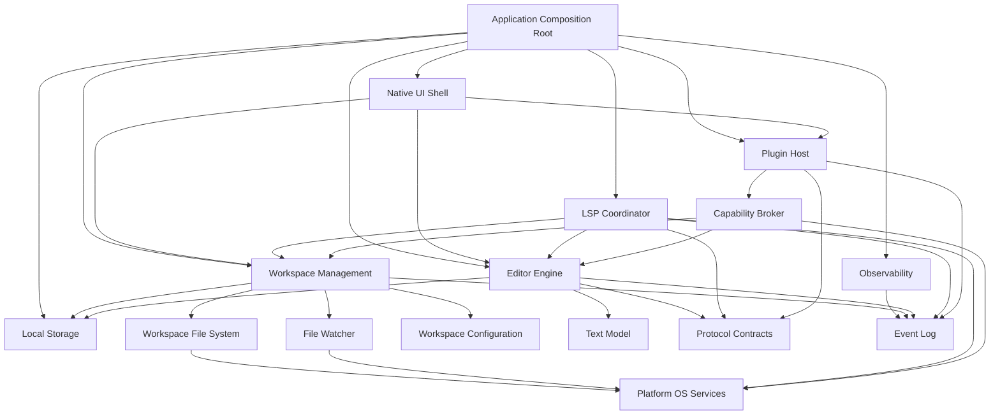

### 4.1 Architectural Layers

| Layer | Responsibility | Canonical owners |
|---|---|---|
| Application composition | Startup, dependency wiring, service lifecycle, shutdown | App root |
| UI shell | Rendering, input routing, command palette, panels, view projections | UI shell |
| Workspace management | Workspace identity, file tree, trust, configuration, watcher coordination | Workspace actor |
| File system abstraction | Safe local reads, atomic writes, metadata, watching, path policy | Platform services plus workspace VFS |
| Editor engine | Buffers, snapshots, selections, transactions, undo, diagnostics overlays | Editor core |
| LSP integration | Server lifecycle, document sync, diagnostics, completions, code actions | LSP coordinator |
| Plugin host | Manifest loading, activation, contribution registry, capability enforcement | Plugin host actor |
| Storage | Durable metadata, settings, session restore, diagnostics caches, migrations | Storage service |
| Observability | Traces, metrics, causal event logs, replay aids | Observability service |

---

## 5. Physical Crate Architecture

### 5.1 Existing Crates Retained

| Crate | Role in this specification |
|---|---|
| `devil-app` | Thin composition root for all core services. |
| `devil-ui` | Native UI shell and view projection layer. |
| `devil-editor` | Editor command and transaction authority. |
| `devil-text` | Rope, text positions, snapshots, edits, spans, and line index primitives. |
| `devil-project` | Workspace management, file tree, watcher orchestration, workspace configuration. |
| `devil-platform` | OS-level file, watcher, keychain, process, shell, and path services. |
| `devil-protocol` | Versioned DTOs, identifiers, events, ports, action schemas. |
| `devil-storage` | Local persistence wrappers, migrations, cache directories. |
| `devil-security` | Capability policy, trust state, path restrictions, outbound/network policy. |
| `devil-observability` | Structured tracing, metrics, event log, replay metadata. |
| `devil-index` | Shallow file and symbol indexing after core workspace/editor paths are stable. |

### 5.2 Proposed Post-Freeze Crates

The following should be added only after current freeze gates are satisfied and new ADRs are accepted:

| Proposed crate | Purpose | Required ADR |
|---|---|---|
| `devil-lsp` | LSP server lifecycle, JSON-RPC transport, document synchronization, language feature normalization. | ADR-0011 |
| `devil-plugin` | Plugin registry, manifests, activation events, contribution points, sandboxed runtime adapters. | ADR-0012 |

Until then, LSP and plugin concepts should remain design-level protocol contracts or narrow spike modules. This avoids premature crate proliferation while preserving the target architecture.

### 5.3 Dependency Direction

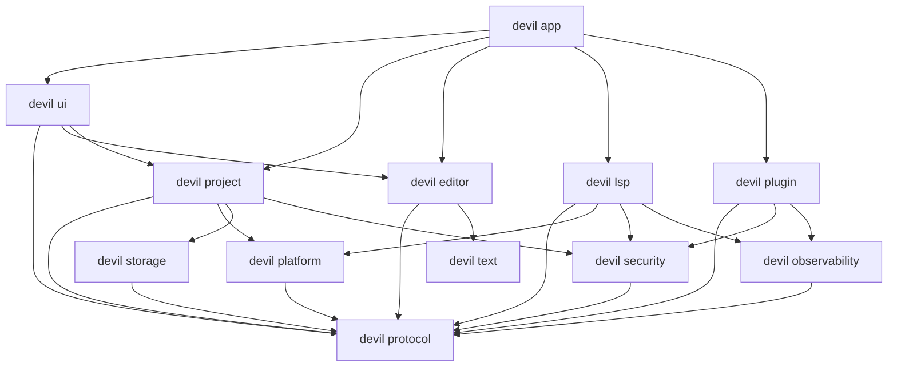

Rules:

- The editor receives project context through protocol ports and DTOs only.
- LSP receives document snapshots and edit events through protocol contracts; it does not own editor buffers.
- Plugins request capabilities from the capability broker; they do not call workspace, editor, platform, or storage internals directly.
- Workspace management owns workspace file identity and file tree projections; editor owns open buffer state.

---

## 6. Component Definitions

## 6.1 Workspace Management System

### Purpose

The workspace system is the authoritative model for an opened project or repository. It discovers the workspace root, tracks file identity, applies ignore rules, owns the file tree projection, coordinates file watching, records trust state, and provides project context to editor, LSP, plugin, and index subsystems.

### Responsibilities

- Open and close local workspaces.
- Resolve project identity and root paths.
- Support single-root V1 with multi-root-ready internal data structures.
- Track workspace trust state before enabling command execution, plugins, or language server launch.
- Maintain file tree projections with ignore rules, hidden files, generated files, binary files, and large-file exclusions.
- Map paths to stable file identifiers.
- Coordinate file watcher events and debounce them into workspace delta events.
- Provide project context through protocol ports.
- Persist workspace metadata, recent workspaces, session restore state, and trust decisions.

### Non-Responsibilities

- Does not own open text buffers.
- Does not render UI.
- Does not execute arbitrary commands directly.
- Does not parse language semantics beyond shallow workspace metadata.
- Does not apply text edits to open editor buffers.

### Internal State

| State object | Description | Persistence |
|---|---|---|
| WorkspaceState | Root path, workspace id, display name, trust status, generation counter. | Durable |
| RootState | Canonical root path, VCS metadata, ignore matchers, config sources. | Durable plus recomputed |
| FileTreeState | Directory nodes, file nodes, file ids, file kinds, size and hash metadata. | Cache with invalidation |
| WatcherState | Active watches, debounce timers, overflow markers, recovery scan status. | Ephemeral |
| WorkspaceConfigState | Settings merged from defaults, user, workspace, and trusted project files. | Durable plus file-backed |
| WorkspaceSessionState | Open buffers, focused file, panel layout hints, last active language services. | Durable session |

### Public Service Surface

- Open workspace request.
- Close workspace request.
- Resolve file request.
- File tree query.
- Workspace config query.
- Workspace trust update.
- Watcher subscription.
- Project info query through the existing protocol port.

### Key Events

- Workspace opened.
- Workspace closed.
- Workspace trust changed.
- File discovered.
- File changed on disk.
- File created on disk.
- File deleted on disk.
- File renamed on disk.
- Workspace rescan started.
- Workspace rescan completed.

---

## 6.2 File System Abstraction Layer

### Purpose

The file system abstraction creates a safe, testable boundary between IDE domain logic and OS file operations. It supports local-first operation, atomic persistence, path policy, conflict detection, file watching, and future sandbox enforcement.

### Layering

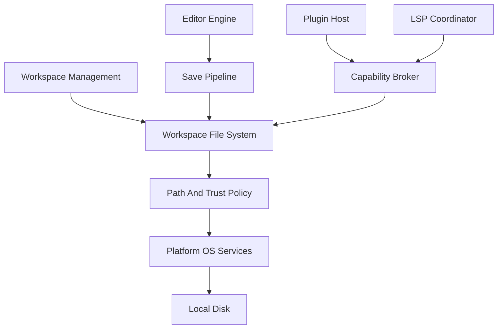

### Platform Service Responsibilities

- Canonicalize paths consistently across Windows, macOS, and Linux.
- Read and write bytes.
- Read and write UTF-8 text with explicit encoding errors.
- Perform atomic writes using temp file plus replace semantics where supported.
- List directories with metadata.
- Watch directories and files.
- Spawn trusted OS processes for language servers and developer commands.
- Access OS keychain for credentials when needed by non-core services.

### Workspace VFS Responsibilities

- Enforce workspace root boundaries.
- Apply trust and path policy.
- Track file ids and content fingerprints.
- Distinguish disk content from unsaved editor buffer content.
- Detect external modification conflicts before save.
- Normalize path casing and symlink policy per platform.
- Expose read-only and mutation capabilities to plugins and LSP through policy-gated handles.

### File Mutation Policy

All file mutations use a central save pipeline:

1. Resolve file id and canonical path.
2. Verify workspace trust and write capability.
3. Check disk fingerprint against last known read or save fingerprint.
4. If conflict exists, produce a conflict state instead of overwriting.
5. Write to a temporary path.
6. Flush and atomically replace target when possible.
7. Update file metadata, content hash, and workspace generation.
8. Emit workspace and editor transaction events.

### Required Data Contracts

- File identity and canonical path DTO.
- File metadata DTO with type, size, modified time, permissions, and hash.
- File content version DTO with hash, source, and generation.
- File change event DTO with reason and old or new identity for renames.
- File conflict DTO with disk version and buffer version.
- Workspace edit proposal DTO that can include file create, delete, rename, and text edits.

---

## 6.3 Text Editor Engine

### Purpose

The editor engine is the deterministic authority for open text buffers, selections, cursors, transactions, undo and redo, editor overlays, and immutable snapshots. It receives semantic information from LSP and indexers but never delegates text ownership to them.

### Responsibilities

- Open buffers from workspace file content.
- Manage buffer ids, file ids, document versions, and snapshot ids.
- Maintain rope-backed text storage.
- Apply typed edit transactions.
- Group undo and redo transactions.
- Maintain cursors, selections, scroll anchors, and viewport-independent editor state.
- Produce immutable snapshots for LSP, indexing, persistence, plugins, and future AI context providers.
- Store diagnostics, code lenses, inlay hints, and decorations as overlays, not as text state.
- Normalize external edit proposals into deterministic transactions.

### Non-Responsibilities

- Does not discover files.
- Does not directly save to disk outside the save pipeline.
- Does not launch language servers.
- Does not execute plugin code.
- Does not decide AI or plugin policy.

### Text Model

The spike implementation uses a string-backed buffer. The production editor requires a rope or piece table capable of efficient large-file edits, snapshots, and line indexing.

Production text primitives:

| Primitive | Purpose |
|---|---|
| TextBuffer | Mutable open text document. |
| TextSnapshot | Immutable view of buffer content with snapshot id and content hash. |
| TextPosition | User-facing line and column coordinate. |
| TextOffset | Byte or UTF-16 offset as explicitly typed coordinate. |
| TextRange | Range in text coordinates with encoding metadata. |
| TextEdit | Single replacement operation. |
| EditBatch | Ordered set of edits applied atomically. |
| TextTransaction | Applied batch with source, pre-snapshot, post-snapshot, changed ranges, and undo metadata. |
| LineIndex | Fast mapping between line, byte, UTF-8, and UTF-16 coordinates. |

### Transaction Model

Every mutation enters through an edit command pipeline:

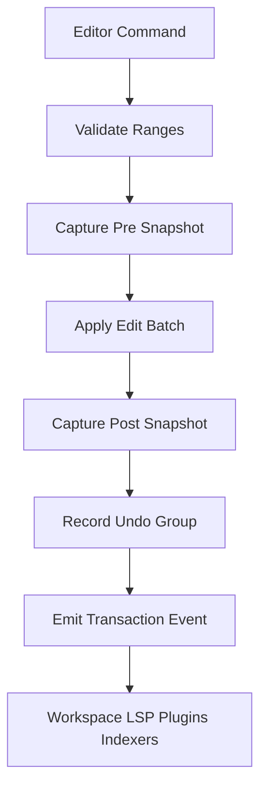

Transaction metadata:

- Transaction id.
- Buffer id.
- File id.
- Workspace id.
- Source kind: user, LSP code action, formatter, plugin, restore, system.
- Pre-snapshot id.
- Post-snapshot id.
- Changed ranges in byte coordinates.
- Changed ranges in LSP UTF-16 coordinates when needed.
- Undo group id.
- Timestamp and causality trace id.

### Editor State Ownership

| State | Owner | Consumer projections |
|---|---|---|
| Text content | Editor core | UI, LSP, indexer, plugins, persistence |
| Cursors and selections | Editor core | UI, command palette, plugins with permission |
| Viewport layout | UI shell | Editor may provide semantic layout hints |
| Diagnostics overlays | Editor overlay store | UI, Problems panel, code action resolver |
| Completion sessions | Editor interaction controller | UI popup, LSP completion providers |
| Undo and redo stacks | Editor core | UI commands, transaction replay tools |
| Snapshot retention | Editor core with storage policy | LSP, indexer, replay, future AI context |

---

## 6.4 LSP Integration

### Purpose

The LSP subsystem provides language intelligence while preserving editor responsiveness and deterministic mutation rules. It owns language server processes and JSON-RPC message flow, but it does not own text or workspace state.

### Responsibilities

- Discover language server configurations from trusted workspace settings and built-in defaults.
- Launch and supervise language server processes through platform process services.
- Initialize LSP servers with workspace folders and client capabilities.
- Synchronize open documents using editor snapshots and transaction events.
- Normalize diagnostics into editor overlay DTOs.
- Provide completions, hover, signature help, go-to-definition, references, rename, formatting, semantic tokens, and code actions.
- Convert LSP workspace edits into workspace edit proposals.
- Apply backpressure, cancellation, and request prioritization.
- Restart failed language servers with bounded retry policy.

### Non-Responsibilities

- Does not mutate text directly.
- Does not read files outside workspace policy.
- Does not render diagnostics.
- Does not act as plugin host.
- Does not bypass trust or network policy.

### LSP Component Model

| Component | Responsibility |
|---|---|
| LspCoordinator | Workspace-level supervisor and route table for languages and servers. |
| LanguageRuntime | Per-language configuration, server selection, capability cache. |
| LspClient | JSON-RPC endpoint for one server process. |
| DocumentSyncManager | Maps editor snapshots and transaction events to LSP document versions. |
| DiagnosticStore | Stores current diagnostics by file, version, source, and severity. |
| CompletionBroker | Merges completion sources and handles cancellation. |
| CodeActionResolver | Resolves and converts actions into workspace edit proposals. |
| SemanticTokenCache | Stores semantic tokens keyed by document version. |

### Document Synchronization Strategy

- Each open buffer receives a monotonically increasing document version.
- Editor transactions produce changed ranges and post-snapshot ids.
- If a language server supports incremental sync, send range edits using UTF-16 positions derived from the line index.
- If incremental sync is unsupported or range conversion is ambiguous, send full document sync for correctness.
- Coalesce rapid edits using a short debounce window, but never delay latency-critical editor input.
- Cancel stale completion, hover, semantic token, and code action requests when document version changes.

### LSP Data Flow

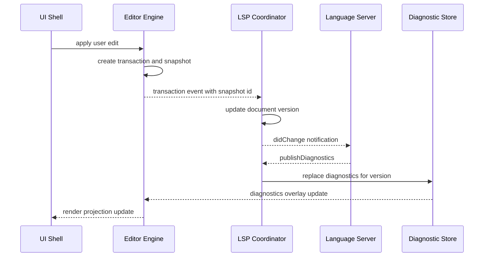

### Code Action Apply Flow

1. User requests code actions at a position or range.
2. LSP sends code action request with document version and diagnostics context.
3. Server returns commands or workspace edits.
4. LSP resolves deferred actions if required.
5. LSP converts result into internal workspace edit proposal.
6. Editor and workspace services validate proposal against current versions.
7. UI previews affected files and text changes.
8. User confirms or rejects.
9. Editor applies open-buffer edits as transactions.
10. Workspace VFS applies file creates, deletes, renames, or closed-file edits.
11. LSP receives resulting didChange or file operation notifications.

---

## 6.5 Plugin Architecture

### Purpose

The plugin system provides controlled extensibility for commands, language integrations, UI contributions, editor decorations, workspace tools, and future AI context providers without adopting unrestricted extension-host semantics.

### V1 Plugin Policy

- First-party and trusted plugins only.
- No generalized third-party marketplace.
- No unrestricted host file system access.
- No unrestricted process or network access.
- All plugin actions use typed capabilities and protocol events.
- Plugin activation is deterministic and observable.

### Runtime Options

| Runtime | V1 suitability | Notes |
|---|---|---|
| In-process Rust plugin modules | High for built-in features | Fast and type-safe, but trust boundary is weak. Use only for first-party code. |
| Out-of-process JSON-RPC plugins | Medium for trusted external tools | Stronger crash isolation and easier protocol versioning. |
| WASI sandbox plugins | Future target | Stronger sandbox for untrusted plugins after policy and ABI mature. |
| JavaScript or Node extension host | Not recommended | Recreates unrestricted extension-host risk and conflicts with clean-slate constraints. |

### Plugin Component Model

| Component | Responsibility |
|---|---|
| PluginRegistry | Discovers installed first-party or trusted plugin manifests. |
| PluginManifest | Declares id, version, activation events, contributions, capabilities, and compatibility range. |
| PluginHost | Starts plugin runtime, dispatches events, owns plugin lifecycle. |
| CapabilityBroker | Grants, denies, or prompts for declared capabilities. |
| ContributionRegistry | Registers commands, panels, menus, language providers, decorations, snippets, themes, and formatters. |
| PluginEventBus | Sends versioned workspace, editor, and configuration events. |
| PluginStateStore | Persists plugin-scoped local state with quotas and migrations. |

### Capability Model

Capabilities are explicit and default-deny:

| Capability | Examples | Enforcement |
|---|---|---|
| Workspace read | File tree, metadata, selected file content | Workspace policy and trust check |
| Workspace write | Create, rename, delete, save file | Workspace edit proposal and user approval when required |
| Editor read | Active selection, open buffer snapshot | Editor snapshot access with scope limits |
| Editor write | Apply edit, add decoration, trigger formatting | Editor transaction proposal path |
| Process execution | Launch tool, run formatter, start LSP server | Platform process service with command policy |
| Network | Fetch schemas, query language package metadata | Security policy and user consent |
| UI contribution | Command palette item, panel, status item | Declarative contribution registry |
| Storage | Plugin-scoped key value or document storage | Storage quota and namespace isolation |

### Plugin Data Flow

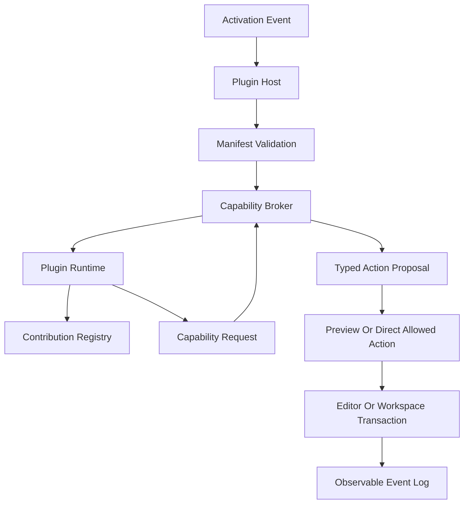

### Plugin Contribution Points

- Commands.
- Keybindings.
- Menus.
- Status bar items.
- Panels.
- Editor decorations.
- Snippets.
- Themes.
- Language definitions.
- Formatters.
- LSP server registrations.
- Workspace scanners.
- Context providers for future AI systems.

Context providers must be passive, inspectable, and policy-scoped. They may expose structured workspace facts to future AI orchestration through protocol contracts, but they must not invoke AI systems themselves.

---

## 7. Data Flow Specifications

## 7.1 Open Workspace

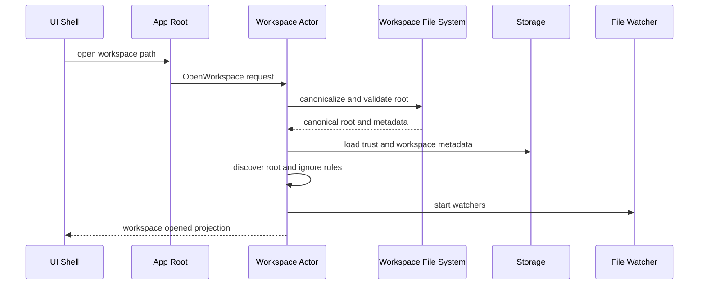

Acceptance properties:

- UI becomes useful after shallow file tree discovery.
- Deep indexing is not required for workspace open success.
- Trust state gates process execution, plugin activation, and LSP launch.

## 7.2 Open File

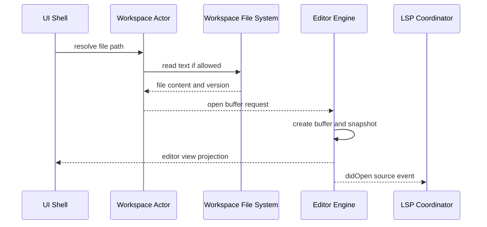

Acceptance properties:

- Large files can be opened in degraded mode if they exceed editing thresholds.
- Binary files are not loaded into text buffers.
- Encoding errors are surfaced as recoverable open errors.

## 7.3 Edit and Save File

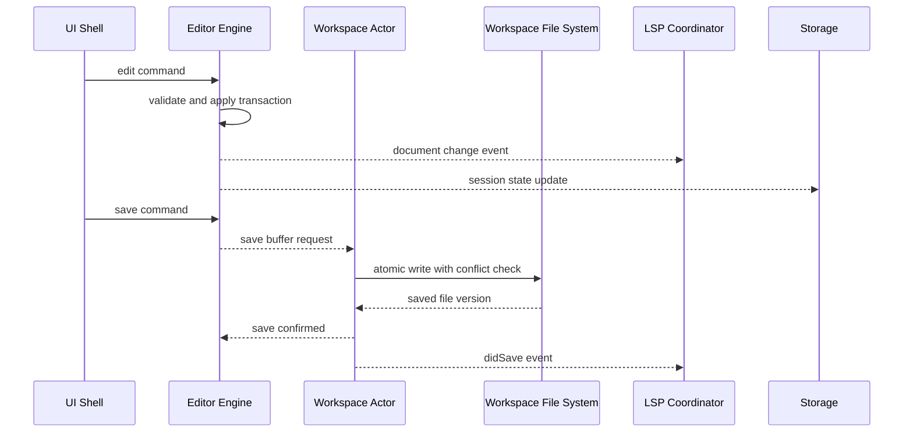

Acceptance properties:

- Save never overwrites external changes silently.
- Undo and redo remain editor-local and deterministic after save.
- Disk write failure leaves editor buffer intact.

## 7.4 External File Change

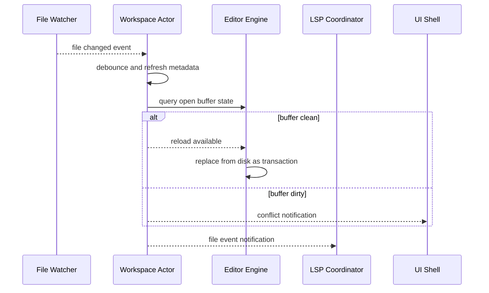

Acceptance properties:

- Dirty open buffers are never overwritten automatically.
- Watcher overflow triggers bounded rescan.
- Rename detection preserves file identity when possible.

## 7.5 Completion Request

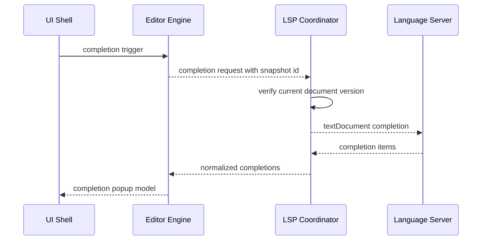

Acceptance properties:

- Stale completion responses are dropped.
- Completion application is an editor transaction.
- UI renders a projection and does not own completion semantics.

## 7.6 Plugin Command Execution

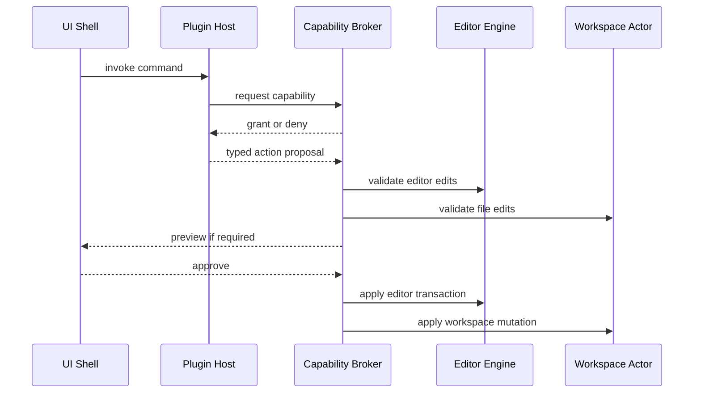

Acceptance properties:

- Plugin commands are observable and cancellable where possible.
- Plugin edits use the same mutation path as LSP code actions.
- Denied capability requests produce visible diagnostic events.

---

## 8. State Management Strategy

### 8.1 Canonical State Ownership

| Domain state | Canonical owner | Mutation mechanism | Projection consumers |
|---|---|---|---|
| Workspace identity and trust | Workspace actor | Workspace requests and trust updates | UI, LSP, plugins, index |
| File tree and metadata | Workspace actor | Watcher events, rescans, file operations | UI, LSP, plugins, index |
| Disk reads and writes | Workspace VFS plus platform service | Capability checked file operations | Workspace, editor save pipeline |
| Open text buffers | Editor engine | Edit transactions | UI, LSP, plugins, index |
| Editor view projection | UI shell | Render state updates | UI only |
| Diagnostics | LSP diagnostic store plus editor overlay store | Versioned diagnostics replacement | UI, editor overlays |
| LSP server sessions | LSP coordinator | Server lifecycle messages | UI status, diagnostics, editor features |
| Plugin activation and contributions | Plugin host | Manifest validation and activation events | UI, command palette, editor |
| Local settings and session restore | Storage service with domain owners | Migrations and typed repositories | App, workspace, editor, plugins |
| Observability events | Observability service | Structured trace and event append | Developer tooling, replay tools |

### 8.2 Versioning Strategy

- Workspace generation increments after workspace-level metadata changes.
- File content version is derived from content hash plus file id plus generation.
- Buffer version increments after each editor transaction.
- Snapshot id identifies immutable text content and is stable for downstream consumers.
- LSP document version mirrors editor buffer version with per-server synchronization state.
- Plugin API version and manifest compatibility range control activation.
- Protocol schema version gates cross-crate DTO changes.

### 8.3 Event Strategy

Events are versioned, typed, and correlation-aware:

- Workspace events: opened, closed, trust changed, file discovered, file changed, file deleted, rescan completed.
- Editor events: buffer opened, transaction applied, undo, redo, saved, conflict detected, buffer closed.
- LSP events: server starting, initialized, request sent, diagnostics received, request cancelled, server failed.
- Plugin events: manifest loaded, activated, deactivated, capability denied, command invoked, contribution registered.
- Storage events: migration started, migration completed, corruption detected, repair attempted.

Event retention should keep metadata and causality by default while avoiding full source snapshots unless explicitly needed for local replay diagnostics.

### 8.4 Snapshot Retention Strategy

- Always retain the current buffer snapshot.
- Retain snapshots required for undo and redo groups.
- Retain recent snapshots referenced by in-flight LSP, indexing, or plugin requests.
- Bound retained snapshots by memory budget and evict oldest non-critical snapshots.
- Persist session restore information separately from full historical snapshots.
- Never rely on unbounded snapshot retention for correctness.

### 8.5 Concurrency Strategy

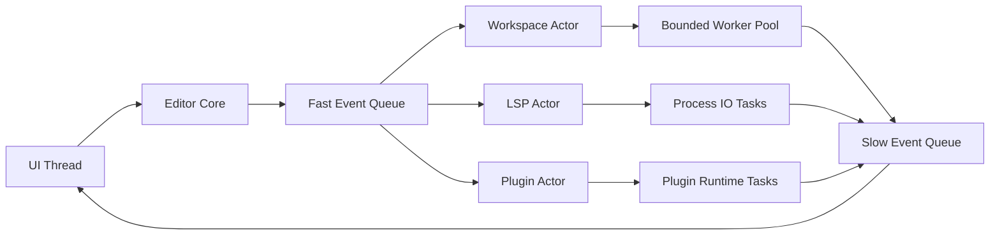

Rules:

- UI thread never waits on workspace scans, file watchers, LSP requests, or plugins.
- Editor applies user edits synchronously and emits events asynchronously.
- Actor mailboxes are bounded.
- Low-priority work is cancelled or degraded before it can affect editing.
- Shutdown drains critical save operations and cancels non-critical requests.

---

## 9. Protocol Contracts Required Next

The existing protocol boundary is a good starting point, but standalone IDE core implementation requires additional contracts.

### 9.1 Workspace and File Contracts

- WorkspaceId.
- WorkspaceRoot.
- FileIdentity.
- CanonicalPath.
- FileMetadata.
- FileContentVersion.
- FileTreeNode.
- FileChangeEvent.
- WorkspaceTrustState.
- WorkspaceConfigSnapshot.
- FileConflict.

### 9.2 Editor Contracts

- BufferVersion.
- TextCoordinateEncoding.
- TextOffset.
- SnapshotDescriptor.
- EditBatch.
- TextTransaction.
- UndoGroup.
- DiagnosticOverlay.
- CompletionRequest.
- CompletionItem.
- WorkspaceEditProposal.

### 9.3 LSP Contracts

- LanguageId.
- LanguageServerId.
- LanguageServerConfig.
- LspServerStatus.
- DocumentSyncState.
- DiagnosticSet.
- CodeActionProposal.
- SemanticTokenSet.
- SymbolLocation.

### 9.4 Plugin Contracts

- PluginId.
- PluginManifest.
- PluginActivationEvent.
- PluginCapability.
- CapabilityGrant.
- PluginCommandDescriptor.
- ContributionDescriptor.
- PluginActionProposal.
- PluginStateNamespace.

All contracts must be serializable, versioned where persisted or crossing process boundaries, and covered by protocol stability tests.

---

## 10. Validation and Acceptance Strategy

### 10.1 Workspace Validation

- Opens a local repository with ignored directories, hidden files, generated files, and binary files.
- Produces a file tree before deep indexing is available.
- Records workspace trust state and gates LSP/plugin execution.
- Handles watcher overflow by performing a bounded rescan.
- Preserves file identity across rename when the platform provides sufficient metadata.

### 10.2 File System Validation

- Reads and writes UTF-8 files through the abstraction layer.
- Performs atomic save where supported and safe fallback where not supported.
- Detects external modification conflicts before overwrite.
- Blocks paths outside workspace root unless explicitly granted.
- Handles Windows path normalization, case behavior, symlinks, and long paths in a platform test matrix.

### 10.3 Editor Validation

- Large-file edit throughput remains deterministic under watcher and LSP load.
- Undo and redo remain correct after inserts, deletes, replacements, formatting, and code actions.
- Snapshot memory remains bounded under repeated edits and LSP requests.
- UTF-8 and UTF-16 coordinate conversion is correct for diagnostics and completions.
- Dirty buffer conflict resolution is explicit and recoverable.

### 10.4 LSP Validation

- Launches a Rust language server from trusted configuration.
- Initializes with the correct workspace folders and client capabilities.
- Sends didOpen, didChange, didSave, and didClose events using correct versions.
- Displays diagnostics without blocking editing.
- Applies formatting and code actions through previewable workspace edit proposals.
- Cancels stale requests and drops stale responses after document changes.

### 10.5 Plugin Validation

- Loads a first-party plugin manifest.
- Activates on deterministic activation events.
- Registers a command and a UI contribution.
- Requests a denied capability and records an observable denial.
- Applies an approved editor edit through the same transaction path as other edit sources.
- Persists plugin-scoped state without access to other plugin namespaces.

---

## 11. Required ADRs and Gaps

### 11.1 Required ADRs

| ADR | Decision needed |
|---|---|
| ADR-0011 | Select LSP architecture, transport, process supervision, and document sync policy. |
| ADR-0012 | Select plugin runtime model, manifest schema, contribution points, and sandbox roadmap. |
| ADR-0013 | Define file system abstraction, atomic save, conflict detection, and path policy. |
| ADR-0014 | Define workspace state model, trust policy, watcher behavior, and file identity strategy. |

### 11.2 Current Implementation Gaps

- Workspace management is not yet implemented beyond crate scaffolding.
- Platform file helpers are spike-level and need a trait-based service boundary.
- The text model is currently string-backed and must evolve to rope or piece table storage.
- Protocol contracts do not yet cover file metadata, workspace deltas, LSP state, diagnostics, completion items, or plugin manifests.
- LSP integration has no physical crate or module yet.
- Plugin architecture has no physical crate or module yet.
- Save pipeline, conflict detection, and atomic write semantics are not yet modeled.
- Capability broker is not yet available for plugins or future AI action mediation.

### 11.3 Sequencing Constraints

Implementation should proceed in this order after existing freeze gates are satisfied:

1. Expand protocol contracts for workspace, file identity, editor transactions, and workspace edit proposals.
2. Implement trait-based platform file services and workspace VFS policy.
3. Implement workspace open, shallow file tree, trust state, and file watching.
4. Replace spike text buffer with production text model and versioned snapshots.
5. Implement save pipeline with conflict detection and atomic write behavior.
6. Add LSP coordinator, process supervision, document sync, diagnostics, completion, formatting, and code action proposal handling.
7. Add plugin manifest parsing, first-party plugin host, contribution registry, and capability broker.
8. Add observability and replay metadata for workspace, editor, LSP, and plugin events.

---

## 12. AI-Readiness Without AI Coupling

The foundational IDE core should expose future AI integration seams without introducing AI dependencies:

- Immutable editor snapshots are available through protocol descriptors.
- Workspace file metadata and symbol data are queryable through protocol services.
- Mutations are represented as workspace edit proposals.
- Plugin context providers are passive and policy-scoped.
- LSP diagnostics, symbols, and code actions are normalized into stable internal models.
- Event logs provide causal history for future explanation and replay.
- Capability broker mediates any future automated action without trusting the requester.

This ensures AI can later become an additional client of the same editor, workspace, LSP, and plugin infrastructure rather than a privileged subsystem with direct mutation or file access.

---

## 13. Final Architecture Summary

The Legion IDE core should be designed as a deterministic, local-first, actor-oriented system with clear ownership boundaries:

- Workspace management owns project identity, trust, file tree, and watcher state.
- The file system abstraction owns safe OS access, workspace path policy, atomic saves, and conflict detection.
- The editor engine owns buffers, transactions, snapshots, undo, redo, and overlays.
- LSP integration owns language server lifecycle and feature normalization, but mutates through editor and workspace proposals only.
- The plugin host owns controlled extensibility through manifests, contribution points, and capabilities.
- Protocol contracts, storage boundaries, and observability make the system modular, testable, replayable, and ready for later AI integration.

The core product must first succeed as a robust standalone IDE. AI features should be added only after these foundations prove reliable under real editing, workspace, LSP, and plugin workloads.
