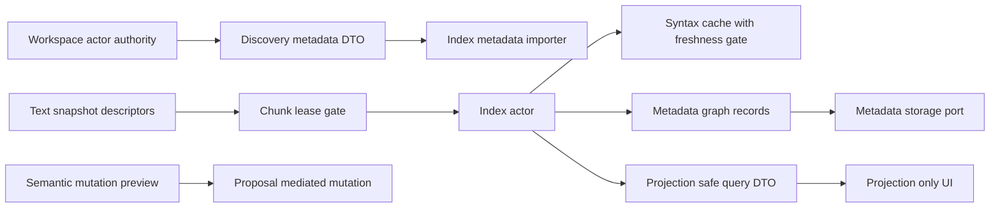

# Semantic Index Boundary Remediation Plan v0.1

> Historical/superseded planning artifact. This plan is superseded by accepted Phase 3 evidence in `plans/evidence/phase-3/predictive-semantic-fabric.md` and current status in `plans/phase-status-ledger.md`.

Date: 2026-05-15

## Scope and constraints

This handoff addressed four semantic-index boundary findings only: repository discovery authority, full-source copies, syntax-cache privacy and freshness, and semantic metadata persistence. It is now superseded by accepted Phase 3 evidence in [`plans/evidence/phase-3/predictive-semantic-fabric.md`](plans/evidence/phase-3/predictive-semantic-fabric.md:1).

The plan preserves the current architecture rules in [`AGENTS.md`](AGENTS.md:1): [`legion-index`](crates/legion-index/src/lib.rs:1) must not gain direct editor, UI, app, workspace-write, or proposal-execution authority; saves remain proposal-mediated; UI remains projection-only; persisted and observed data remains metadata-only by default.

## Current-state evidence

| Concern | Evidence | Boundary problem |
| --- | --- | --- |
| Repository discovery authority | [`RepositoryScanConfig`](crates/legion-index/src/lib.rs:694) owns a live root path, bounds, and ignore patterns, while [`RepositoryScanner`](crates/legion-index/src/lib.rs:776) canonicalizes the root with [`fs::canonicalize`](crates/legion-index/src/lib.rs:794), reads ignore files with [`read_gitignore_patterns()`](crates/legion-index/src/lib.rs:799), walks directories with [`fs::read_dir`](crates/legion-index/src/lib.rs:843), reads file contents with [`fs::read`](crates/legion-index/src/lib.rs:902), and mints [`FileId`](crates/legion-index/src/lib.rs:910). | [`legion-index`](crates/legion-index/src/lib.rs:1) is acting as filesystem discovery authority instead of consuming workspace-authoritative discovery metadata. This conflicts with [`ADR-0017-semantic-fabric-indexing.md`](plans/adrs/ADR-0017-semantic-fabric-indexing.md:36), which requires metadata-first discovery and workspace-discovered ignore decisions. |
| Workspace already owns the relevant discovery authority | [`WorkspaceActor`](crates/legion-project/src/lib.rs:410) owns shallow tree state and applies discovery policy through [`should_skip_entry()`](crates/legion-project/src/lib.rs:583), including hidden, generated, binary, and large-file skips. It records authoritative [`FileMetadata`](crates/legion-project/src/lib.rs:670), [`FileTreeNode`](crates/legion-project/src/lib.rs:1062), workspace generation, file content version, fingerprints, and watcher recovery state through [`rebuild_tree_from_scan()`](crates/legion-project/src/lib.rs:1319). | The safe authority boundary is already present in [`legion-project`](crates/legion-project/src/lib.rs:410), but [`legion-index`](crates/legion-index/src/lib.rs:1) currently bypasses it for scan paths. |
| Full-source copies | [`SourceDocument`](crates/legion-index/src/lib.rs:935) owns a full [`String`](crates/legion-index/src/lib.rs:945). [`SourceDocument::from_text_snapshot()`](crates/legion-index/src/lib.rs:1007) calls [`TextSnapshot::try_full_text()`](crates/legion-text/src/lib.rs:340) and copies to an owned [`String`](crates/legion-index/src/lib.rs:1022). [`TextSnapshot`](crates/legion-text/src/lib.rs:235) only retains a full cache below [`DEFAULT_FULL_CACHE_BYTE_BUDGET_BYTES`](crates/legion-text/src/lib.rs:27), and larger snapshots return [`TextError::FullCacheBudgetExceeded`](crates/legion-text/src/lib.rs:513). | Full-source indexing is acceptable only as a bounded degraded path. The active shape makes full text the normal indexing input, despite chunk descriptors and bounded chunk materialization already existing in [`TextSnapshot::chunk_descriptors()`](crates/legion-text/src/lib.rs:351) and [`TextSnapshot::chunk_text()`](crates/legion-text/src/lib.rs:356). |
| Syntax-cache privacy and freshness | [`SyntaxCacheKey`](crates/legion-index/src/lib.rs:1068) includes only content hash, language, and grammar version. [`SyntaxTreeCache::get_or_parse()`](crates/legion-index/src/lib.rs:1152) returns a cloned cached [`ParseOutcome`](crates/legion-index/src/lib.rs:1097). That cached outcome includes file-specific [`FileSemanticIndex`](crates/legion-index/src/lib.rs:1210), [`SymbolFileMapRecord`](crates/legion-protocol/src/lib.rs:2970), and [`SemanticGraphRecord`](crates/legion-protocol/src/lib.rs:3048) data. [`SourceDocument::invalidation_key()`](crates/legion-index/src/lib.rs:1037) carries the broader file, snapshot, generation, content, model, grammar, privacy, and schema metadata required to validate freshness. | The current narrow cache key can reuse file-specific outcomes across distinct files with the same content hash, and it does not enforce privacy-scope, file identity, workspace-generation, snapshot, or schema freshness before reuse. |
| Semantic metadata persistence | [`InMemoryStorage`](crates/legion-storage/src/lib.rs:147) stores workspace configs, trust, file metadata, sessions, proposal audit records, and event metadata, while [`StorageRepositoryRequest`](crates/legion-protocol/src/lib.rs:4221) has no semantic metadata request variants. [`PersistedState`](crates/legion-storage/src/lib.rs:169) persists only workspace configs, trust, file metadata, and sessions. | Metadata storage surfaces exist, but durable semantic symbol, graph, freshness, tombstone, and namespace persistence contracts are undefined. Persisting full source or vectors would violate current retention and vector-deferral rules. |
| Governance and phase status | [`predictive-semantic-fabric.md`](plans/evidence/phase-3/predictive-semantic-fabric.md:11) now marks Phase 3 and LSP supervision as accepted. [`xtask`](xtask/src/main.rs:21) requires named Phase 3 evidence artifacts before an accepted status can pass. [`dependency-policy.md`](plans/dependency-policy.md:88) permits [`legion-index`](crates/legion-index/Cargo.toml:1) to use only [`legion-protocol`](crates/legion-protocol/Cargo.toml:1), [`legion-storage`](crates/legion-storage/Cargo.toml:1), and [`legion-text`](crates/legion-text/Cargo.toml:1) as internal dependencies for Phase 3. | Implementation evidence now exists; future boundary DTO expansions still require dependency-policy and `xtask` updates if literal contract checks are expanded. |

## Decisions

1. Repository discovery must be workspace-authoritative. [`legion-index`](crates/legion-index/src/lib.rs:1) may import discovery records, deltas, ignore decisions, file identities, fingerprints, trust labels, and privacy labels from protocol DTOs, but it must not own filesystem traversal, ignore parsing, canonicalization, file identity minting, or live file reads.
2. The current full-source [`SourceDocument`](crates/legion-index/src/lib.rs:935) path is a degraded compatibility path only. New indexing inputs should be snapshot descriptors, changed ranges, chunk descriptors, and explicit bounded leases from [`legion-text`](crates/legion-text/src/lib.rs:1), not unbounded owned source strings.
3. The current whole-outcome [`SyntaxTreeCache`](crates/legion-index/src/lib.rs:1113) cannot safely use the narrow [`SyntaxCacheKey`](crates/legion-index/src/lib.rs:1068). Either widen the key while caching file-specific [`ParseOutcome`](crates/legion-index/src/lib.rs:1097), or split parser artifacts from file semantic records before using a narrow content-hash key.
4. Durable semantic persistence is metadata-only and Phase-gated. It may store invalidation keys, provenance, symbol hashes, bounded display labels when policy permits, graph edges, freshness state, tombstones, and namespace metadata. It must not persist full source snapshots, chunk payloads, embeddings, vectors, model summaries, provider outputs, or proposal execution payloads by default.
5. Vector indexing remains deferred exactly as stated in [`ADR-0017-semantic-fabric-indexing.md`](plans/adrs/ADR-0017-semantic-fabric-indexing.md:82) and [`predictive-semantic-fabric.md`](plans/evidence/phase-3/predictive-semantic-fabric.md:82).

## Boundary flow target

## Code-level remediation handoff

### 1. Repository discovery consumes workspace-authoritative metadata

- Add protocol discovery DTOs in [`crates/legion-protocol/src/lib.rs`](crates/legion-protocol/src/lib.rs:1). Use existing [`FileMetadata`](crates/legion-protocol/src/lib.rs:624), [`FileTreeNode`](crates/legion-protocol/src/lib.rs:661), [`FileTreeDelta`](crates/legion-protocol/src/lib.rs:687), [`SemanticFileFingerprintIdentity`](crates/legion-protocol/src/lib.rs:2862), and [`SemanticPrivacyScope`](crates/legion-protocol/src/lib.rs:252) where possible. Add only missing policy fields: discovery decision, skip reason, generated marker, binary marker, vendored marker, oversized marker, trust label, and metadata-only flag.
- Prefer concrete DTO names such as [`WorkspaceDiscoveryRecord`](crates/legion-protocol/src/lib.rs:1), [`WorkspaceDiscoverySnapshot`](crates/legion-protocol/src/lib.rs:1), [`WorkspaceDiscoveryDelta`](crates/legion-protocol/src/lib.rs:1), and [`WorkspaceDiscoveryPolicyDecision`](crates/legion-protocol/src/lib.rs:1). If these new names become literal protocol requirements, update [`plans/dependency-policy.md`](plans/dependency-policy.md:88) and the protocol-symbol validation in [`xtask`](xtask/src/main.rs:83).
- Extend [`WorkspaceActor`](crates/legion-project/src/lib.rs:410) in a future implementation to emit or expose discovery snapshots based on its existing tree scan, metadata, and skip decisions. The snapshot should be produced after [`rebuild_tree_from_scan()`](crates/legion-project/src/lib.rs:1319) and after watcher recovery in [`collect_watcher_events()`](crates/legion-project/src/lib.rs:1335), not by [`legion-index`](crates/legion-index/src/lib.rs:1).
- Replace public use of [`RepositoryScanConfig`](crates/legion-index/src/lib.rs:694), [`RepositoryScanner`](crates/legion-index/src/lib.rs:776), and [`RepositoryScanner::scan()`](crates/legion-index/src/lib.rs:786) with an importer such as [`RepositoryDiscoveryImporter::ingest_snapshot()`](crates/legion-index/src/lib.rs:1). The importer should accept only protocol discovery DTOs and produce `IndexWorkItem` metadata or metadata-only semantic records.
- Move direct filesystem scanner code behind test-only fixtures or delete it. Production [`legion-index`](crates/legion-index/src/lib.rs:1) should not import [`std::fs`](crates/legion-index/src/lib.rs:7), call [`fs::read_dir`](crates/legion-index/src/lib.rs:843), call [`fs::read`](crates/legion-index/src/lib.rs:902), call [`read_gitignore_patterns()`](crates/legion-index/src/lib.rs:799), or mint [`FileId`](crates/legion-index/src/lib.rs:910) from paths.
- Treat ignored, generated, binary, vendored, oversized, untrusted, and restricted-privacy files according to workspace policy: excluded records are not indexed; metadata-only records may preserve file identity, kind, size, language, freshness, privacy scope, and skip reason; content indexing occurs only for files with an explicit content-allowed decision.
- Preserve the distinct authorities of workspace disk fingerprints and semantic content hashes. The workspace remains responsible for save preconditions through [`WorkspaceActor::save_file_with_proposal()`](crates/legion-project/src/lib.rs:1638), while semantic records carry [`SemanticInvalidationKey`](crates/legion-protocol/src/lib.rs:2889).

Acceptance tests for this section should be added to [`crates/legion-index/tests/index_workflows.rs`](crates/legion-index/tests/index_workflows.rs:1), [`crates/legion-protocol/tests/dto_contracts.rs`](crates/legion-protocol/tests/dto_contracts.rs:1), and workspace tests near [`crates/legion-project/tests/watcher_recovery.rs`](crates/legion-project/tests/watcher_recovery.rs:1):

- Workspace discovery snapshot includes policy decisions for hidden, generated, binary, oversized, and ignored paths without [`legion-index`](crates/legion-index/src/lib.rs:1) scanning disk.
- [`legion-index`](crates/legion-index/src/lib.rs:1) imports discovery records and schedules only allowed content records.
- Metadata-only records are queryable as metadata but cannot produce source excerpts, parse jobs, or full-text leases.
- Watcher overflow recovery updates discovery deltas and invalidates affected records before replacements become authoritative.
- A dependency or source-policy gate proves production [`legion-index`](crates/legion-index/src/lib.rs:1) no longer calls live filesystem traversal APIs.

### 2. Replace live full-source indexing with chunk leases or degraded bounded semantics

- Replace [`SourceDocument`](crates/legion-index/src/lib.rs:935) as the normal input with an enum such as [`SemanticSourceInput`](crates/legion-index/src/lib.rs:1): descriptor-only metadata, changed-range metadata, chunk lease batch, and degraded bounded full text.
- Introduce lease DTOs in [`legion-text`](crates/legion-text/src/lib.rs:1) or [`legion-protocol`](crates/legion-protocol/src/lib.rs:1) that carry snapshot identity, buffer version, content hash, chunk ordinal, chunk byte range, chunk hash, byte budget, expiry or retention reason, privacy scope, and causality. Existing [`TextChunkDescriptor`](crates/legion-text/src/lib.rs:193), [`TextSnapshot::chunk_descriptors()`](crates/legion-text/src/lib.rs:351), and [`TextSnapshot::chunk_text()`](crates/legion-text/src/lib.rs:356) are the starting point.
- Feed editor-originated changes through changed-range metadata from [`TextTransactionDescriptor`](crates/legion-protocol/src/lib.rs:1173), including [`ChangedTextRange`](crates/legion-protocol/src/lib.rs:1185), instead of requiring a whole-document string for every parse or lexical refresh.
- Keep [`SourceDocument::from_text_snapshot()`](crates/legion-index/src/lib.rs:1007) only as a deprecated or explicitly degraded adapter. It must enforce a semantic-index byte budget, set [`SemanticFreshnessState::Partial`](crates/legion-protocol/src/lib.rs:2914) or degraded reasons when used, and never persist the copied text.
- Convert [`LexicalIndexer::index_document()`](crates/legion-index/src/lib.rs:1513) to stream over chunk leases or changed ranges. For a short compatibility phase, allow a fixture-only [`SourceDocument`](crates/legion-index/src/lib.rs:935) constructor for tests, but runtime work should carry leases or descriptors.
- Add explicit cancellation checks between chunks so [`IndexingActor`](crates/legion-index/src/lib.rs:251) can stop obsolete chunk work without blocking editor input or save workflows.

Acceptance tests for this section should be added to [`crates/legion-index/tests/index_workflows.rs`](crates/legion-index/tests/index_workflows.rs:1), [`crates/legion-text/src/lib.rs`](crates/legion-text/src/lib.rs:1) tests, and [`crates/legion-editor/tests/performance_suite.rs`](crates/legion-editor/tests/performance_suite.rs:1):

- Large snapshots over [`DEFAULT_FULL_CACHE_BYTE_BUDGET_BYTES`](crates/legion-text/src/lib.rs:27) do not require [`TextSnapshot::try_full_text()`](crates/legion-text/src/lib.rs:340) for indexing.
- Chunk lease batches produce the same lexical symbol metadata as bounded full text for small files.
- Changed-range inputs refresh affected symbols and mark unaffected records fresh or stale according to their invalidation keys.
- Degraded bounded full-text mode returns partial freshness and degraded reasons, and no full text appears in durable storage, observability, query DTOs, or evidence artifacts.
- Cancellation between chunks prevents stale background indexing from blocking live snapshot work.

### 3. Enforce cache privacy and freshness before reuse

- For the immediate current shape, treat [`SyntaxTreeCache`](crates/legion-index/src/lib.rs:1113) as file-private because it stores full [`ParseOutcome`](crates/legion-index/src/lib.rs:1097) values with file-specific [`FileSemanticIndex`](crates/legion-index/src/lib.rs:1210). Widen [`SyntaxCacheKey`](crates/legion-index/src/lib.rs:1068) to include file identity, snapshot or file content version, workspace generation, privacy scope, schema version, and parser options, or stop caching whole outcomes.
- For the preferred Phase 3 shape, split the cache into a content-addressed syntax artifact and per-file semantic extraction. A narrow [`SyntaxCacheKey`](crates/legion-index/src/lib.rs:1068) may key only parser artifacts when entries contain no path, file id, source excerpt, symbol display name, graph record, or privacy-sensitive property.
- Add a freshness authority such as [`SyntaxCacheFreshnessAuthority::validate()`](crates/legion-index/src/lib.rs:1) that checks requested content hash, language, grammar version, parser options, schema version, privacy scope, file identity, workspace generation, snapshot id, and model version before any cached artifact or outcome can be reused.
- Require [`SemanticFreshness`](crates/legion-protocol/src/lib.rs:2927) in syntax, symbol, graph, and query outputs, not only [`SemanticFreshnessState`](crates/legion-protocol/src/lib.rs:2914). Query status should become stale, partial, degraded, or unavailable rather than fresh when any freshness authority check fails.
- Privacy downgrades must tombstone or quarantine records before replacement records become query-authoritative. This applies to [`SymbolFileMapRecord`](crates/legion-protocol/src/lib.rs:2970), [`SemanticGraphRecord`](crates/legion-protocol/src/lib.rs:3048), and [`SemanticQueryResult`](crates/legion-protocol/src/lib.rs:3189).
- Add an explicit test proving identical content in two files with different [`FileId`](crates/legion-protocol/src/lib.rs:40) or [`SemanticPrivacyScope`](crates/legion-protocol/src/lib.rs:252) does not return the wrong file path, symbol id, graph record, or display label from cache.

Acceptance tests for this section should be added to [`crates/legion-index/tests/index_workflows.rs`](crates/legion-index/tests/index_workflows.rs:1) and contract tests in [`crates/legion-protocol/tests/dto_contracts.rs`](crates/legion-protocol/tests/dto_contracts.rs:1):

- Same content hash and grammar version but different file identity cannot reuse file-specific [`ParseOutcome`](crates/legion-index/src/lib.rs:1097).
- Same content hash and grammar version but reduced privacy scope invalidates or downgrades cached records.
- Grammar version mismatch invalidates parser artifacts through [`SyntaxTreeCache::invalidate_grammar()`](crates/legion-index/src/lib.rs:1172).
- Schema version mismatch rejects cached artifacts or marks them unavailable.
- Queries with [`SemanticQueryFreshnessPolicy::RequireFresh`](crates/legion-protocol/src/lib.rs:3113) never return [`SemanticQueryStatus::Fresh`](crates/legion-protocol/src/lib.rs:3153) across content, grammar, model, schema, generation, snapshot, file identity, or privacy mismatch.

### 4. Define metadata-only semantic persistence boundaries

- Add a semantic metadata repository contract to [`legion-storage`](crates/legion-storage/src/lib.rs:1) only after protocol DTOs and contract tests are accepted. Suggested interfaces are [`SemanticMetadataRepository`](crates/legion-storage/src/lib.rs:1), [`SemanticMetadataBatch`](crates/legion-protocol/src/lib.rs:1), [`SemanticMetadataQuery`](crates/legion-protocol/src/lib.rs:1), and [`SemanticMetadataTombstone`](crates/legion-protocol/src/lib.rs:1).
- Store metadata-only records: namespace id, workspace id, file id, language id, content hash, disk fingerprint reference, file content version, workspace generation, snapshot id, grammar version, model metadata version, privacy scope, extraction version, freshness state, provenance, symbol name hashes, bounded display labels when policy permits, graph endpoints, graph labels, redaction hints, and tombstone reasons.
- Do not store full source text, chunk payloads, full syntax trees with source text, embeddings, vectors, provider outputs, model summaries, proposal edit payload bodies, or replay source snapshots by default. This aligns with metadata-only redaction defaults in [`EventSinkConfig`](crates/legion-observability/src/lib.rs:51) and [`InMemoryEventSink::try_emit()`](crates/legion-observability/src/lib.rs:90).
- Add [`StorageRepositoryRequest`](crates/legion-protocol/src/lib.rs:4221) variants only for metadata batches and tombstones, such as [`SaveSemanticMetadataBatch`](crates/legion-protocol/src/lib.rs:4221), [`ReadSemanticMetadata`](crates/legion-protocol/src/lib.rs:4221), and [`TombstoneSemanticMetadata`](crates/legion-protocol/src/lib.rs:4221). If added, update [`InMemoryStorage`](crates/legion-storage/src/lib.rs:147), [`FileBackedStorage`](crates/legion-storage/src/lib.rs:162), [`PersistedState`](crates/legion-storage/src/lib.rs:169), [`plans/dependency-policy.md`](plans/dependency-policy.md:88), and [`xtask`](xtask/src/main.rs:83) as needed.
- Use tombstones for privacy-scope reduction, file identity replacement, workspace generation changes, schema upgrades, and content hash mismatches. Tombstoned records must not be query-authoritative.
- Keep vector persistence out of scope. Any embedding or vector-store dependency requires a later ADR, dependency-policy update, contract tests, retention review, and evidence update.

Acceptance tests for this section should be added to [`crates/legion-storage/src/lib.rs`](crates/legion-storage/src/lib.rs:711), [`crates/legion-protocol/tests/dto_contracts.rs`](crates/legion-protocol/tests/dto_contracts.rs:1), and [`crates/legion-index/tests/index_workflows.rs`](crates/legion-index/tests/index_workflows.rs:1):

- Semantic metadata batch round-trips through [`InMemoryStorage`](crates/legion-storage/src/lib.rs:147) without source payloads.
- File-backed persistence migrates schema safely and quarantines corrupt semantic metadata using the existing corruption behavior in [`FileBackedStorage::open()`](crates/legion-storage/src/lib.rs:312).
- Privacy tombstones remove or downgrade records before query exposure.
- Persistence rejects full-source fields, chunk payload fields, vectors, embeddings, and provider outputs.
- [`cargo run -p xtask -- check-deps`](xtask/src/main.rs:43) continues to enforce only approved internal dependencies for [`legion-index`](crates/legion-index/Cargo.toml:1).

## Evidence artifacts to produce under phase 3

Eventually store implementation evidence under [`plans/evidence/phase-3`](plans/evidence/phase-3). The current [`xtask`](xtask/src/main.rs:21) required artifact list already includes the core files below:

| Artifact | Should prove |
| --- | --- |
| [`semantic-fabric-architecture-map.md`](plans/evidence/phase-3/semantic-fabric-architecture-map.md) | Actor ownership, discovery import flow, chunk lease flow, cache freshness authority, storage metadata boundary, and non-mutation constraints. |
| [`index-dependency-boundary.txt`](plans/evidence/phase-3/index-dependency-boundary.txt) | [`legion-index`](crates/legion-index/Cargo.toml:1) uses only approved internal dependencies and no direct workspace, editor, app, UI, provider, or vector-store dependency. |
| [`repository-discovery-ignore-fingerprint.md`](plans/evidence/phase-3/repository-discovery-ignore-fingerprint.md) | Workspace-authored discovery snapshots, ignore decisions, file fingerprints, content hashes, metadata-only downgrades, and no production [`legion-index`](crates/legion-index/src/lib.rs:1) filesystem traversal. |
| [`lexical-symbol-map-tests.txt`](plans/evidence/phase-3/lexical-symbol-map-tests.txt) | Lexical extraction from chunk leases or changed ranges, metadata-only behavior, stale-work cancellation, and symbol-file lookup. |
| [`tree-sitter-cache-tests.txt`](plans/evidence/phase-3/tree-sitter-cache-tests.txt) | Cache reuse only after content, grammar, schema, privacy, freshness, and file-identity validation. |
| [`normalized-graph-contract-tests.txt`](plans/evidence/phase-3/normalized-graph-contract-tests.txt) | Graph records carry invalidation keys, provenance, privacy scope, freshness, and metadata-only storage compatibility. |
| [`semantic-query-api-tests.txt`](plans/evidence/phase-3/semantic-query-api-tests.txt) | Query DTOs expose freshness and degradation and never expose full source or editor ownership. |
| [`privacy-redaction-audit.md`](plans/evidence/phase-3/privacy-redaction-audit.md) | Caches, storage records, observability events, and evidence artifacts default to metadata-only retention and enforce privacy-scope invalidation. |
| [`vector-deferral-audit.md`](plans/evidence/phase-3/vector-deferral-audit.md) | No embeddings, vector records, vector dependencies, model-backed retrieval, or provider egress are activated. |

If implementation adds a dedicated semantic persistence artifact, add it to [`PHASE3_REQUIRED_ARTIFACTS`](xtask/src/main.rs:21) and cite it from [`predictive-semantic-fabric.md`](plans/evidence/phase-3/predictive-semantic-fabric.md:104).

## Validation commands for implementation handoff

Phase 3 is accepted because the relevant outputs are captured under [`plans/evidence/phase-3`](plans/evidence/phase-3) and the checklist in [`predictive-semantic-fabric.md`](plans/evidence/phase-3/predictive-semantic-fabric.md:118) is complete.

| Gate | Command | Expected artifact |
| --- | --- | --- |
| Dependency policy | `cargo run -p xtask -- check-deps` | [`check-deps.txt`](plans/evidence/phase-3/check-deps.txt) and [`index-dependency-boundary.txt`](plans/evidence/phase-3/index-dependency-boundary.txt) |
| Formatting | `cargo fmt --all --check` | [`cargo-fmt-check.txt`](plans/evidence/phase-3/cargo-fmt-check.txt) |
| Workspace check | `cargo check --workspace --all-targets` | [`cargo-check-workspace-all-targets.txt`](plans/evidence/phase-3/cargo-check-workspace-all-targets.txt) |
| Workspace tests | `cargo test --workspace --all-targets` | [`cargo-test-workspace-all-targets.txt`](plans/evidence/phase-3/cargo-test-workspace-all-targets.txt) |
| Workspace clippy | `cargo clippy --workspace --all-targets -- -D warnings` | [`cargo-clippy-workspace-all-targets.txt`](plans/evidence/phase-3/cargo-clippy-workspace-all-targets.txt) |
| Index workflows | `cargo test -p legion-index --all-targets` | [`legion-index-tests.txt`](plans/evidence/phase-3/legion-index-tests.txt), [`lexical-symbol-map-tests.txt`](plans/evidence/phase-3/lexical-symbol-map-tests.txt), and [`tree-sitter-cache-tests.txt`](plans/evidence/phase-3/tree-sitter-cache-tests.txt) |
| Protocol DTO contracts | `cargo test -p legion-protocol --test dto_contracts` | [`legion-protocol-dto-contracts.txt`](plans/evidence/phase-3/legion-protocol-dto-contracts.txt) |
| Storage contracts | `cargo test -p legion-storage --all-targets` | A future semantic metadata storage artifact, or coverage cited in [`privacy-redaction-audit.md`](plans/evidence/phase-3/privacy-redaction-audit.md) |
| Save regression | `cargo test -p legion-app --test workspace_vfs_integration workspace_vfs_integration_external_overwrite_between_open_and_save_yields_conflict` | [`save-conflict-regression.txt`](plans/evidence/phase-3/save-conflict-regression.txt) |
| Editor performance guard | `cargo test -p legion-editor --test performance_suite -- --list` plus Phase 3 latency runs | [`editor-semantic-latency.txt`](plans/evidence/phase-3/editor-semantic-latency.txt) |

## Non-goals for this subtask

- Do not edit [`crates/legion-index/src/lib.rs`](crates/legion-index/src/lib.rs:1), [`crates/legion-text/src/lib.rs`](crates/legion-text/src/lib.rs:1), [`crates/legion-storage/src/lib.rs`](crates/legion-storage/src/lib.rs:1), [`crates/legion-protocol/src/lib.rs`](crates/legion-protocol/src/lib.rs:1), [`crates/legion-project/src/lib.rs`](crates/legion-project/src/lib.rs:1), [`xtask/src/main.rs`](xtask/src/main.rs:1), or manifests in this subtask.
- Do not implement repository scanner refactors, chunk leases, syntax-cache code, storage code, proposal execution, LSP runtime, vector indexing, embeddings, or write-size enforcement in this subtask.
- Phase 3 status is accepted in [`predictive-semantic-fabric.md`](plans/evidence/phase-3/predictive-semantic-fabric.md:11) after implementation evidence was added.
